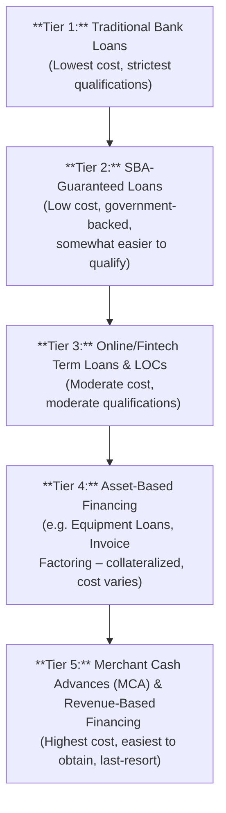

```mermaid

  flowchart TB
      tier1["**Tier 1:** Traditional Bank Loans\n(Lowest cost, strictest
  qualifications)"]
      tier2["**Tier 2:** SBA-Guaranteed Loans\n(Low cost, government-backed,
  somewhat easier to qualify)"]
      tier3["**Tier 3:** Online/Fintech Term Loans & LOCs\n(Moderate cost,
  moderate qualifications)"]
      tier4["**Tier 4:** Asset-Based Financing\n(e.g. Equipment Loans, Invoice
  Factoring – collateralized, cost varies)"]
      tier5["**Tier 5:** Merchant Cash Advances (MCA) & Revenue-Based
  Financing\n(Highest cost, easiest to obtain, last-resort)"]
      tier1 --> tier2 --> tier3 --> tier4 --> tier5
```