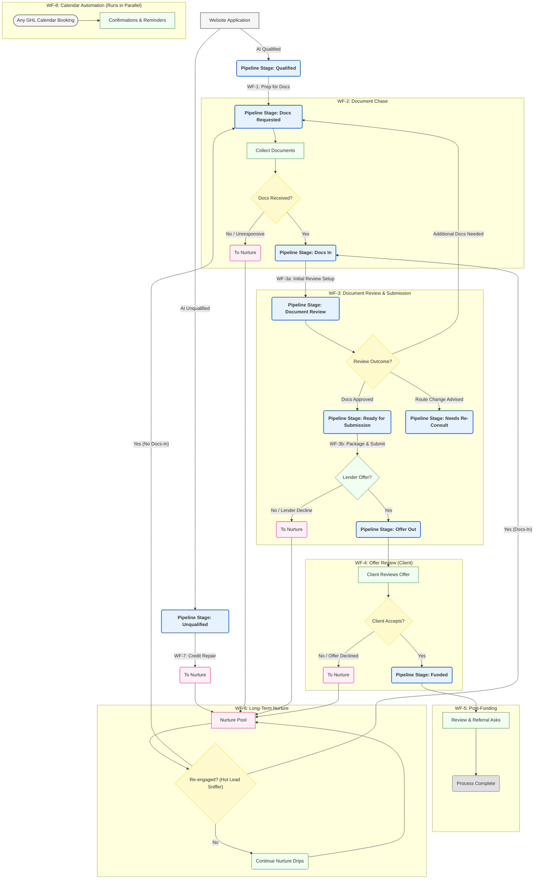
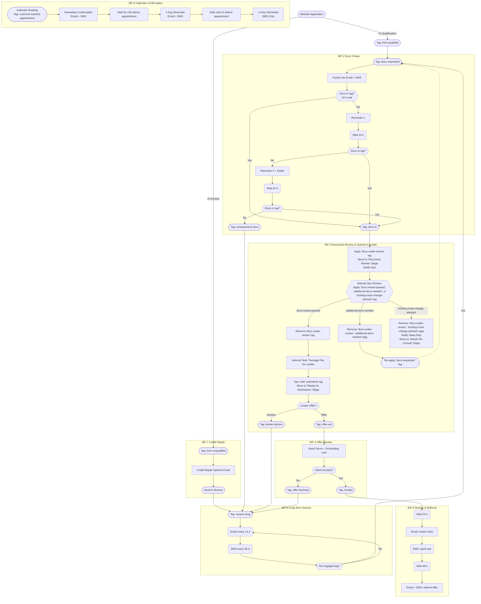

Nexli Funding – Workflow & Tag Playbook

(Last updated 20 May 2025)

This document is the single source of truth for every automation that moves a prospect from website application to Funded deal, plus follow-up review and long-term nurture.
It explains:

| Section | What you'll find |
|---------|-----------------|
| 1. Tag Dictionary | What each tag means and who/what applies it |
| 2. Workflow Summaries | Trigger → goal → key steps for all seven workflows |
| 3. Global "Hot-Lead Sniffer" Trigger | How re-engaged prospects leap out of nurture |
| 4. Sales Pipeline Stages & Definitions (Sales View) | Mapping GHL pipeline stages to tags and sales actions |
| 5. High-Level Pipeline Overview | Broad overview of the main sales pipeline stages and workflow touchpoints |
| 6. Detailed Mermaid Flowchart | Visual map of the entire journey (renders in any Mermaid viewer) |
| 7. GoHighLevel Automation Implementation Guide | How to build these automations in GoHighLevel |
| 8. SLA & Reporting Notes | Quick reference for Ops & Management |
| 9. Calendar Appointment Workflow | Confirmation and reminder sequence for all calendar bookings |
| 10. TODO List | Outstanding action items and implementation tasks |
| 11. AI Caller Workflows | Automated AI Caller system and its integration with GoHighLevel (GHL) |

⸻

1 Tag Dictionary

| Tag | Added by | Purpose / Effect |
|-----|----------|------------------|
| form-qualified | Website AI Pre-Qualification → Webhook | Indicates prospect passed initial AI qualification |
| form-unqualified | Website AI Pre-Qualification → Webhook | Bypasses Fast-Five, sends to WF-7 Auto-Disqualify or Credit Repair |
| offerId-tracking | Website → Webhook | Unique identifier for tracking throughout application process |
| credit-stacking | User Selection → Webhook | Routes to MyScoreIQ for credit report |
| revenue-loan | User Selection → Webhook | Routes to document collection for business loans |
| mca-loan | User Selection → Webhook | Routes to document collection for merchant cash advance |
| call-answered | Closer (call disposition) | Branch logic only |
| call-noanswer | Closer | Triggers follow-up loop inside WF-1 |
| call-back | Closer | Creates future dial task; exits WF-1 |
| disqualified | Closer | Ends contact—no further workflows |
| docs-requested | Closer (one-click tag) OR WF-3 (if additional docs needed post-review) | Starts WF-2 Docs Chase. Can be re-applied if initial doc review requests more items. |
| docs-in | Portal webhook or Ops | Indicates all initially requested docs are uploaded by prospect; Triggers WF-3 Document Review. |
| docs-under-review | WF-3 (auto) | Docs received and are now with Ops for initial review. |
| docs-review-passed | Ops (manual) | Docs reviewed and deemed complete and correct for the current funding route. Allows WF-3 to proceed to lender submission. |
| additional-docs-needed | Ops (manual) | Doc review found more items are needed for the current funding route. Triggers re-application of 'docs-requested' and re-starts WF-2. |
| funding-route-change-advised | Ops (manual) | Doc review suggests a different funding product/route is more appropriate. Triggers alert to Sales for re-consult. |
| submitted | Ops (manual, post-review) | File packaged and sent to lender, after passing document review. Kicks off SLA timer; prerequisite for lender offer. |
| lender-decline | Ops | Drops into WF-6 Nurture |
| offer-out | Ops when terms arrive | Starts WF-4 Offer Review |
| offer-declined | Prospect says "no" | Sends to WF-6 Nurture |
| funded | Ops (ACH confirmed) | Starts WF-5 Review & Referral |
| unresponsive-docs | WF-2 auto after 3 nudges | Sends to WF-6 Nurture |
| cold-lead | WF-1 auto after 3 failed calls | Sends to WF-6 Nurture |
| nurture-long | Auto tag inside WF-6 | Indicates contact is in long-term drip |
| re-engaged | Global trigger (reply, click, booking) or rep tag | Pulls contact out of WF-6 and back into pipeline |
| customer-booked-appointment | Calendar (QB8uLe2eg2L0jJwAk8Hq) | Triggers WF-8 Calendar Confirmation flow |

⸻

2 Workflow Summaries

| # | Name & Goal | Trigger | Key Actions | Exit / Next Tag |
|---|------------|---------|------------|----------------|
| WF-1 | Tag for Docs Chase Initiate document request | form-qualified | ① Website applies AI qualification ② Apply docs-requested tag | docs-requested |
| WF-2 | Docs Chase Secure uploads within 72 h | docs-requested | Portal link → event-wait for docs-in with 2 reminder loops. If 'additional-docs-needed' was applied, this workflow re-engages. | docs-in or unresponsive-docs |
| WF-3 | Document Review & Lender Submission Review docs, prepare for lender, or request revisions. | docs-in | ① Apply `docs-under-review` tag. ② Move to "Document Review" GHL pipeline stage. ③ Notify Ops: "Docs for [Contact] ready for review." ④ PAUSE - Await Ops manual tag:    IF `docs-review-passed` (by Ops): Remove `docs-under-review`. Ops packages file & adds `submitted` tag. Await `offer-out` or `lender-decline`.    IF `additional-docs-needed` (by Ops): Remove `docs-under-review`, `additional-docs-needed`. Add `docs-requested` (re-triggers WF-2).    IF `funding-route-change-advised` (by Ops): Remove `docs-under-review`, `funding-route-change-advised`. Move to "Needs Re-Consult" stage. Notify Sales Rep. | `offer-out` / `lender-decline` (Path A) `docs-requested` (Path B) (Manual Follow-up Path C) |
| WF-4 | Offer Review Show terms; client decision | offer-out | Email+SMS terms + Calendly → event-wait for accept | funded or offer-declined |
| WF-5 | Review & Referral Social proof + upsell | funded | Day 1 review ask; Day 3 referral ask | End after sequence |
| WF-6 | Long-Term Nurture Recycle non-funded leads | unresponsive-docs, cold-lead, lender-decline, offer-declined | 14-day ed emails + 30-day SMS check-in loop | Tag re-engaged (auto) returns them to pipeline |
| WF-7 | Credit Repair Handle form-unqualified leads | form-unqualified | Special intro email explaining credit repair options | Sends to WF-6 Nurture |
| WF-8 | Calendar Confirmations Manage appointment reminders | customer-booked-appointment | Immediate confirmation + 1-day and 1-hour reminders | No exit - standalone flow |

⸻

3 Global Hot-Lead Sniffer Trigger

| Condition (OR logic) | Action |
|----------------------|--------|
| Conversation → Customer Replied | Add re-engaged, remove nurture-long, notify rep |
| Trigger Link "get-started" Clicked | Same as above |
| Appointment Created (any calendar) | Same as above |
| Keyword = READY / START | Same as above |

Follow-up branch:

IF Tag docs-in exists
    → Add Tag submitted
ELSE
    → Add Tag docs-requested

⸻

4 Sales Pipeline Stages & Definitions (Sales View)

This table outlines the main GHL pipeline stages, the key tag associated with each, and what it means for the sales team when a lead is in that stage. This helps understand where the lead is and what actions are generally expected or automated.

| GHL Pipeline Stage         | Key Identifying Tag(s)            | What it Means for Sales / Next Steps                                                                 |
|----------------------------|-----------------------------------|------------------------------------------------------------------------------------------------------|
| **New Lead / Qualified**   | `form-qualified`                  | New lead passed initial AI qualification. WF-1 is auto-applying `docs-requested`. Await document portal setup. |
| **Docs Requested**         | `docs-requested`                  | Automation (WF-2) has sent document request & portal link. Monitor for `docs-in`. Follow up if lead stalls. |
| **Docs In**                | `docs-in`                         | Prospect has uploaded documents. WF-3 is auto-applying `docs-under-review`. Ops will be notified.       |
| **Document Review**        | `docs-under-review`               | Ops is currently reviewing submitted documents. Await outcome: `docs-review-passed`, `additional-docs-needed`, or `funding-route-change-advised`. |
| **Needs Re-Consult**       | `funding-route-change-advised`    | Ops review suggests a different funding route. Sales needs to reconnect with the lead to discuss new options/docs. |
| **Ready for Submission**   | `docs-review-passed`, `submitted` | Docs approved by Ops & file packaged. Ops is submitting to lender(s). Await `offer-out` or `lender-decline`. |
| **Offer Out**              | `offer-out`                       | Lender has provided terms. Automation (WF-4) is sending offer and scheduling link to client. Sales to follow up to discuss & close. |
| **Funded**                 | `funded`                          | Deal is closed and funded! Automation (WF-5) handles review/referral requests. Sales can congratulate client. |
| **Unqualified / Credit Repair** | `form-unqualified`             | Lead did not pass initial AI. WF-7 sends credit repair info. Typically moves to Nurture. Low priority for immediate sales follow-up unless re-engaged. |
| **Nurture**                | `nurture-long`                    | Lead is in long-term follow-up (WF-6) due to being unresponsive, declined, etc. Monitor for `re-engaged` tag. |
| **On Hold / Call Back**    | `call-back`                       | Sales has requested a specific call-back time. A task should be created. Lead is temporarily out of main active flow. |
| **Disqualified**           | `disqualified`                    | Lead is not a fit, or has requested no further contact. No further action from sales or automation. |

⸻

5 High-Level Pipeline Overview

This flowchart provides a high-level snapshot of the main sales pipeline stages, corresponding GoHighLevel workflows (WF), and how leads progress through the system, including nurture and re-engagement paths.

⸻

6 Detailed Mermaid Flowchart

⸻

7 GoHighLevel Automation Implementation Guide

This section provides a general framework and considerations for building out the Nexli Funding pipeline automations within GoHighLevel (GHL). Refer to the "Tag Dictionary" (Section 1), "Workflow Summaries" (Section 2), and the "Detailed Mermaid Flowchart" (Section 6) as the primary blueprints for your GHL Workflows.

**General Principles:**

*   **One Workflow per Documented WF:** For clarity and manageability, aim to create a distinct GHL Workflow for each of the WFs (WF-1 through WF-8) outlined in the "Workflow Summaries" section.
*   **Tag-Driven Logic:** Tags are the primary drivers of this automation.
    *   Most GHL Workflows will be triggered by a specific tag being added (e.g., `docs-requested` triggers WF-2).
    *   Workflows will often conclude by adding a new tag to trigger the next Workflow or move the contact to a nurture sequence (e.g., WF-2 adds `docs-in` or `unresponsive-docs`).
*   **GHL Pipeline Stages:** Align GHL Pipeline Stages with the key milestones in the flowcharts (e.g., "Qualified", "Docs Requested", "Docs In", "Document Review", "Ready for Submission", "Offer Out", "Funded", "Needs Re-Consult"). Automate moving contacts between these pipeline stages using your GHL Workflows, typically triggered by tag additions.
*   **Clear Naming Conventions:** Use consistent and descriptive names for your GHL Workflows, Triggers, Actions, and any custom fields or values. This will make troubleshooting and maintenance easier. (e.g., "Nexli WF-2: Docs Chase", Trigger: "Tag Added - docs-requested").

**Workflow-Specific Implementation Notes (Examples):**

*   **WF-1 (Tag for Docs Chase):**
    *   Trigger: Tag `form-qualified` is added.
    *   Action: Add tag `docs-requested`.
    *   Action: Move to "Docs Requested" pipeline stage in GHL.
*   **WF-2 (Docs Chase):**
    *   Trigger: Tag `docs-requested` is added.
    *   Action: Send initial email/SMS with portal link.
    *   Use "Wait" steps with "Event - Contact Tag" conditions to check for `docs-in` tag.
        *   If `docs-in` added within X hours, proceed to WF-3 logic.
        *   If not, send Reminder 1. Wait again.
        *   If still not, send Reminder 2 (+ Dialer task if applicable). Wait again.
        *   If still no `docs-in`, add `unresponsive-docs` tag and move to Nurture (WF-6).
    *   Action (if `docs-in`): Add `docs-in` tag. Move to "Docs In / Ready to Submit" pipeline stage.
*   **WF-3 (Document Review & Lender Submission):**
    *   Trigger: Tag `docs-in` is added.
    *   Action: Apply `docs-under-review` tag.
    *   Action: Move contact to "Document Review" GHL pipeline stage.
    *   Action: Notify relevant Ops team/user: "Documents for [Contact Name] are ready for review."
    *   Action: Add a "Wait" step configured for "Webhook / Event - Contact Tag". This step effectively pauses the workflow until Ops manually adds one of the review outcome tags.
        *   **Branch A (Docs OK for Submission):** Condition for this branch in the Wait step is `docs-review-passed` tag added.
            *   Action: Remove `docs-under-review` tag.
            *   Action: (Ops Manually) Ops packages the file.
            *   Action: (Ops Manually) Ops adds `submitted` tag.
            *   Action: Move contact to "Ready for Submission" GHL pipeline stage (can be part of the workflow when `submitted` tag is detected, or Ops does it manually when adding the tag).
            *   (Workflow then waits for `offer-out` or `lender-decline` tag via another Wait step or separate workflow as previously defined for WF-4 trigger).
        *   **Branch B (More Docs Needed):** Condition for this branch in the Wait step is `additional-docs-needed` tag added.
            *   Action: Remove `docs-under-review` tag.
            *   Action: Remove `additional-docs-needed` tag (its purpose was to trigger this branch).
            *   Action: Add `docs-requested` tag (this will re-initiate WF-2: Docs Chase).
            *   Action: Move contact back to "Docs Requested" GHL pipeline stage.
            *   *(End of this workflow path for WF-3; WF-2 takes over)*
        *   **Branch C (Different Funding Route Advised):** Condition for this branch in the Wait step is `funding-route-change-advised` tag added.
            *   Action: Remove `docs-under-review` tag.
            *   Action: Remove `funding-route-change-advised` tag (its purpose was to trigger this branch).
            *   Action: Move contact to "Needs Re-Consult" GHL pipeline stage.
            *   Action: Notify the primary Sales Rep: "[Contact Name] needs a funding route re-evaluation after document review."
            *   *(End of this workflow path for WF-3; manual intervention or a separate re-consult workflow takes over)*
*   **WF-6 (Long-Term Nurture):**
    *   Trigger: Tags `unresponsive-docs`, `cold-lead`, `lender-decline`, or `offer-declined` are added.
    *   Action: Add `nurture-long` tag.
    *   Action: Start email/SMS drip sequences (e.g., "Wait X days", "Send Email Y").
*   **Global Hot-Lead Sniffer (Implemented as separate GHL Workflows):**
    *   Create separate GHL Workflows for each condition:
        *   Trigger: Customer Replied → Action: Add `re-engaged`, remove `nurture-long`, notify rep.
        *   Trigger: Trigger Link Clicked ("get-started") → Action: Same as above.
        *   Trigger: Appointment Booked (Any Calendar) → Action: Same as above.
        *   Trigger: Specific Inbound SMS Keyword (e.g., "READY", "START") → Action: Same as above.
    *   For the follow-up branch:
        *   After adding `re-engaged`, use an IF/ELSE condition:
            *   IF contact has `docs-in` tag → Add `submitted` tag.
            *   ELSE → Add `docs-requested` tag.

**Key GHL Features to Utilize:**

*   **Workflow Triggers:** Primarily "Contact Tag Added". Also "Customer Replied", "Trigger Link Clicked", "Appointment Status Changed", "Inbound Webhook" (for website/AI integration).
*   **Workflow Actions:** "Add Tag", "Remove Tag", "Send Email", "Send SMS", "Wait", "If/Else", "Create/Update Opportunity" (to move pipeline stages), "Add Task", "Notify Internal User/Team".
*   **Custom Fields:** For storing data like `offerId-tracking` or any other specific information not covered by standard fields, especially for managing dynamic lists of required documents if not using a full client portal.
*   **Calendars & Appointments:** Use GHL calendar bookings to trigger WF-8 and potentially the "Hot-Lead Sniffer."
*   **Trigger Links:** For tracking engagement in emails/SMS and re-engaging leads.
*   **Email & SMS Templates:** Create and use standardized templates for all communications.
*   **Reporting:** Leverage GHL's reporting and Smart Lists to monitor workflow performance and SLAs (as noted in Section 8 - soon to be Section 9).

**Webhook Integration (e.g., Website AI Pre-Qualification):**

*   The `form-qualified` and `form-unqualified` tags are noted as being applied via Webhook from your Website AI.
*   In GHL, you'll set up "Inbound Webhook" triggers in the relevant Workflows.
*   Your website/AI system will then need to be configured to send a POST request to these GHL webhook URLs with the contact's information and the appropriate data to identify them (e.g., email or phone) when a qualification decision is made.
*   The GHL Workflow can then parse the incoming data and apply the correct tag (`form-qualified` or `form-unqualified`).

**Testing:**

*   Thoroughly test each GHL Workflow individually and then test the end-to-end flow with test contacts.
*   Verify tags are added/removed correctly, communications are sent, pipeline stages are updated, and contacts move to the correct subsequent workflows or nurture sequences.

This guide provides a starting point. You'll need to adapt and refine these suggestions based on the specific capabilities and UI of your GoHighLevel instance.

**Managing Variable and Additional Document Requests**

A common challenge is handling requests for an initial set of documents (e.g., bank statements) and then needing to request more specific documents (e.g., tax returns, driver's license) based on an initial review or changing circumstances. Here's a strategy to manage this with simplicity for sales and clarity for clients:

*   **Ideal: Client Document Portal with Dynamic Checklist:**
    *   **Concept:** A secure online portal where each client logs in to see a personalized, dynamic checklist of all documents currently required for their application.
    *   **Updates:** Operations (Ops) directly updates this checklist in the portal whenever new documents are identified as necessary (e.g., during WF-3 Document Review).
    *   **Client Action:** Clients upload documents against specific items on their checklist.
    *   **GHL Integration:** The portal should ideally use webhooks to:
        *   Notify GHL (and thus Ops/Sales) when a document is uploaded.
        *   Potentially add a generic tag like `client-doc-uploaded-in-portal` to trigger an internal review or notification.
    *   **Initial & Follow-up Emails (WF-2):**
        *   The `docs-requested` email (and any re-request emails if `additional-docs-needed` is applied) would primarily direct the client to their portal: "Please log in to your secure portal at [Portal Link] to view your current document checklist and upload files."
        *   This keeps email content generic and clean, as the specific list is always live in the portal.

*   **Alternative/Supplement: GHL Custom Field for Document Lists:**
    *   **Concept:** If a full portal isn't immediately available, or to supplement portal communications, use a multi-line text custom field in GHL on the Contact record (e.g., `Ops: Current Required Docs List`).
    *   **Updates:** Ops manually maintains this field. When `additional-docs-needed` is applied, Ops *must* update this custom field with the *new and outstanding* list of documents before the next automated email goes out.
    *   **Initial & Follow-up Emails (WF-2):**
        *   The `docs-requested` email would merge this custom field: "Our records show we currently need the following to proceed: \n{{contact.custom_ops_current_required_docs_list}}\n Please upload these securely via [Secure Upload Link/Instructions]."
        *   **Caution:** This requires strict discipline from Ops to ensure the custom field is always accurate before any re-request email is triggered by the `additional-docs-needed` tag. Outdated lists in emails are confusing.

*   **Ops Role is Key for List Management:**
    *   Regardless of portal or custom field, Ops becomes the central owner of what documents are officially required at any given time.
    *   When Ops applies the `additional-docs-needed` tag during WF-3 (Document Review), their immediate next step is to update the client's document checklist (in the portal or the GHL custom field).
    *   The re-application of the `docs-requested` tag then triggers WF-2, which sends an email pointing to the *newly updated* list.

*   **Simplifying for the Sales Team:**
    *   **Focus:** Salespeople should focus on client communication, relationship building, and guiding clients to the portal (or referring to the latest email from WF-2). They manage the opportunity based on pipeline stage.
    *   **If Sales Identifies an Ad-Hoc Document Need (outside formal review):**
        1.  **Recommended Path (Simplest & Most Consistent):** Salesperson informs Ops (e.g., via internal GHL task, internal chat, or a dedicated email).
        2.  Ops then:
            *   Updates the official document checklist (portal or GHL custom field).
            *   If an automated email notification to the client about this new list is desired, Ops ensures the `additional-docs-needed` (or `docs-requested`) tag is (re)applied to trigger WF-2.
        3.  This keeps the "source of truth" for required documents managed by Ops, ensuring consistency in client communication and internal tracking.
    *   **Avoid Sales Directly Tagging for Specific Docs (Unless Highly Structured):** While you *could* create tags for every conceivable document (e.g., `request-tax-return-2023`, `request-DL`), this can quickly become unwieldy and hard to manage in GHL workflows for dynamic list generation in emails. It's often simpler to have Ops manage the checklist.

*   **Website Document Collection Point:**
    *   Your website should have a clear, secure way for prospects/clients to upload documents.
    *   **Initial Application:** If they apply on your website, it could direct them to create an account for the document portal immediately, or provide a secure upload link for initial documents (like bank statements).
    *   **Existing Clients:** A "Client Login" or "Upload Documents" button prominent on your site should lead to the portal or a page with secure upload instructions.
    *   **Security is Paramount:** Ensure any upload mechanism is secure (HTTPS, proper file handling, etc.). Generic email attachments for sensitive documents should be avoided.

This approach centralizes the dynamic list, makes Ops the gatekeeper for what's officially requested (ensuring accuracy), and simplifies the salesperson's role to guiding the client and managing the deal's progression.

**Synchronizing Pipeline Stages and Tag-Driven Automations**

It's crucial that your GHL pipeline stages accurately reflect a lead's progress through the automated workflows, and vice-versa. This ensures both manual actions by sales reps and automated processes work in harmony.

There are two main ways a lead's pipeline stage will change:

1.  **Workflow-Driven Stage Changes (Primary Method):**
    *   As outlined in the "General Principles" and "Workflow-Specific Implementation Notes," your main GHL Workflows (WF-1 to WF-8) should be responsible for moving leads to the correct pipeline stage *after* the relevant actions are completed and tags are applied.
    *   **How to Build:**
        *   At the end of a workflow sequence (or at a key milestone within it), after a defining tag is added (e.g., `docs-in` is added by WF-2), use the GHL workflow action "Create/Update Opportunity" (or "Move Opportunity").
        *   Configure this action to place the contact into the pipeline stage that corresponds to the tag just applied (e.g., move to "Docs In / Ready to Submit" stage when `docs-in` tag is added).
    *   **Benefit:** This keeps the pipeline view automatically updated based on actual automation progress.

2.  **Manual Stage Changes by Sales Team (Drag-and-Drop in Pipeline):**
    *   Sales team members might manually drag a lead from one pipeline stage to another. To keep your tag-based automations in sync, you need to react to these manual changes.
    *   **How to Build:**
        *   For each pipeline stage that a salesperson might manually drag a lead *into* (e.g., "Qualified", "Docs Requested", "Docs In", "Document Review", "Ready for Submission", "Offer Out", "Funded", "Needs Re-Consult"), create a simple GHL Workflow (or a new trigger within an existing workflow, though separate can be cleaner for this specific purpose).
        *   **Trigger:** Use the GHL trigger "Pipeline Stage Changed".
            *   Filter this trigger to specify:
                *   The specific pipeline ("Nexli Funding Pipeline" or your equivalent).
                *   The specific stage the contact was moved *into* (e.g., "Document Review").
        *   **Action:**
            *   The primary action should be to **add the main defining tag** associated with that new pipeline stage (e.g., if moved to "Document Review" stage, the workflow adds the `docs-under-review` tag).
            *   **Crucial Condition:** Add a condition to this action (often available directly in the "Add Tag" action settings or by using an If/Else branch): "Only add tag if contact does NOT already have tag X" (where X is the tag being added). This prevents re-triggering workflows unnecessarily if the tag was already applied by an automated process and avoids issues with applying a tag that's already present.
            *   Consider if any other tags need to be removed (e.g., a tag from a previous stage if it wasn't automatically removed by another process).
            *   Optionally, you can add a notification to the sales rep or Ops if a manual move has specific implications.
    *   **Benefit:** When a lead is manually dragged, the system automatically applies the correct underlying tag. This ensures:
        *   The contact record is correctly tagged for reporting and segmentation.
        *   If the applied tag is a trigger for a main workflow (and the lead hasn't been processed by it for this stage), that workflow can then pick up and continue the automation from that point.

**Key to Keeping it "Nice and Neat":**

*   **Define Primary Tags for Stages:** As a rule, each of your GHL pipeline stages should have one primary tag that signifies a contact has officially reached that point (e.g., "Docs Requested" stage <=> `docs-requested` tag). This makes the synchronization logic straightforward.
*   **Workflow Responsibility:**
    *   Your main, multi-step workflows (WF-1 to WF-8) are responsible for *doing the work* (sending emails, waiting, etc.) and then updating both the tag and the GHL pipeline stage.
    *   The smaller "Pipeline Stage Changed" triggered workflows are primarily responsible for *tag sanitation* when manual moves occur, ensuring the tags reflect the manual stage placement and kickstarting main workflows if appropriate.
*   **Avoid Conflicting Triggers:** Be mindful that a tag added by a "Pipeline Stage Changed" workflow doesn't inadvertently cause a loop by re-triggering the same stage change. The "only add tag if not already present" condition is key here.

By setting up this two-way synchronization, your sales team can use the visual pipeline for manual adjustments, while your core automations reliably drive leads through the process based on tags, keeping everything aligned.

⸻

8 SLA & Reporting Quick Notes

- Docs-in → Submitted should average < 8 hours.
  - Smart-List: Tag docs-in AND NOT submitted AND lastTagAddedDate > 8h
- Submitted → Offer-out lender SLA = ≤ 24 hours.
  - Alert built in WF-3 (Wait 24 h; if no offer tag, Slack #ops).
- Dashboard KPIs
  - CPL (qualified), Cost per Docs-in, Fund-rate %, Gross Commission, Payback ROAS.
  - Build in Looker Studio pulling GHL pipeline + ad spend sheet.
- Monthly QA
  - Randomly audit 5 funded files: must contain disclosure PDF, signed broker fee page, correct bank statements.

⸻

9 Calendar Appointment Workflow

This workflow triggers automatically when any prospect books a call using any of our calendar links. GoHighLevel Calendar ID: QB8uLe2eg2L0jJwAk8Hq

| Timing | Communication | Content |
|--------|---------------|---------|
| Immediate | Confirmation Email + SMS | Thank you for booking, appointment details, add to calendar link |
| 24h before | Reminder Email + SMS | Reminder of upcoming call, what to expect, any preparation needed |
| 1h before | SMS Only | Quick reminder that call is starting soon |

⸻

10 TODO List

- [x] Review all emails for correct calendar links and automations
- [ ] Set up business review profiles and monitoring:
  - [ ] Google Business Profile
  - [ ] Yelp
  - [ ] Trustpilot
- [ ] Create SOP documentation for lender offer handling process
- [x] Verify all email templates are mobile responsive
- [ ] Test calendar booking flow with confirmation and reminder sequences
- [ ] Set up automated reports for workflow KPIs
- [ ] Create training documentation for new sales team members
- [ ] Design and implement/integrate a client document portal with dynamic checklists and GHL webhook capabilities.

⸻

11 AI Caller Workflows

This section documents the automated AI Caller system and its integration with GoHighLevel (GHL) through an MCP server running on n8n.

### System Overview

The AI Caller and LiveKit agent system interacts with GHL through custom fields and webhook triggers. This implementation enables automated calls, SMS, and emails driven by AI conversation workflows.

| Component | Function |
|-----------|----------|
| AI Caller | Manages automated phone conversations with prospects |
| LiveKit Agent | Handles real-time communication protocols |
| MCP Server (n8n) | Middleware that connects the AI system with GHL |

### Custom Field Integration

The system uses custom fields in GHL to trigger communications:

| Custom Field | Used By | Purpose |
|--------------|---------|---------|
| ai-caller-sms | Send SMS | Contains SMS content generated by AI |
| ai-caller-subject-line | Send Email | Contains email subject generated by AI |
| ai-caller-email-body | Send Email | Contains email body content generated by AI |

### GHL Workflow Configuration

A dedicated folder called "AI Caller Workflows" in GHL contains workflows that trigger communication based on custom field updates:

1. **SMS Workflow**:
   - Trigger: Custom field "ai-caller-sms" is populated
   - Action: Send SMS with content from the custom field

2. **Email Workflow**:
   - Trigger: Custom fields "ai-caller-subject-line" and "ai-caller-email-body" are populated
   - Action: Send email using these fields for subject and body content

### Integration Process Flow

### Implementation Notes

- The AI Caller system uses the GHL API through the MCP server to update contact records
- Custom fields are automatically populated by the AI based on conversation context
- All communications are tracked in GHL contact history for compliance and follow-up
- The system respects contact preferences and communication opt-outs

Contact Operations team for access to the AI Caller system and integration documentation.

⸻

Need to change something?
1. Add / rename a tag here first → then update the Trigger or Workflow.
2. Update this doc and bump the "Last updated" date so everyone knows they're reading the latest playbook.

Happy funding!