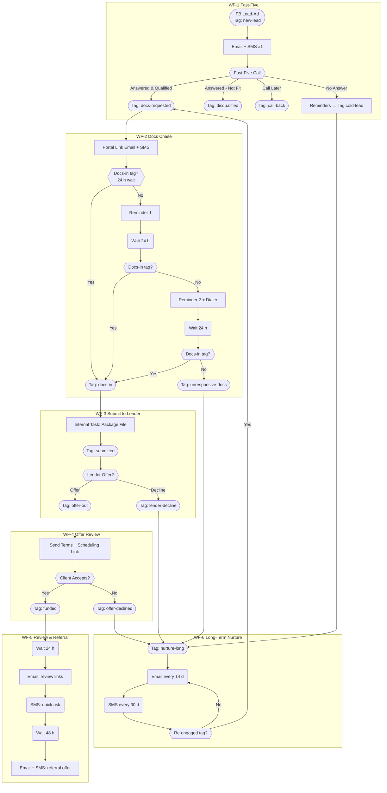

Nexli Funding – Workflow & Tag Playbook

(Last updated 24 Apr 2025)

This document is the single source of truth for every automation that moves a prospect from Facebook lead-ad to Funded deal, plus follow-up review and long-term nurture.
It explains:

| Section | What you'll find |
|---------|-----------------|
| 1. Tag Dictionary | What each tag means and who/what applies it |
| 2. Workflow Summaries | Trigger → goal → key steps for all six workflows |
| 3. Global "Hot-Lead Sniffer" Trigger | How re-engaged prospects leap out of nurture |
| 4. Mermaid Flowchart | Visual map of the entire journey (renders in any Mermaid viewer) |
| 5. SLA & Reporting Notes | Quick reference for Ops & Management |

⸻

1 Tag Dictionary

| Tag | Added by | Purpose / Effect |
|-----|----------|------------------|
| new-lead | FB Lead-Ad → Zap | Starts WF-1 Fast-Five |
| call-answered | Closer (call disposition) | Branch logic only |
| call-noanswer | Closer | Triggers follow-up loop inside WF-1 |
| call-back | Closer | Creates future dial task; exits WF-1 |
| disqualified | Closer | Ends contact—no further workflows |
| docs-requested | Closer (one-click tag) | Starts WF-2 Docs Chase |
| docs-in | Portal webhook or Ops | Starts WF-3 Submit to Lender |
| submitted | Ops when file sent | Kicks off SLA timer; prerequisite for lender offer |
| lender-decline | Ops | Drops into WF-6 Nurture |
| offer-out | Ops when terms arrive | Starts WF-4 Offer Review |
| offer-declined | Prospect says "no" | Sends to WF-6 Nurture |
| funded | Ops (ACH confirmed) | Starts WF-5 Review & Referral |
| unresponsive-docs | WF-2 auto after 3 nudges | Sends to WF-6 Nurture |
| cold-lead | WF-1 auto after 3 failed calls | Sends to WF-6 Nurture |
| nurture-long | Auto tag inside WF-6 | Indicates contact is in long-term drip |
| re-engaged | Global trigger (reply, click, booking) or rep tag | Pulls contact out of WF-6 and back into pipeline |

⸻

2 Workflow Summaries

| # | Name & Goal | Trigger | Key Actions | Exit / Next Tag |
|---|------------|---------|------------|----------------|
| WF-1 | Fast-Five Live verify & qualify in ≤5 min | new-lead | ① Email+SMS welcome ② Power-dial call ③ If qualified → add docs-requested | docs-requested or disqualify / cold-lead |
| WF-2 | Docs Chase Secure uploads within 72 h | docs-requested | Portal link → event-wait for docs-in with 2 reminder loops | docs-in or unresponsive-docs |
| WF-3 | Submit to Lender Package & send file | docs-in | Internal prep task → Ops adds submitted → await lender → tag offer-out or lender-decline | offer-out / lender-decline |
| WF-4 | Offer Review Show terms; client decision | offer-out | Email+SMS terms + Calendly → event-wait for accept | funded or offer-declined |
| WF-5 | Review & Referral Social proof + upsell | funded | Day 1 review ask; Day 3 referral ask | End after sequence |
| WF-6 | Long-Term Nurture Recycle non-funded leads | unresponsive-docs, cold-lead, lender-decline, offer-declined | 14-day ed emails + 30-day SMS check-in loop | Tag re-engaged (auto) returns them to pipeline |

⸻

3 Global Hot-Lead Sniffer Trigger

| Condition (OR logic) | Action |
|----------------------|--------|
| Conversation → Customer Replied | Add re-engaged, remove nurture-long, notify rep |
| Trigger Link "get-started" Clicked | Same as above |
| Appointment Created (any calendar) | Same as above |
| Keyword = READY / START | Same as above |

Follow-up branch:

IF Tag docs-in exists
    → Add Tag submitted
ELSE
    → Add Tag docs-requested

⸻

4 Mermaid Flowchart

⸻

5 SLA & Reporting Quick Notes

- Docs-in → Submitted should average < 8 hours.
  - Smart-List: Tag docs-in AND NOT submitted AND lastTagAddedDate > 8h
- Submitted → Offer-out lender SLA = ≤ 24 hours.
  - Alert built in WF-3 (Wait 24 h; if no offer tag, Slack #ops).
- Dashboard KPIs
  - CPL (qualified), Cost per Docs-in, Fund-rate %, Gross Commission, Payback ROAS.
  - Build in Looker Studio pulling GHL pipeline + ad spend sheet.
- Monthly QA
  - Randomly audit 5 funded files: must contain disclosure PDF, signed broker fee page, correct bank statements.

⸻

Need to change something?
1. Add / rename a tag here first → then update the Trigger or Workflow.
2. Update this doc and bump the "Last updated" date so everyone knows they're reading the latest playbook.

Happy funding!