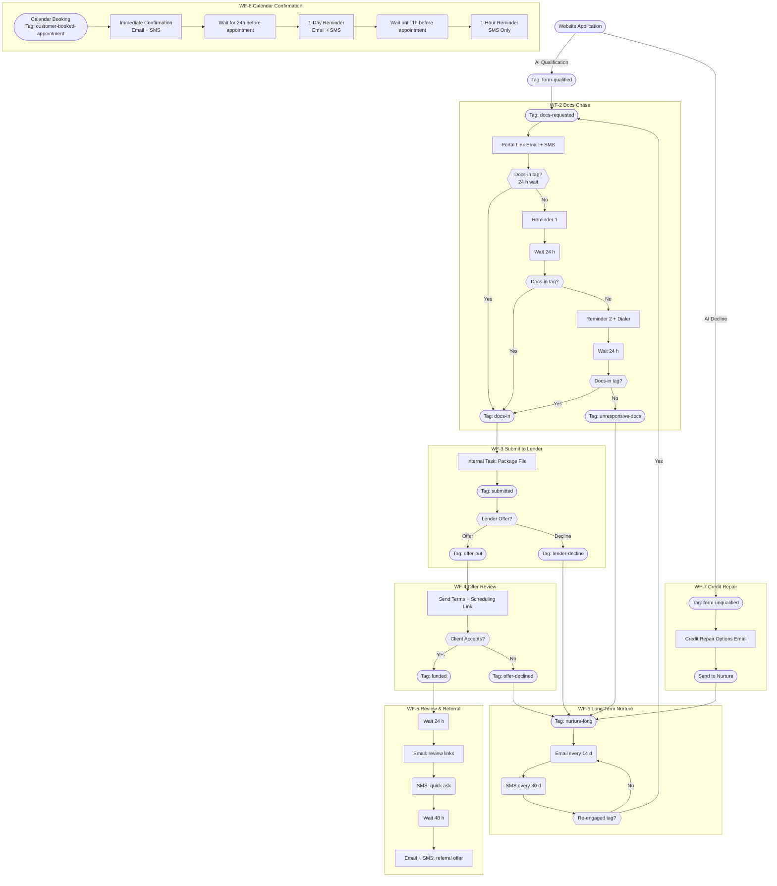

Nexli Funding – Workflow & Tag Playbook

(Last updated 20 May 2025)

This document is the single source of truth for every automation that moves a prospect from website application to Funded deal, plus follow-up review and long-term nurture.
It explains:

| Section | What you'll find |
|---------|-----------------|
| 1. Tag Dictionary | What each tag means and who/what applies it |
| 2. Workflow Summaries | Trigger → goal → key steps for all seven workflows |
| 3. Global "Hot-Lead Sniffer" Trigger | How re-engaged prospects leap out of nurture |
| 4. High-Level Pipeline Overview | Broad overview of the main sales pipeline stages and workflow touchpoints |
| 5. Detailed Mermaid Flowchart | Visual map of the entire journey (renders in any Mermaid viewer) |
| 6. GoHighLevel Automation Implementation Guide | How to build these automations in GoHighLevel |
| 7. SLA & Reporting Notes | Quick reference for Ops & Management |
| 8. Calendar Appointment Workflow | Confirmation and reminder sequence for all calendar bookings |
| 9. TODO List | Outstanding action items and implementation tasks |
| 10. AI Caller Workflows | Automated AI Caller system and its integration with GoHighLevel (GHL) |

⸻

1 Tag Dictionary

| Tag | Added by | Purpose / Effect |
|-----|----------|------------------|
| form-qualified | Website AI Pre-Qualification → Webhook | Indicates prospect passed initial AI qualification |
| form-unqualified | Website AI Pre-Qualification → Webhook | Bypasses Fast-Five, sends to WF-7 Auto-Disqualify or Credit Repair |
| offerId-tracking | Website → Webhook | Unique identifier for tracking throughout application process |
| credit-stacking | User Selection → Webhook | Routes to MyScoreIQ for credit report |
| revenue-loan | User Selection → Webhook | Routes to document collection for business loans |
| mca-loan | User Selection → Webhook | Routes to document collection for merchant cash advance |
| call-answered | Closer (call disposition) | Branch logic only |
| call-noanswer | Closer | Triggers follow-up loop inside WF-1 |
| call-back | Closer | Creates future dial task; exits WF-1 |
| disqualified | Closer | Ends contact—no further workflows |
| docs-requested | Closer (one-click tag) | Starts WF-2 Docs Chase |
| docs-in | Portal webhook or Ops | Starts WF-3 Submit to Lender |
| submitted | Ops when file sent | Kicks off SLA timer; prerequisite for lender offer |
| lender-decline | Ops | Drops into WF-6 Nurture |
| offer-out | Ops when terms arrive | Starts WF-4 Offer Review |
| offer-declined | Prospect says "no" | Sends to WF-6 Nurture |
| funded | Ops (ACH confirmed) | Starts WF-5 Review & Referral |
| unresponsive-docs | WF-2 auto after 3 nudges | Sends to WF-6 Nurture |
| cold-lead | WF-1 auto after 3 failed calls | Sends to WF-6 Nurture |
| nurture-long | Auto tag inside WF-6 | Indicates contact is in long-term drip |
| re-engaged | Global trigger (reply, click, booking) or rep tag | Pulls contact out of WF-6 and back into pipeline |
| customer-booked-appointment | Calendar (QB8uLe2eg2L0jJwAk8Hq) | Triggers WF-8 Calendar Confirmation flow |

⸻

2 Workflow Summaries

| # | Name & Goal | Trigger | Key Actions | Exit / Next Tag |
|---|------------|---------|------------|----------------|
| WF-1 | Tag for Docs Chase Initiate document request | form-qualified | ① Website applies AI qualification ② Apply docs-requested tag | docs-requested |
| WF-2 | Docs Chase Secure uploads within 72 h | docs-requested | Portal link → event-wait for docs-in with 2 reminder loops | docs-in or unresponsive-docs |
| WF-3 | Submit to Lender Package & send file | docs-in | Internal prep task → Ops adds submitted → await lender → tag offer-out or lender-decline | offer-out / lender-decline |
| WF-4 | Offer Review Show terms; client decision | offer-out | Email+SMS terms + Calendly → event-wait for accept | funded or offer-declined |
| WF-5 | Review & Referral Social proof + upsell | funded | Day 1 review ask; Day 3 referral ask | End after sequence |
| WF-6 | Long-Term Nurture Recycle non-funded leads | unresponsive-docs, cold-lead, lender-decline, offer-declined | 14-day ed emails + 30-day SMS check-in loop | Tag re-engaged (auto) returns them to pipeline |
| WF-7 | Credit Repair Handle form-unqualified leads | form-unqualified | Special intro email explaining credit repair options | Sends to WF-6 Nurture |
| WF-8 | Calendar Confirmations Manage appointment reminders | customer-booked-appointment | Immediate confirmation + 1-day and 1-hour reminders | No exit - standalone flow |

⸻

3 Global Hot-Lead Sniffer Trigger

| Condition (OR logic) | Action |
|----------------------|--------|
| Conversation → Customer Replied | Add re-engaged, remove nurture-long, notify rep |
| Trigger Link "get-started" Clicked | Same as above |
| Appointment Created (any calendar) | Same as above |
| Keyword = READY / START | Same as above |

Follow-up branch:

IF Tag docs-in exists
    → Add Tag submitted
ELSE
    → Add Tag docs-requested

⸻

4 High-Level Pipeline Overview

This flowchart provides a high-level snapshot of the main sales pipeline stages, corresponding GoHighLevel workflows (WF), and how leads progress through the system, including nurture and re-engagement paths.

⸻

5 Detailed Mermaid Flowchart

⸻

6 GoHighLevel Automation Implementation Guide

This section provides a general framework and considerations for building out the Nexli Funding pipeline automations within GoHighLevel (GHL). Refer to the "Tag Dictionary" (Section 1), "Workflow Summaries" (Section 2), and the "Detailed Mermaid Flowchart" (Section 5) as the primary blueprints for your GHL Workflows.

**General Principles:**

*   **One Workflow per Documented WF:** For clarity and manageability, aim to create a distinct GHL Workflow for each of the WFs (WF-1 through WF-8) outlined in the "Workflow Summaries" section.
*   **Tag-Driven Logic:** Tags are the primary drivers of this automation.
    *   Most GHL Workflows will be triggered by a specific tag being added (e.g., `docs-requested` triggers WF-2).
    *   Workflows will often conclude by adding a new tag to trigger the next Workflow or move the contact to a nurture sequence (e.g., WF-2 adds `docs-in` or `unresponsive-docs`).
*   **GHL Pipeline Stages:** Align GHL Pipeline Stages with the key milestones in the flowcharts (e.g., "Qualified", "Docs Requested", "Docs In", "Offer Out", "Funded"). Automate moving contacts between these pipeline stages using your GHL Workflows, typically triggered by tag additions.
*   **Clear Naming Conventions:** Use consistent and descriptive names for your GHL Workflows, Triggers, Actions, and any custom fields or values. This will make troubleshooting and maintenance easier. (e.g., "Nexli WF-2: Docs Chase", Trigger: "Tag Added - docs-requested").

**Workflow-Specific Implementation Notes (Examples):**

*   **WF-1 (Tag for Docs Chase):**
    *   Trigger: Tag `form-qualified` is added.
    *   Action: Add tag `docs-requested`.
    *   Action: Move to "Docs Requested" pipeline stage in GHL.
*   **WF-2 (Docs Chase):**
    *   Trigger: Tag `docs-requested` is added.
    *   Action: Send initial email/SMS with portal link.
    *   Use "Wait" steps with "Event - Contact Tag" conditions to check for `docs-in` tag.
        *   If `docs-in` added within X hours, proceed to WF-3 logic.
        *   If not, send Reminder 1. Wait again.
        *   If still not, send Reminder 2 (+ Dialer task if applicable). Wait again.
        *   If still no `docs-in`, add `unresponsive-docs` tag and move to Nurture (WF-6).
    *   Action (if `docs-in`): Add `docs-in` tag. Move to "Docs In / Ready to Submit" pipeline stage.
*   **WF-3 (Submit to Lender):**
    *   Trigger: Tag `docs-in` is added.
    *   Action: Create internal task for Ops to package file.
    *   (Manual step by Ops): Ops adds `submitted` tag once done.
    *   Wait step for lender decision (could be a manual tag update by Ops: `offer-out` or `lender-decline`).
*   **WF-6 (Long-Term Nurture):**
    *   Trigger: Tags `unresponsive-docs`, `cold-lead`, `lender-decline`, or `offer-declined` are added.
    *   Action: Add `nurture-long` tag.
    *   Action: Start email/SMS drip sequences (e.g., "Wait X days", "Send Email Y").
*   **Global Hot-Lead Sniffer (Implemented as separate GHL Workflows):**
    *   Create separate GHL Workflows for each condition:
        *   Trigger: Customer Replied → Action: Add `re-engaged`, remove `nurture-long`, notify rep.
        *   Trigger: Trigger Link Clicked ("get-started") → Action: Same as above.
        *   Trigger: Appointment Booked (Any Calendar) → Action: Same as above.
        *   Trigger: Specific Inbound SMS Keyword (e.g., "READY", "START") → Action: Same as above.
    *   For the follow-up branch:
        *   After adding `re-engaged`, use an IF/ELSE condition:
            *   IF contact has `docs-in` tag → Add `submitted` tag.
            *   ELSE → Add `docs-requested` tag.

**Key GHL Features to Utilize:**

*   **Workflow Triggers:** Primarily "Contact Tag Added". Also "Customer Replied", "Trigger Link Clicked", "Appointment Status Changed", "Inbound Webhook" (for website/AI integration).
*   **Workflow Actions:** "Add Tag", "Remove Tag", "Send Email", "Send SMS", "Wait", "If/Else", "Create/Update Opportunity" (to move pipeline stages), "Add Task", "Notify Internal User/Team".
*   **Custom Fields:** For storing data like `offerId-tracking` or any other specific information not covered by standard fields.
*   **Calendars & Appointments:** Use GHL calendar bookings to trigger WF-8 and potentially the "Hot-Lead Sniffer."
*   **Trigger Links:** For tracking engagement in emails/SMS and re-engaging leads.
*   **Email & SMS Templates:** Create and use standardized templates for all communications.
*   **Reporting:** Leverage GHL's reporting and Smart Lists to monitor workflow performance and SLAs (as noted in Section 7 - soon to be Section 8).

**Webhook Integration (e.g., Website AI Pre-Qualification):**

*   The `form-qualified` and `form-unqualified` tags are noted as being applied via Webhook from your Website AI.
*   In GHL, you'll set up "Inbound Webhook" triggers in the relevant Workflows.
*   Your website/AI system will then need to be configured to send a POST request to these GHL webhook URLs with the contact's information and the appropriate data to identify them (e.g., email or phone) when a qualification decision is made.
*   The GHL Workflow can then parse the incoming data and apply the correct tag (`form-qualified` or `form-unqualified`).

**Testing:**

*   Thoroughly test each GHL Workflow individually and then test the end-to-end flow with test contacts.
*   Verify tags are added/removed correctly, communications are sent, pipeline stages are updated, and contacts move to the correct subsequent workflows or nurture sequences.

This guide provides a starting point. You'll need to adapt and refine these suggestions based on the specific capabilities and UI of your GoHighLevel instance.

**Synchronizing Pipeline Stages and Tag-Driven Automations**

It's crucial that your GHL pipeline stages accurately reflect a lead's progress through the automated workflows, and vice-versa. This ensures both manual actions by sales reps and automated processes work in harmony.

There are two main ways a lead's pipeline stage will change:

1.  **Workflow-Driven Stage Changes (Primary Method):**
    *   As outlined in the "General Principles" and "Workflow-Specific Implementation Notes," your main GHL Workflows (WF-1 to WF-8) should be responsible for moving leads to the correct pipeline stage *after* the relevant actions are completed and tags are applied.
    *   **How to Build:**
        *   At the end of a workflow sequence (or at a key milestone within it), after a defining tag is added (e.g., `docs-in` is added by WF-2), use the GHL workflow action "Create/Update Opportunity" (or "Move Opportunity").
        *   Configure this action to place the contact into the pipeline stage that corresponds to the tag just applied (e.g., move to "Docs In / Ready to Submit" stage when `docs-in` tag is added).
    *   **Benefit:** This keeps the pipeline view automatically updated based on actual automation progress.

2.  **Manual Stage Changes by Sales Team (Drag-and-Drop in Pipeline):**
    *   Sales team members might manually drag a lead from one pipeline stage to another. To keep your tag-based automations in sync, you need to react to these manual changes.
    *   **How to Build:**
        *   For each pipeline stage that a salesperson might manually drag a lead *into*, create a simple GHL Workflow (or a new trigger within an existing workflow, though separate can be cleaner for this specific purpose).
        *   **Trigger:** Use the GHL trigger "Pipeline Stage Changed".
            *   Filter this trigger to specify:
                *   The specific pipeline ("Nexli Funding Pipeline" or your equivalent).
                *   The specific stage the contact was moved *into* (e.g., "Docs Requested").
        *   **Action:**
            *   The primary action should be to **add the main defining tag** associated with that new pipeline stage (e.g., if moved to "Docs Requested" stage, the workflow adds the `docs-requested` tag).
            *   **Crucial Condition:** Add a condition to this action (often available directly in the "Add Tag" action settings or by using an If/Else branch): "Only add tag if contact does NOT already have tag X" (where X is the tag being added). This prevents re-triggering workflows unnecessarily if the tag was already applied by an automated process and avoids issues with applying a tag that's already present.
            *   Consider if any other tags need to be removed (e.g., a tag from a previous stage if it wasn't automatically removed by another process).
            *   Optionally, you can add a notification to the sales rep or Ops if a manual move has specific implications.
    *   **Benefit:** When a lead is manually dragged, the system automatically applies the correct underlying tag. This ensures:
        *   The contact record is correctly tagged for reporting and segmentation.
        *   If the applied tag is a trigger for a main workflow (and the lead hasn't been processed by it for this stage), that workflow can then pick up and continue the automation from that point.

**Key to Keeping it "Nice and Neat":**

*   **Define Primary Tags for Stages:** As a rule, each of your GHL pipeline stages should have one primary tag that signifies a contact has officially reached that point (e.g., "Docs Requested" stage <=> `docs-requested` tag). This makes the synchronization logic straightforward.
*   **Workflow Responsibility:**
    *   Your main, multi-step workflows (WF-1 to WF-8) are responsible for *doing the work* (sending emails, waiting, etc.) and then updating both the tag and the GHL pipeline stage.
    *   The smaller "Pipeline Stage Changed" triggered workflows are primarily responsible for *tag sanitation* when manual moves occur, ensuring the tags reflect the manual stage placement and kickstarting main workflows if appropriate.
*   **Avoid Conflicting Triggers:** Be mindful that a tag added by a "Pipeline Stage Changed" workflow doesn't inadvertently cause a loop by re-triggering the same stage change. The "only add tag if not already present" condition is key here.

By setting up this two-way synchronization, your sales team can use the visual pipeline for manual adjustments, while your core automations reliably drive leads through the process based on tags, keeping everything aligned.

⸻

7 SLA & Reporting Quick Notes

- Docs-in → Submitted should average < 8 hours.
  - Smart-List: Tag docs-in AND NOT submitted AND lastTagAddedDate > 8h
- Submitted → Offer-out lender SLA = ≤ 24 hours.
  - Alert built in WF-3 (Wait 24 h; if no offer tag, Slack #ops).
- Dashboard KPIs
  - CPL (qualified), Cost per Docs-in, Fund-rate %, Gross Commission, Payback ROAS.
  - Build in Looker Studio pulling GHL pipeline + ad spend sheet.
- Monthly QA
  - Randomly audit 5 funded files: must contain disclosure PDF, signed broker fee page, correct bank statements.

⸻

8 Calendar Appointment Workflow

This workflow triggers automatically when any prospect books a call using any of our calendar links. GoHighLevel Calendar ID: QB8uLe2eg2L0jJwAk8Hq

| Timing | Communication | Content |
|--------|---------------|---------|
| Immediate | Confirmation Email + SMS | Thank you for booking, appointment details, add to calendar link |
| 24h before | Reminder Email + SMS | Reminder of upcoming call, what to expect, any preparation needed |
| 1h before | SMS Only | Quick reminder that call is starting soon |

⸻

9 TODO List

- [x] Review all emails for correct calendar links and automations
- [ ] Set up business review profiles and monitoring:
  - [ ] Google Business Profile
  - [ ] Yelp
  - [ ] Trustpilot
- [ ] Create SOP documentation for lender offer handling process
- [x] Verify all email templates are mobile responsive
- [ ] Test calendar booking flow with confirmation and reminder sequences
- [ ] Set up automated reports for workflow KPIs
- [ ] Create training documentation for new sales team members

⸻

10 AI Caller Workflows

This section documents the automated AI Caller system and its integration with GoHighLevel (GHL) through an MCP server running on n8n.

### System Overview

The AI Caller and LiveKit agent system interacts with GHL through custom fields and webhook triggers. This implementation enables automated calls, SMS, and emails driven by AI conversation workflows.

| Component | Function |
|-----------|----------|
| AI Caller | Manages automated phone conversations with prospects |
| LiveKit Agent | Handles real-time communication protocols |
| MCP Server (n8n) | Middleware that connects the AI system with GHL |

### Custom Field Integration

The system uses custom fields in GHL to trigger communications:

| Custom Field | Used By | Purpose |
|--------------|---------|---------|
| ai-caller-sms | Send SMS | Contains SMS content generated by AI |
| ai-caller-subject-line | Send Email | Contains email subject generated by AI |
| ai-caller-email-body | Send Email | Contains email body content generated by AI |

### GHL Workflow Configuration

A dedicated folder called "AI Caller Workflows" in GHL contains workflows that trigger communication based on custom field updates:

1. **SMS Workflow**:
   - Trigger: Custom field "ai-caller-sms" is populated
   - Action: Send SMS with content from the custom field

2. **Email Workflow**:
   - Trigger: Custom fields "ai-caller-subject-line" and "ai-caller-email-body" are populated
   - Action: Send email using these fields for subject and body content

### Integration Process Flow

### Implementation Notes

- The AI Caller system uses the GHL API through the MCP server to update contact records
- Custom fields are automatically populated by the AI based on conversation context
- All communications are tracked in GHL contact history for compliance and follow-up
- The system respects contact preferences and communication opt-outs

Contact Operations team for access to the AI Caller system and integration documentation.

⸻

Need to change something?
1. Add / rename a tag here first → then update the Trigger or Workflow.
2. Update this doc and bump the "Last updated" date so everyone knows they're reading the latest playbook.

Happy funding!