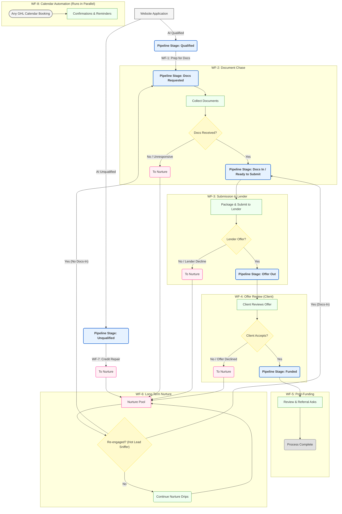
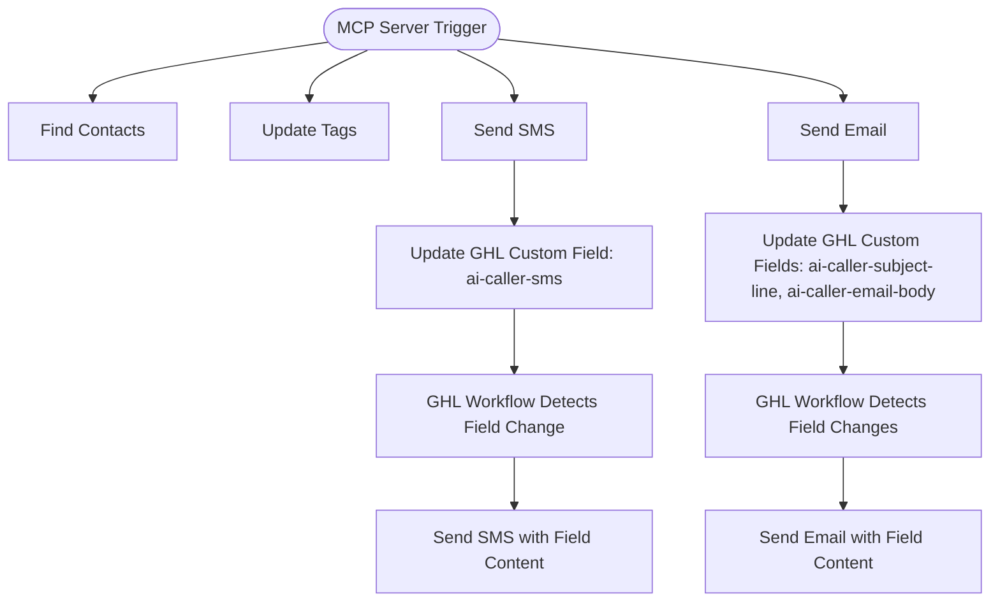

Nexli Funding – Workflow & Tag Playbook

(Last updated 13 May 2025)

This document is the single source of truth for every automation that moves a prospect from website application to Funded deal, plus follow-up review and long-term nurture.
It explains:

| Section | What you'll find |
|---------|-----------------|
| 1. Tag Dictionary | What each tag means and who/what applies it |
| 2. Workflow Summaries | Trigger → goal → key steps for all seven workflows |
| 3. Global "Hot-Lead Sniffer" Trigger | How re-engaged prospects leap out of nurture |
| 4. High-Level Pipeline Overview | Broad overview of the main sales pipeline stages and workflow touchpoints |
| 5. Detailed Mermaid Flowchart | Visual map of the entire journey (renders in any Mermaid viewer) |
| 6. SLA & Reporting Notes | Quick reference for Ops & Management |
| 7. Calendar Appointment Workflow | Confirmation and reminder sequence for all calendar bookings |
| 8. TODO List | Outstanding action items and implementation tasks |
| 9. AI Caller Workflows | Automated AI Caller system and its integration with GoHighLevel (GHL) |

⸻

1 Tag Dictionary

| Tag | Added by | Purpose / Effect |
|-----|----------|------------------|
| form-qualified | Website AI Pre-Qualification → Webhook | Indicates prospect passed initial AI qualification |
| form-unqualified | Website AI Pre-Qualification → Webhook | Bypasses Fast-Five, sends to WF-7 Auto-Disqualify or Credit Repair |
| offerId-tracking | Website → Webhook | Unique identifier for tracking throughout application process |
| credit-stacking | User Selection → Webhook | Routes to MyScoreIQ for credit report |
| revenue-loan | User Selection → Webhook | Routes to document collection for business loans |
| mca-loan | User Selection → Webhook | Routes to document collection for merchant cash advance |
| call-answered | Closer (call disposition) | Branch logic only |
| call-noanswer | Closer | Triggers follow-up loop inside WF-1 |
| call-back | Closer | Creates future dial task; exits WF-1 |
| disqualified | Closer | Ends contact—no further workflows |
| docs-requested | Closer (one-click tag) | Starts WF-2 Docs Chase |
| docs-in | Portal webhook or Ops | Starts WF-3 Submit to Lender |
| submitted | Ops when file sent | Kicks off SLA timer; prerequisite for lender offer |
| lender-decline | Ops | Drops into WF-6 Nurture |
| offer-out | Ops when terms arrive | Starts WF-4 Offer Review |
| offer-declined | Prospect says "no" | Sends to WF-6 Nurture |
| funded | Ops (ACH confirmed) | Starts WF-5 Review & Referral |
| unresponsive-docs | WF-2 auto after 3 nudges | Sends to WF-6 Nurture |
| cold-lead | WF-1 auto after 3 failed calls | Sends to WF-6 Nurture |
| nurture-long | Auto tag inside WF-6 | Indicates contact is in long-term drip |
| re-engaged | Global trigger (reply, click, booking) or rep tag | Pulls contact out of WF-6 and back into pipeline |
| customer-booked-appointment | Calendar (QB8uLe2eg2L0jJwAk8Hq) | Triggers WF-8 Calendar Confirmation flow |

⸻

2 Workflow Summaries

| # | Name & Goal | Trigger | Key Actions | Exit / Next Tag |
|---|------------|---------|------------|----------------|
| WF-1 | Tag for Docs Chase Initiate document request | form-qualified | ① Website applies AI qualification ② Apply docs-requested tag | docs-requested |
| WF-2 | Docs Chase Secure uploads within 72 h | docs-requested | Portal link → event-wait for docs-in with 2 reminder loops | docs-in or unresponsive-docs |
| WF-3 | Submit to Lender Package & send file | docs-in | Internal prep task → Ops adds submitted → await lender → tag offer-out or lender-decline | offer-out / lender-decline |
| WF-4 | Offer Review Show terms; client decision | offer-out | Email+SMS terms + Calendly → event-wait for accept | funded or offer-declined |
| WF-5 | Review & Referral Social proof + upsell | funded | Day 1 review ask; Day 3 referral ask | End after sequence |
| WF-6 | Long-Term Nurture Recycle non-funded leads | unresponsive-docs, cold-lead, lender-decline, offer-declined | 14-day ed emails + 30-day SMS check-in loop | Tag re-engaged (auto) returns them to pipeline |
| WF-7 | Credit Repair Handle form-unqualified leads | form-unqualified | Special intro email explaining credit repair options | Sends to WF-6 Nurture |
| WF-8 | Calendar Confirmations Manage appointment reminders | customer-booked-appointment | Immediate confirmation + 1-day and 1-hour reminders | No exit - standalone flow |

⸻

3 Global Hot-Lead Sniffer Trigger

| Condition (OR logic) | Action |
|----------------------|--------|
| Conversation → Customer Replied | Add re-engaged, remove nurture-long, notify rep |
| Trigger Link "get-started" Clicked | Same as above |
| Appointment Created (any calendar) | Same as above |
| Keyword = READY / START | Same as above |

Follow-up branch:

IF Tag docs-in exists
    → Add Tag submitted
ELSE
    → Add Tag docs-requested

⸻

4 High-Level Pipeline Overview

This flowchart provides a high-level snapshot of the main sales pipeline stages, corresponding GoHighLevel workflows (WF), and how leads progress through the system, including nurture and re-engagement paths.

⸻

5 Detailed Mermaid Flowchart

⸻

6 SLA & Reporting Quick Notes

- Docs-in → Submitted should average < 8 hours.
  - Smart-List: Tag docs-in AND NOT submitted AND lastTagAddedDate > 8h
- Submitted → Offer-out lender SLA = ≤ 24 hours.
  - Alert built in WF-3 (Wait 24 h; if no offer tag, Slack #ops).
- Dashboard KPIs
  - CPL (qualified), Cost per Docs-in, Fund-rate %, Gross Commission, Payback ROAS.
  - Build in Looker Studio pulling GHL pipeline + ad spend sheet.
- Monthly QA
  - Randomly audit 5 funded files: must contain disclosure PDF, signed broker fee page, correct bank statements.

⸻

7 Calendar Appointment Workflow

This workflow triggers automatically when any prospect books a call using any of our calendar links. GoHighLevel Calendar ID: QB8uLe2eg2L0jJwAk8Hq

| Timing | Communication | Content |
|--------|---------------|---------|
| Immediate | Confirmation Email + SMS | Thank you for booking, appointment details, add to calendar link |
| 24h before | Reminder Email + SMS | Reminder of upcoming call, what to expect, any preparation needed |
| 1h before | SMS Only | Quick reminder that call is starting soon |

⸻

8 TODO List

- [x] Review all emails for correct calendar links and automations
- [ ] Set up business review profiles and monitoring:
  - [ ] Google Business Profile
  - [ ] Yelp
  - [ ] Trustpilot
- [ ] Create SOP documentation for lender offer handling process
- [x] Verify all email templates are mobile responsive
- [ ] Test calendar booking flow with confirmation and reminder sequences
- [ ] Set up automated reports for workflow KPIs
- [ ] Create training documentation for new sales team members

⸻

9 AI Caller Workflows

This section documents the automated AI Caller system and its integration with GoHighLevel (GHL) through an MCP server running on n8n.

### System Overview

The AI Caller and LiveKit agent system interacts with GHL through custom fields and webhook triggers. This implementation enables automated calls, SMS, and emails driven by AI conversation workflows.

| Component | Function |
|-----------|----------|
| AI Caller | Manages automated phone conversations with prospects |
| LiveKit Agent | Handles real-time communication protocols |
| MCP Server (n8n) | Middleware that connects the AI system with GHL |

### Custom Field Integration

The system uses custom fields in GHL to trigger communications:

| Custom Field | Used By | Purpose |
|--------------|---------|---------|
| ai-caller-sms | Send SMS | Contains SMS content generated by AI |
| ai-caller-subject-line | Send Email | Contains email subject generated by AI |
| ai-caller-email-body | Send Email | Contains email body content generated by AI |

### GHL Workflow Configuration

A dedicated folder called "AI Caller Workflows" in GHL contains workflows that trigger communication based on custom field updates:

1. **SMS Workflow**:
   - Trigger: Custom field "ai-caller-sms" is populated
   - Action: Send SMS with content from the custom field

2. **Email Workflow**:
   - Trigger: Custom fields "ai-caller-subject-line" and "ai-caller-email-body" are populated
   - Action: Send email using these fields for subject and body content

### Integration Process Flow

### Implementation Notes

- The AI Caller system uses the GHL API through the MCP server to update contact records
- Custom fields are automatically populated by the AI based on conversation context
- All communications are tracked in GHL contact history for compliance and follow-up
- The system respects contact preferences and communication opt-outs

Contact Operations team for access to the AI Caller system and integration documentation.

⸻

Need to change something?
1. Add / rename a tag here first → then update the Trigger or Workflow.
2. Update this doc and bump the "Last updated" date so everyone knows they're reading the latest playbook.

Happy funding!