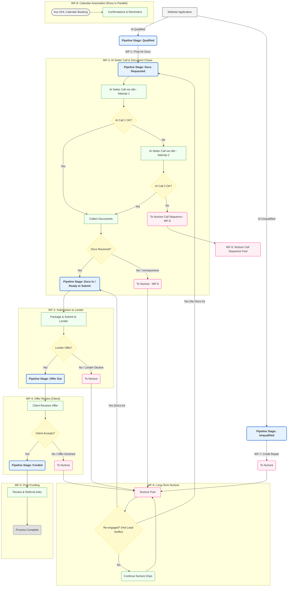
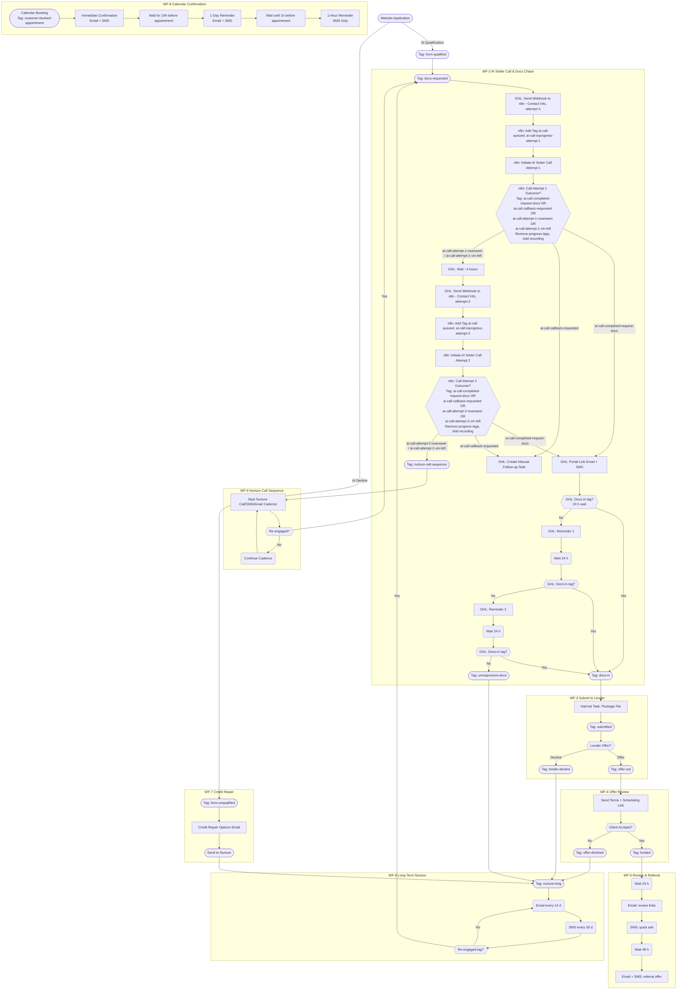
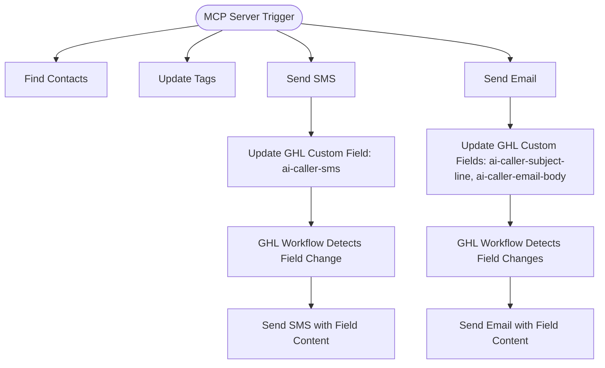

Nexli Funding – Workflow & Tag Playbook

(Last updated 20 May 2025)

This document is the single source of truth for every automation that moves a prospect from website application to Funded deal, plus follow-up review and long-term nurture.
It explains:

| Section | What you'll find |
|---------|-----------------|
| 1. Tag Dictionary | What each tag means and who/what applies it |
| 2. Workflow Summaries | Trigger → goal → key steps for all seven workflows |
| 3. Global "Hot-Lead Sniffer" Trigger | How re-engaged prospects leap out of nurture |
| 4. High-Level Pipeline Overview | Broad overview of the main sales pipeline stages and workflow touchpoints |
| 5. Detailed Mermaid Flowchart | Visual map of the entire journey (renders in any Mermaid viewer) |
| 6. GoHighLevel Automation Implementation Guide | How to build these automations in GoHighLevel |
| 7. SLA & Reporting Notes | Quick reference for Ops & Management |
| 8. Calendar Appointment Workflow | Confirmation and reminder sequence for all calendar bookings |
| 9. TODO List | Outstanding action items and implementation tasks |
| 10. AI Caller Workflows | Automated AI Caller system and its integration with GoHighLevel (GHL) |

⸻

1 Tag Dictionary

| Tag | Added by | Purpose / Effect |
|-----|----------|------------------|
| form-qualified | Website AI Pre-Qualification → Webhook | Indicates prospect passed initial AI qualification |
| form-unqualified | Website AI Pre-Qualification → Webhook | Bypasses Fast-Five, sends to WF-7 Auto-Disqualify or Credit Repair |
| offerId-tracking | Website → Webhook | Unique identifier for tracking throughout application process |
| credit-stacking | User Selection → Webhook | Routes to MyScoreIQ for credit report |
| revenue-loan | User Selection → Webhook | Routes to document collection for business loans |
| mca-loan | User Selection → Webhook | Routes to document collection for merchant cash advance |
| call-answered | n8n / AI Setter | AI Setter call was answered by the prospect. |
| call-noanswer | n8n / AI Setter | AI Setter call was not answered. |
| call-back | Closer or n8n / AI Setter | Creates future dial task or indicates prospect requested callback during AI call; exits WF-1 or specific AI call loop. |
| disqualified | Closer | Ends contact—no further workflows |
| docs-requested | WF-1 (auto) or Manual | Starts WF-2 (AI Setter Call initiation, then Docs Chase if call successful). |
| docs-in | Portal webhook or Ops | Indicates all requested docs are uploaded by prospect after successful AI call; Triggers WF-3 Submit to Lender. |
| ai-call-queued | n8n / AI Setter | AI setter call has been successfully queued in n8n after receiving a webhook from GHL. |
| ai-call-inprogress | n8n / AI Setter | AI setter call is actively being attempted or is underway (can be attempt-specific, e.g., `ai-call-inprogress-attempt-1`). |
| ai-call-vm-left | n8n / AI Setter | AI Setter left a voicemail during an attempted call. (Deprecated, see attempt-specific tags) |
| ai-call-callback-requested | n8n / AI Setter | Prospect explicitly requested a callback during the AI Setter call. Triggers manual task or specific follow-up. |
| ai-call-completed-request-docs | n8n / AI Setter | AI Setter call concluded, prospect agreed to provide documents. Triggers GHL to send portal link & instructions. |
| ai-call-attempt-1-noanswer | n8n / AI Setter | First AI call attempt was not answered. Triggers GHL for same-day retry. |
| ai-call-attempt-1-vm-left | n8n / AI Setter | First AI call attempt resulted in a voicemail being left. Triggers GHL for same-day retry. |
| ai-call-attempt-2-noanswer | n8n / AI Setter | Second AI call attempt was not answered. Triggers move to WF-9 Nurture Call Sequence. |
| ai-call-attempt-2-vm-left | n8n / AI Setter | Second AI call attempt resulted in a voicemail being left. Triggers move to WF-9 Nurture Call Sequence. |
| nurture-call-sequence | GHL (WF-2) | Contact has had two unsuccessful AI call attempts and is moved to a longer-term nurture call sequence (WF-9). |
| submitted | Ops (manual, post-prep) | File packaged and sent to lender. Kicks off SLA timer; prerequisite for lender offer. |
| lender-decline | Ops | Drops into WF-6 Nurture |
| offer-out | Ops when terms arrive | Starts WF-4 Offer Review |
| offer-declined | Prospect says "no" | Sends to WF-6 Nurture |
| funded | Ops (ACH confirmed) | Starts WF-5 Review & Referral |
| unresponsive-docs | WF-2 auto after 3 nudges | Sends to WF-6 Nurture |
| cold-lead | WF-1 auto after 3 failed calls | Sends to WF-6 Nurture |
| nurture-long | Auto tag inside WF-6 | Indicates contact is in long-term drip |
| re-engaged | Global trigger (reply, click, booking) or rep tag | Pulls contact out of WF-6 and back into pipeline |
| customer-booked-appointment | Calendar (QB8uLe2eg2L0jJwAk8Hq) | Triggers WF-8 Calendar Confirmation flow |

⸻

2 Workflow Summaries

| # | Name & Goal | Trigger | Key Actions | Exit / Next Tag |
|---|------------|---------|------------|----------------|
| WF-1 | Tag for Docs Chase Initiate document request | form-qualified | ① Website applies AI qualification ② Apply docs-requested tag | docs-requested |
| WF-2 | AI Setter Call (2 Attempts) & Docs Chase AI attempts to qualify for docs (max 2 calls same day), then secure uploads. | docs-requested | **Attempt 1:** ① GHL: Webhook to n8n (payload: contact info, attempt=1). ② n8n: Adds `ai-call-queued`, `ai-call-inprogress-attempt-1`. ③ n8n: On call end, adds ONE of: `ai-call-completed-request-docs`, `ai-call-callback-requested`, `ai-call-attempt-1-noanswer`, `ai-call-attempt-1-vm-left`. Removes progress tags. Adds recording link. **GHL Listens for Attempt 1 Outcomes:** ④ IF `ai-call-completed-request-docs`: GHL sends Portal link email/SMS → event-wait for `docs-in` with 2 reminder loops. ⑤ IF `ai-call-callback-requested`: GHL creates task for manual follow-up. ⑥ IF `ai-call-attempt-1-noanswer` OR `ai-call-attempt-1-vm-left`: GHL waits ~4 hours.    **Attempt 2 (after wait):**    ⑦ GHL: Webhook to n8n (payload: contact info, attempt=2).    ⑧ n8n: Adds `ai-call-queued`, `ai-call-inprogress-attempt-2`.    ⑨ n8n: On call end, adds ONE of: `ai-call-completed-request-docs`, `ai-call-callback-requested`, `ai-call-attempt-2-noanswer`, `ai-call-attempt-2-vm-left`. Removes progress tags. Adds recording.    **GHL Listens for Attempt 2 Outcomes:**    ⑩ IF `ai-call-completed-request-docs`: As per step ④.    ⑪ IF `ai-call-callback-requested`: As per step ⑤.    ⑫ IF `ai-call-attempt-2-noanswer` OR `ai-call-attempt-2-vm-left`: GHL adds `nurture-call-sequence` tag (triggers WF-9). | `docs-in` (happy path from either attempt) `unresponsive-docs` (if no upload after portal sent) `nurture-call-sequence` (after 2 failed attempts) Manual follow-up for `ai-call-callback-requested` (from either attempt) |
| WF-3 | Submit to Lender Package & send file | docs-in | Internal prep task → Ops adds submitted → await lender → tag offer-out or lender-decline | offer-out / lender-decline |
| WF-4 | Offer Review Show terms; client decision | offer-out | Email+SMS terms + Calendly → event-wait for accept | funded or offer-declined |
| WF-5 | Review & Referral Social proof + upsell | funded | Day 1 review ask; Day 3 referral ask | End after sequence |
| WF-6 | Long-Term Nurture Recycle non-funded leads | unresponsive-docs, cold-lead, lender-decline, offer-declined | 14-day ed emails + 30-day SMS check-in loop | Tag re-engaged (auto) returns them to pipeline |
| WF-7 | Credit Repair Handle form-unqualified leads | form-unqualified | Special intro email explaining credit repair options | Sends to WF-6 Nurture |
| WF-8 | Calendar Confirmations Manage appointment reminders | customer-booked-appointment | Immediate confirmation + 1-day and 1-hour reminders | No exit - standalone flow |
| WF-9 | Nurture Call Sequence Longer-term call follow-up for AI non-contacts | `nurture-call-sequence` (applied by WF-2 after 2 failed AI calls) | Automated sequence of spaced-out call attempts (manual or AI, TBD) and value-based SMS/emails. | `re-engaged` (if contact responds/books) `disqualified` (if explicitly opts out) |

⸻

3 Global Hot-Lead Sniffer Trigger

| Condition (OR logic) | Action |
|----------------------|--------|
| Conversation → Customer Replied | Add re-engaged, remove nurture-long, notify rep |
| Trigger Link "get-started" Clicked | Same as above |
| Appointment Created (any calendar) | Same as above |
| Keyword = READY / START | Same as above |

Follow-up branch:

IF Tag docs-in exists
    → Add Tag submitted
ELSE
    → Add Tag docs-requested

⸻

4 High-Level Pipeline Overview

This flowchart provides a high-level snapshot of the main sales pipeline stages, corresponding GoHighLevel workflows (WF), and how leads progress through the system, including nurture and re-engagement paths.

```mermaid
graph TD;
    A[Website Application] -->|AI Qualified| QS(Pipeline Stage: Qualified);
    A -->|AI Unqualified| UQ(Pipeline Stage: Unqualified);

    UQ -- "WF-7: Credit Repair" --> ToNurture1(To Nurture);
    
    QS -- "WF-1: Prep for Docs" --> DR(Pipeline Stage: Docs Requested);
    
    subgraph "WF-2: AI Setter Call & Document Chase"
        DR --> WF2_AICall[AI Setter Call via n8n - Attempt 1];
        WF2_AICall --> WF2_AICallOutcome{AI Call 1 OK?};
        WF2_AICallOutcome -- Yes --> WF2_DocProcess[Collect Documents];
        WF2_DocProcess --> WF2_DocDecision{Docs Received?};
        WF2_DocDecision -- Yes --> DS(Pipeline Stage: Docs In / Ready to Submit);
        WF2_DocDecision -- No / Unresponsive --> ToNurture2(To Nurture - WF-6);
        WF2_AICallOutcome -- No --> WF2_AICallRetry[AI Setter Call via n8n - Attempt 2];
        WF2_AICallRetry --> WF2_AICallRetryOutcome{AI Call 2 OK?};
        WF2_AICallRetryOutcome -- Yes --> WF2_DocProcess;
        WF2_AICallRetryOutcome -- No --> ToNurtureCallSeq(To Nurture Call Sequence - WF-9);
    end

    subgraph "WF-3: Submission to Lender"
        DS --> WF3_Process[Package & Submit to Lender];
        WF3_Process --> WF3_Decision{Lender Offer?};
        WF3_Decision -- Yes --> HO(Pipeline Stage: Offer Out);
        WF3_Decision -- No / Lender Decline --> ToNurture3(To Nurture);
    end

    subgraph "WF-4: Offer Review (Client)"
        HO --> WF4_Process[Client Reviews Offer];
        WF4_Process --> WF4_Decision{Client Accepts?};
        WF4_Decision -- Yes --> F(Pipeline Stage: Funded);
        WF4_Decision -- No / Offer Declined --> ToNurture4(To Nurture);
    end

    subgraph "WF-5: Post-Funding"
        F --> WF5_Process[Review & Referral Asks];
        WF5_Process --> Done(Process Complete);
    end
    
    ToNurture1 --> N;
    ToNurture2 --> N;
    ToNurture3 --> N;
    ToNurture4 --> N;

    ToNurtureCallSeq --> NCS[WF-9: Nurture Call Sequence Pool];

    subgraph "WF-6: Long-Term Nurture"
        N[Nurture Pool] --> N_ReEngage{"Re-engaged? (Hot Lead Sniffer)"};
        N_ReEngage -- "Yes (No Docs-In)" --> DR;
        N_ReEngage -- "Yes (Docs-In)" --> DS;
        N_ReEngage -- No --> N_Loop(Continue Nurture Drips);
        N_Loop --> N;
    end
    
    subgraph "WF-8: Calendar Automation (Runs in Parallel)"
        CalendarBooking([Any GHL Calendar Booking]) --> WF8_Process[Confirmations & Reminders];
    end

    classDef pipelineStage fill:#e6f2ff,stroke:#0052cc,stroke-width:2px,font-weight:bold;
    class QS,UQ,DR,DS,HO,F pipelineStage

    classDef workflowBlock fill:#f0fff0,stroke:#228B22,stroke-width:1px;
    class WF2_AICall,WF2_AICallRetry,WF2_DocProcess,WF3_Process,WF4_Process,WF5_Process,WF8_Process,N_Loop workflowBlock
    
    classDef nurtureNode fill:#fff0f5,stroke:#FF69B4,stroke-width:2px;
    class N,ToNurture1,ToNurture2,ToNurture3,ToNurture4,ToNurtureCallSeq,NCS nurtureNode

    classDef decision fill:#FFFACD,stroke:#FFD700,stroke-width:1px;
    class WF2_AICallOutcome,WF2_AICallRetryOutcome,WF2_DocDecision,WF3_Decision,WF4_Decision,N_ReEngage decision

    classDef entryPoint fill:#F5F5F5,stroke:#808080,stroke-width:2px;
    class A,CalendarBooking entryPoint

    classDef endPoint fill:#E0E0E0,stroke:#A0A0A0,stroke-width:2px;
    class Done endPoint
```

⸻

5 Detailed Mermaid Flowchart

```mermaid
graph TD;
    %% ---------- LEAD ENTRY POINT ----------
    Z1([Website Application])
    Z1 -->|AI Qualification| A1([Tag: form-qualified])
    Z1 -->|AI Decline| A0([Tag: form-unqualified])
    
    %% ---------- LOAN TYPE SELECTION / INITIAL STEPS ----------
    A1 --> A5([Tag: docs-requested])
    
    %% ---------- WF-7 CREDIT REPAIR ----------
    subgraph CreditRepair["WF-7 Credit Repair"]
        A0 --> A0a[Credit Repair Options Email]
        A0a --> A0b([Send to Nurture])
    end
    
    %% ---------- WF-2 AI SETTER CALL & DOCS CHASE ----------
    subgraph AICallAndDocsChase["WF-2 AI Setter Call & Docs Chase"]
        A5 --> B0_GHL_Webhook[GHL: Send Webhook to n8n - Contact Info, attempt=1]
        B0_GHL_Webhook --> B0_n8n_Queue[n8n: Add Tag ai-call-queued, ai-call-inprogress-attempt-1]
        B0_n8n_Queue --> B0_n8n_Call[n8n: Initiate AI Setter Call Attempt 1]
        B0_n8n_Call --> B0_n8n_Outcome1{{n8n: Call Attempt 1 Outcome?<br/>Tag: ai-call-completed-request-docs OR<br/>ai-call-callback-requested OR<br/>ai-call-attempt-1-noanswer OR<br/>ai-call-attempt-1-vm-left<br/>Remove progress tags, Add recording}}

        B0_n8n_Outcome1 -- "ai-call-completed-request-docs" --> B1_GHL_SendDocs[GHL: Portal Link Email + SMS]
        B1_GHL_SendDocs --> B2_GHL_WaitDocs{{GHL: Docs-in tag?<br/>24 h wait}}
        B2_GHL_WaitDocs -->|Yes| B8([Tag: docs-in])
        B2_GHL_WaitDocs -->|No| R1_GHL[GHL: Reminder 1] --> W1_GHL(Wait 24 h) --> B3_GHL_WaitDocs{{GHL: Docs-in tag?}}
        B3_GHL_WaitDocs -->|Yes| B8
        B3_GHL_WaitDocs -->|No| R2_GHL[GHL: Reminder 2] --> W2_GHL(Wait 24 h) --> B4_GHL_WaitDocs{{GHL: Docs-in tag?}}
        B4_GHL_WaitDocs -->|Yes| B8
        B4_GHL_WaitDocs -->|No| B5([Tag: unresponsive-docs])

        B0_n8n_Outcome1 -- "ai-call-callback-requested" --> B_CallbackTask[GHL: Create Manual Follow-up Task]
        B0_n8n_Outcome1 -- "ai-call-attempt-1-noanswer / ai-call-attempt-1-vm-left" --> B_WaitRetry[GHL: Wait ~4 hours]
        
        B_WaitRetry --> B0_GHL_Webhook_Retry[GHL: Send Webhook to n8n - Contact Info, attempt=2]
        B0_GHL_Webhook_Retry --> B0_n8n_Queue_Retry[n8n: Add Tag ai-call-queued, ai-call-inprogress-attempt-2]
        B0_n8n_Queue_Retry --> B0_n8n_Call_Retry[n8n: Initiate AI Setter Call Attempt 2]
        B0_n8n_Call_Retry --> B0_n8n_Outcome2{{n8n: Call Attempt 2 Outcome?<br/>Tag: ai-call-completed-request-docs OR<br/>ai-call-callback-requested OR<br/>ai-call-attempt-2-noanswer OR<br/>ai-call-attempt-2-vm-left<br/>Remove progress tags, Add recording}}

        B0_n8n_Outcome2 -- "ai-call-completed-request-docs" --> B1_GHL_SendDocs
        B0_n8n_Outcome2 -- "ai-call-callback-requested" --> B_CallbackTask
        B0_n8n_Outcome2 -- "ai-call-attempt-2-noanswer / ai-call-attempt-2-vm-left" --> B_ToNurtureCallSeq([Tag: nurture-call-sequence])
    end

    %% ---------- WF-3 SUBMIT TO LENDER ----------
    subgraph Submit["WF-3 Submit to Lender"]
        B8 --> C1[Internal Task: Package File]
        C1 --> C2([Tag: submitted])
        C2 --> C3{{Lender Offer?}}
        C3 -->|Offer| C4([Tag: offer-out])
        C3 -->|Decline| C5([Tag: lender-decline])
    end

    %% ---------- WF-4 OFFER REVIEW ----------
    subgraph OfferReview["WF-4 Offer Review"]
        C4 --> D1[Send Terms + Scheduling Link]
        D1 --> D2{{Client Accepts?}}
        D2 -->|Yes| D3([Tag: funded])
        D2 -->|No| D4([Tag: offer-declined])
    end

    %% ---------- WF-5 REVIEW & REFERRAL ----------
    subgraph ReviewReq["WF-5 Review & Referral"]
        D3 --> E1(Wait 24 h)
        E1 --> E2[Email: review links]
        E2 --> E3(SMS: quick ask)
        E3 --> E4(Wait 48 h)
        E4 --> E5[Email + SMS: referral offer]
    end

    %% ---------- WF-6 LONG-TERM NURTURE ----------
    subgraph Nurture["WF-6 Long-Term Nurture"]
        A0b --> N1([Tag: nurture-long])
        B5 --> N1
        C5 --> N1
        D4 --> N1
        N1 --> N2(Email every 14 d)
        N2 --> N3_sms(SMS every 30 d)
        N3_sms --> N4_reEngage{{Re-engaged tag?}}
        N4_reEngage -->|Yes| A5
        N4_reEngage -->|No| N2
    end
    
    %% ---------- WF-9 NURTURE CALL SEQUENCE ----------
    subgraph NurtureCallSeq["WF-9 Nurture Call Sequence"]
        B_ToNurtureCallSeq --> NCS1[Start Nurture Call/SMS/Email Cadence]
        NCS1 --> NCS2{{Re-engaged?}}
        NCS2 -->|Yes| A5
        NCS2 -->|No| NCS_Loop(Continue Cadence)
        NCS_Loop --> NCS1
    end
    
    %% ---------- WF-8 CALENDAR CONFIRMATION FLOW ----------
    subgraph CalendarFlow["WF-8 Calendar Confirmation"]
        CAL1([Calendar Booking<br/>Tag: customer-booked-appointment])
        CAL1 --> CAL2[Immediate Confirmation<br/>Email + SMS]
        CAL2 --> CAL3(Wait for 24h before appointment)
        CAL3 --> CAL4[1-Day Reminder<br/>Email + SMS]
        CAL4 --> CAL5(Wait until 1h before appointment)
        CAL5 --> CAL6[1-Hour Reminder<br/>SMS Only]
    end

```

⸻

6 GoHighLevel Automation Implementation Guide

This section provides a general framework and considerations for building out the Nexli Funding pipeline automations within GoHighLevel (GHL). Refer to the "Tag Dictionary" (Section 1), "Workflow Summaries" (Section 2), and the "Detailed Mermaid Flowchart" (Section 5) as the primary blueprints for your GHL Workflows.

**General Principles:**

*   **One Workflow per Documented WF:** For clarity and manageability, aim to create a distinct GHL Workflow for each of the WFs (WF-1 through WF-8) outlined in the "Workflow Summaries" section.
*   **Tag-Driven Logic:** Tags are the primary drivers of this automation.
    *   Most GHL Workflows will be triggered by a specific tag being added (e.g., docs-requested triggers WF-2).
    *   Workflows will often conclude by adding a new tag to trigger the next Workflow or move the contact to a nurture sequence (e.g., WF-2 adds docs-in or unresponsive-docs).
*   **GHL Pipeline Stages:** Align GHL Pipeline Stages with the key milestones in the flowcharts (e.g., "Qualified", "Docs Requested", "Docs In", "Offer Out", "Funded"). Automate moving contacts between these pipeline stages using your GHL Workflows, typically triggered by tag additions.
*   **Clear Naming Conventions:** Use consistent and descriptive names for your GHL Workflows, Triggers, Actions, and any custom fields or values. This will make troubleshooting and maintenance easier. (e.g., "Nexli WF-2: Docs Chase", Trigger: "Tag Added - docs-requested").

**Workflow-Specific Implementation Notes (Examples):**

*   **WF-1 (Tag for Docs Chase):**
    *   Trigger: Tag form-qualified is added.
    *   Action: Add tag docs-requested.
    *   Action: Move to "Docs Requested" pipeline stage in GHL.
*   **WF-2 (AI Setter Call (2 Attempts) & Docs Chase):**
    *   Trigger: Tag `docs-requested` is added.
    *   **Attempt 1 - GHL to n8n (AI Call Initiation):**
        *   Action: Send Webhook to your n8n server. 
            *   Payload should include contact identifiers and a field indicating `attempt=1`.
        *   (n8n will apply `ai-call-queued`, `ai-call-inprogress-attempt-1`, and then one outcome tag: `ai-call-completed-request-docs`, `ai-call-callback-requested`, `ai-call-attempt-1-noanswer`, or `ai-call-attempt-1-vm-left`. n8n removes progress tags and adds recording link to GHL custom field.)

    *   **GHL Listens for Attempt 1 Outcomes (Separate GHL Workflow Triggers or If/Else branches):**
        *   Trigger: Tag `ai-call-completed-request-docs` is added (by n8n, from any attempt).
            *   Action: Send initial email/SMS with portal link for document upload (ensure this part of the workflow can be re-entered if attempt 2 is successful).
            *   Use "Wait" steps with "Event - Contact Tag" conditions to check for `docs-in` tag.
                *   If `docs-in` added: Add `docs-in` tag. Move to "Docs In / Ready to Submit" pipeline stage. (End of this path for WF-2)
                *   If not, send Reminder 1. Wait again.
                *   If still not, send Reminder 2. Wait again.
                *   If still no `docs-in`, add `unresponsive-docs` tag and move to Nurture (WF-6).
        *   Trigger: Tag `ai-call-callback-requested` is added (by n8n, from any attempt).
            *   Action: Create a manual task for sales rep: "Contact requested callback. Review recording: [link]. Attempt: [custom field for attempt number]."
            *   Action: Potentially move to "On Hold / Call Back" pipeline stage.
        *   Trigger: Tag `ai-call-attempt-1-noanswer` OR `ai-call-attempt-1-vm-left` is added (by n8n).
            *   Action: Wait ~4 hours (use GHL Wait step).
            *   **Attempt 2 - GHL to n8n (AI Call Re-Initiation):**
                *   Action: Send Webhook to your n8n server (similar to first, but with `attempt=2`).
                *   (n8n applies `ai-call-queued`, `ai-call-inprogress-attempt-2`, then an outcome: `ai-call-completed-request-docs`, `ai-call-callback-requested`, `ai-call-attempt-2-noanswer`, or `ai-call-attempt-2-vm-left`. n8n removes progress tags and adds recording link.)

    *   **GHL Listens for Attempt 2 Outcomes (Further branches or separate GHL Workflow Triggers):**
        *   Trigger: Tag `ai-call-attempt-2-noanswer` OR `ai-call-attempt-2-vm-left` is added (by n8n).
            *   Action: Add tag `nurture-call-sequence` (this will trigger WF-9).
            *   Action: Move to "Nurture" pipeline stage (or a specific "Nurture - Call Cadence" stage if created).

*   **WF-3 (Submit to Lender):**
    *   Trigger: Tag `docs-in` is added.
    *   Action: Create internal task for Ops to package file.
    *   (Manual step by Ops): Ops adds submitted tag once done.
    *   Wait step for lender decision (could be a manual tag update by Ops: offer-out or lender-decline).
*   **WF-6 (Long-Term Nurture):**
    *   Trigger: Tags `unresponsive-docs`, `cold-lead`, `lender-decline`, or `offer-declined` are added.
    *   Action: Add `nurture-long` tag.
    *   Action: Start email/SMS drip sequences (e.g., "Wait X days", "Send Email Y").
*   **WF-9 (Nurture Call Sequence):**
    *   Trigger: Tag `nurture-call-sequence` is added (by WF-2 after two failed AI call attempts).
    *   Purpose: To place contacts into a longer-term, less frequent call cadence, potentially mixed with value-driven SMS/emails.
    *   Actions:
        *   Add to a specific GHL list or Smart List for this sequence.
        *   Initiate a GHL workflow that includes spaced-out call tasks (manual) or triggers for a different, less aggressive AI call campaign (if applicable).
        *   Include steps for sending value-based emails or SMS messages between call attempts.
        *   Ensure Global Hot-Lead Sniffer logic can pull contacts from this workflow if they re-engage.
    *   Exit: `re-engaged` tag applied, or `disqualified`.

*   **Global Hot-Lead Sniffer (Implemented as separate GHL Workflows):**
    *   Create separate GHL Workflows for each condition:
        *   Trigger: Customer Replied → Action: Add re-engaged, remove nurture-long, notify rep.
        *   Trigger: Trigger Link Clicked ("get-started") → Action: Same as above.
        *   Trigger: Appointment Booked (Any Calendar) → Action: Same as above.
        *   Trigger: Specific Inbound SMS Keyword (e.g., "READY", "START") → Action: Same as above.
    *   For the follow-up branch:
        *   After adding re-engaged, use an IF/ELSE condition:
            *   IF contact has docs-in tag → Add submitted tag.
            *   ELSE → Add docs-requested tag.

**Key GHL Features to Utilize:**

*   **Workflow Triggers:** Primarily "Contact Tag Added". Also "Customer Replied", "Trigger Link Clicked", "Appointment Status Changed", "Inbound Webhook" (for website/AI integration).
*   **Workflow Actions:** "Add Tag", "Remove Tag", "Send Email", "Send SMS", "Wait", "If/Else", "Create/Update Opportunity" (to move pipeline stages), "Add Task", "Notify Internal User/Team".
*   **Custom Fields:** For storing data like offerId-tracking or any other specific information not covered by standard fields.
*   **Calendars & Appointments:** Use GHL calendar bookings to trigger WF-8 and potentially the "Hot-Lead Sniffer."
*   **Trigger Links:** For tracking engagement in emails/SMS and re-engaging leads.
*   **Email & SMS Templates:** Create and use standardized templates for all communications.
*   **Reporting:** Leverage GHL's reporting and Smart Lists to monitor workflow performance and SLAs (as noted in Section 7 - soon to be Section 8).

**Webhook Integration (e.g., Website AI Pre-Qualification):**

*   The form-qualified and form-unqualified tags are noted as being applied via Webhook from your Website AI.
*   In GHL, you'll set up "Inbound Webhook" triggers in the relevant Workflows.
*   Your website/AI system will then need to be configured to send a POST request to these GHL webhook URLs with the contact's information and the appropriate data to identify them (e.g., email or phone) when a qualification decision is made.
*   The GHL Workflow can then parse the incoming data and apply the correct tag (form-qualified or form-unqualified).

**Testing:**

*   Thoroughly test each GHL Workflow individually and then test the end-to-end flow with test contacts.
*   Verify tags are added/removed correctly, communications are sent, pipeline stages are updated, and contacts move to the correct subsequent workflows or nurture sequences.

This guide provides a starting point. You'll need to adapt and refine these suggestions based on the specific capabilities and UI of your GoHighLevel instance.

**Synchronizing Pipeline Stages and Tag-Driven Automations**

It's crucial that your GHL pipeline stages accurately reflect a lead's progress through the automated workflows, and vice-versa. This ensures both manual actions by sales reps and automated processes work in harmony.

There are two main ways a lead's pipeline stage will change:

1.  **Workflow-Driven Stage Changes (Primary Method):**
    *   As outlined in the "General Principles" and "Workflow-Specific Implementation Notes," your main GHL Workflows (WF-1 to WF-8) should be responsible for moving leads to the correct pipeline stage *after* the relevant actions are completed and tags are applied.
    *   **How to Build:**
        *   At the end of a workflow sequence (or at a key milestone within it), after a defining tag is added (e.g., docs-in is added by WF-2), use the GHL workflow action "Create/Update Opportunity" (or "Move Opportunity").
        *   Configure this action to place the contact into the pipeline stage that corresponds to the tag just applied (e.g., move to "Docs In / Ready to Submit" stage when docs-in tag is added).
    *   **Benefit:** This keeps the pipeline view automatically updated based on actual automation progress.

2.  **Manual Stage Changes by Sales Team (Drag-and-Drop in Pipeline):**
    *   Sales team members might manually drag a lead from one pipeline stage to another. To keep your tag-based automations in sync, you need to react to these manual changes.
    *   **How to Build:**
        *   For each pipeline stage that a salesperson might manually drag a lead *into*, create a simple GHL Workflow (or a new trigger within an existing workflow, though separate can be cleaner for this specific purpose).
        *   **Trigger:** Use the GHL trigger "Pipeline Stage Changed".
            *   Filter this trigger to specify:
                *   The specific pipeline ("Nexli Funding Pipeline" or your equivalent).
                *   The specific stage the contact was moved *into* (e.g., "Docs Requested").
        *   **Action:**
            *   The primary action should be to **add the main defining tag** associated with that new pipeline stage (e.g., if moved to "Docs Requested" stage, the workflow adds the docs-requested tag).
            *   **Crucial Condition:** Add a condition to this action (often available directly in the "Add Tag" action settings or by using an If/Else branch): "Only add tag if contact does NOT already have tag X" (where X is the tag being added). This prevents re-triggering workflows unnecessarily if the tag was already applied by an automated process and avoids issues with applying a tag that's already present.
            *   Consider if any other tags need to be removed (e.g., a tag from a previous stage if it wasn't automatically removed by another process).
            *   Optionally, you can add a notification to the sales rep or Ops if a manual move has specific implications.
    *   **Benefit:** When a lead is manually dragged, the system automatically applies the correct underlying tag. This ensures:
        *   The contact record is correctly tagged for reporting and segmentation.
        *   If the applied tag is a trigger for a main workflow (and the lead hasn't been processed by it for this stage), that workflow can then pick up and continue the automation from that point.

**Key to Keeping it "Nice and Neat":**

*   **Define Primary Tags for Stages:** As a rule, each of your GHL pipeline stages should have one primary tag that signifies a contact has officially reached that point (e.g., "Docs Requested" stage <=> docs-requested tag). This makes the synchronization logic straightforward.
*   **Workflow Responsibility:**
    *   Your main, multi-step workflows (WF-1 to WF-8) are responsible for *doing the work* (sending emails, waiting, etc.) and then updating both the tag and the GHL pipeline stage.
    *   The smaller "Pipeline Stage Changed" triggered workflows are primarily responsible for *tag sanitation* when manual moves occur, ensuring the tags reflect the manual stage placement and kickstarting main workflows if appropriate.
*   **Avoid Conflicting Triggers:** Be mindful that a tag added by a "Pipeline Stage Changed" workflow doesn't inadvertently cause a loop by re-triggering the same stage change. The "only add tag if not already present" condition is key here.

By setting up this two-way synchronization, your sales team can use the visual pipeline for manual adjustments, while your core automations reliably drive leads through the process based on tags, keeping everything aligned.

⸻

7 SLA & Reporting Quick Notes

- Docs-in → Submitted should average < 8 hours.
  - Smart-List: Tag docs-in AND NOT submitted AND lastTagAddedDate > 8h
- Submitted → Offer-out lender SLA = ≤ 24 hours.
  - Alert built in WF-3 (Wait 24 h; if no offer tag, Slack #ops).
- Dashboard KPIs
  - CPL (qualified), Cost per Docs-in, Fund-rate %, Gross Commission, Payback ROAS.
  - Build in Looker Studio pulling GHL pipeline + ad spend sheet.
- Monthly QA
  - Randomly audit 5 funded files: must contain disclosure PDF, signed broker fee page, correct bank statements.

⸻

8 Calendar Appointment Workflow

This workflow triggers automatically when any prospect books a call using any of our calendar links. GoHighLevel Calendar ID: QB8uLe2eg2L0jJwAk8Hq

| Timing | Communication | Content |
|--------|---------------|---------|
| Immediate | Confirmation Email + SMS | Thank you for booking, appointment details, add to calendar link |
| 24h before | Reminder Email + SMS | Reminder of upcoming call, what to expect, any preparation needed |
| 1h before | SMS Only | Quick reminder that call is starting soon |

⸻

9 TODO List

- [x] Review all emails for correct calendar links and automations
- [ ] Set up business review profiles and monitoring:
  - [ ] Google Business Profile
  - [ ] Yelp
  - [ ] Trustpilot
- [ ] Create SOP documentation for lender offer handling process
- [x] Verify all email templates are mobile responsive
- [ ] Test calendar booking flow with confirmation and reminder sequences
- [ ] Set up automated reports for workflow KPIs
- [ ] Create training documentation for new sales team members

⸻

10 AI Caller Workflows

This section documents the automated AI Caller system and its integration with GoHighLevel (GHL) through an MCP server running on n8n.

### System Overview

The AI Caller and LiveKit agent system interacts with GHL through custom fields and webhook triggers. This implementation enables automated calls, SMS, and emails driven by AI conversation workflows.

| Component | Function |
|-----------|----------|
| AI Caller | Manages automated phone conversations with prospects |
| LiveKit Agent | Handles real-time communication protocols |
| MCP Server (n8n) | Middleware that connects the AI system with GHL |

### Custom Field Integration

The system uses custom fields in GHL to trigger communications:

| Custom Field | Used By | Purpose |
|--------------|---------|---------|
| ai-caller-sms | Send SMS | Contains SMS content generated by AI |
| ai-caller-subject-line | Send Email | Contains email subject generated by AI |
| ai-caller-email-body | Send Email | Contains email body content generated by AI |

### GHL Workflow Configuration

A dedicated folder called "AI Caller Workflows" in GHL contains workflows that trigger communication based on custom field updates:

1. **SMS Workflow**:
   - Trigger: Custom field "ai-caller-sms" is populated
   - Action: Send SMS with content from the custom field

2. **Email Workflow**:
   - Trigger: Custom fields "ai-caller-subject-line" and "ai-caller-email-body" are populated
   - Action: Send email using these fields for subject and body content

### Integration Process Flow

```mermaid
graph TD;
    A1([MCP Server Trigger]) --> B1[Find Contacts]
    A1 --> B2[Update Tags]
    A1 --> B3[Send SMS]
    A1 --> B4[Send Email]
    
    B3 --> C1[Update GHL Custom Field: ai-caller-sms]
    B4 --> C2[Update GHL Custom Fields: ai-caller-subject-line, ai-caller-email-body]
    
    C1 --> D1[GHL Workflow Detects Field Change]
    C2 --> D2[GHL Workflow Detects Field Changes]
    
    D1 --> E1[Send SMS with Field Content]
    D2 --> E2[Send Email with Field Content]
```

### Implementation Notes

- The AI Caller system uses the GHL API through the MCP server to update contact records
- Custom fields are automatically populated by the AI based on conversation context
- All communications are tracked in GHL contact history for compliance and follow-up
- The system respects contact preferences and communication opt-outs

Contact Operations team for access to the AI Caller system and integration documentation.

⸻

Need to change something?
1. Add / rename a tag here first → then update the Trigger or Workflow.
2. Update this doc and bump the "Last updated" date so everyone knows they're reading the latest playbook.

Happy funding!