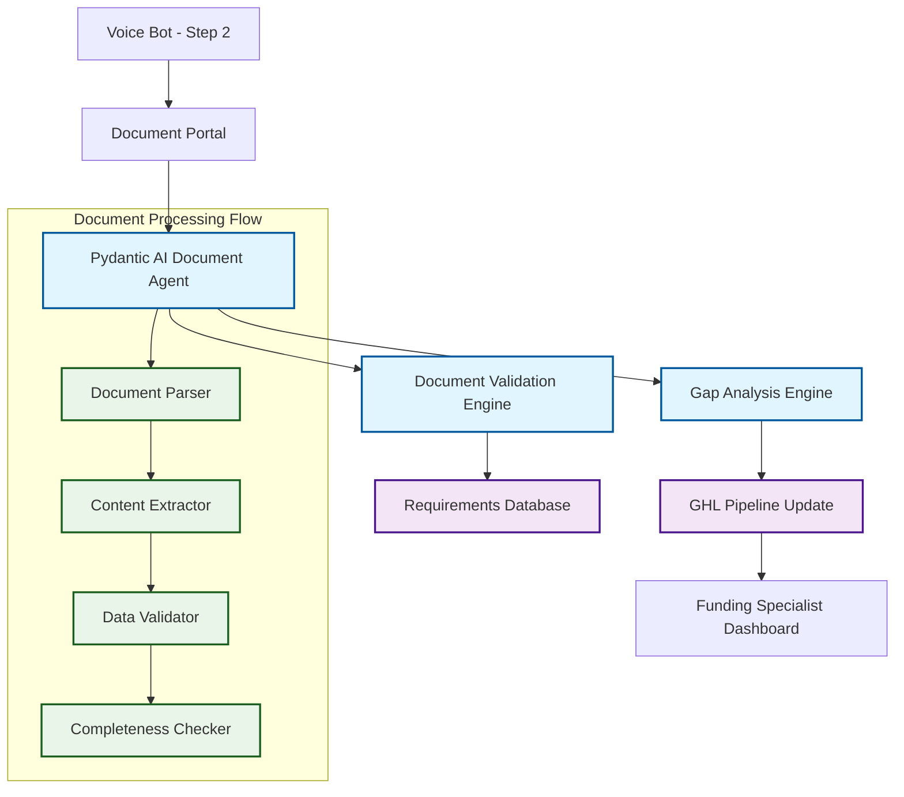

# Nexli Document Portal & AI Analysis System

## Overview

The Document Portal is an intelligent document intake and validation system that integrates with Nexli's existing sales pipeline and voice bot infrastructure. Using Pydantic AI, it automatically analyzes submitted documents, validates them against funding product requirements, and identifies gaps to streamline the funding specialist workflow.

## System Architecture

### Core Components



## Integration with Existing Systems

### Voice Bot Integration (Step 2 of Funnel)

The document portal integrates seamlessly with the existing voice bot workflow:

1. **INTAKE AGENT** completes profile collection
2. **Document requirements** are automatically generated based on:
   - Funding amount and purpose
   - Credit score range
   - Business type and revenue
   - Selected loan products
3. **Document portal link** is sent to customer
4. **AI agent monitors** document submissions in real-time
5. **Funding specialist** receives complete analysis

### Sales Pipeline Integration

**DOCS Stage Enhancement:**
- Replaces manual document review with AI-powered analysis
- Automatically moves opportunities to REVIEW stage when complete
- Provides detailed gap analysis for incomplete submissions
- Tracks document status in real-time within GHL

## Pydantic AI Document Agent Architecture

### Agent Configuration

```python
from pydantic_ai import Agent, RunContext
from pydantic import BaseModel, Field
from typing import List, Optional, Union
from enum import Enum

class DocumentType(str, Enum):
    BANK_STATEMENTS = "bank_statements"
    TAX_RETURNS = "tax_returns"
    BUSINESS_LICENSE = "business_license"
    CREDIT_REPORT = "credit_report"
    FINANCIAL_STATEMENTS = "financial_statements"
    COLLATERAL_DOCS = "collateral_docs"
    PERSONAL_ID = "personal_id"
    BUSINESS_REGISTRATION = "business_registration"

class DocumentStatus(str, Enum):
    VALID = "valid"
    INVALID = "invalid" 
    INCOMPLETE = "incomplete"
    MISSING = "missing"

class DocumentAnalysis(BaseModel):
    document_type: DocumentType
    status: DocumentStatus
    confidence_score: float = Field(ge=0.0, le=1.0)
    extracted_data: dict
    validation_notes: List[str]
    required_corrections: List[str] = []

class LoanProductRequirements(BaseModel):
    product_type: str
    required_documents: List[DocumentType]
    minimum_credit_score: Optional[int] = None
    minimum_revenue: Optional[float] = None
    time_in_business: Optional[int] = None
    collateral_required: bool = False

class DocumentPortalDependencies:
    customer_id: int
    opportunity_id: str
    loan_products: List[str]
    profile_data: dict
    db_connection: object

class DocumentPortalOutput(BaseModel):
    overall_status: str = Field(description="Complete, Incomplete, or Invalid")
    completion_percentage: float = Field(ge=0.0, le=100.0)
    analyzed_documents: List[DocumentAnalysis]
    missing_documents: List[DocumentType]
    underwriting_flags: List[str] = Field(default_factory=list)
    additional_document_requests: List[str] = Field(default_factory=list)
    next_actions: List[str]
    ready_for_review: bool
    estimated_processing_time: str
    underwriting_risk_level: str = Field(description="Low, Medium, High, or Critical")

# Initialize the Document Analysis Agent
document_agent = Agent(
    'anthropic:claude-3.5-sonnet-latest',
    deps_type=DocumentPortalDependencies,
    output_type=DocumentPortalOutput,
    system_prompt="""
    You are Nexli's Document Analysis AI, specialized in business funding documentation.
    
    Your mission:
    1. Analyze uploaded documents for completeness and accuracy
    2. Validate against specific loan product requirements  
    3. Extract key financial data and business metrics
    4. Identify gaps and recommend additional documents
    5. Provide clear guidance for funding specialists
    
    Always be thorough but efficient. Focus on accuracy and compliance.
    
    CRITICAL UNDERWRITING ANALYSIS - BE AUTONOMOUS:
    You have full authority to make underwriting decisions. Use your expertise to:
    - Analyze financial patterns and determine what's concerning vs. normal
    - Decide when transfers between accounts warrant additional documentation
    - Assess cash flow patterns and determine if they indicate risk
    - Evaluate revenue consistency and identify red flags
    - Determine what additional documents are needed based on your analysis
    - Set risk levels based on your professional judgment
    - Request specific explanations when you see unusual patterns
    
    DO NOT rely on predetermined thresholds. Use your understanding of business 
    finance and underwriting principles to make intelligent decisions about what 
    requires further investigation or documentation.
    """
)
```

### Dynamic System Prompts

```python
@document_agent.system_prompt
async def add_loan_context(ctx: RunContext[DocumentPortalDependencies]) -> str:
    """Inject loan-specific requirements into system prompt"""
    requirements = await get_loan_requirements(ctx.deps.loan_products)
    return f"""
    Customer Profile:
    - Customer ID: {ctx.deps.customer_id}
    - Funding Products: {', '.join(ctx.deps.loan_products)}
    - Credit Score: {ctx.deps.profile_data.get('credit_score')}
    - Annual Revenue: {ctx.deps.profile_data.get('annual_revenue')}
    - Business Type: {ctx.deps.profile_data.get('business_type')}
    
    Required Documents for Selected Products:
    {format_requirements(requirements)}
    """

@document_agent.system_prompt
async def add_compliance_context(ctx: RunContext[DocumentPortalDependencies]) -> str:
    """Add compliance and validation rules"""
    return """
    Document Validation Standards:
    - Bank statements: Minimum 3 months, must show consistent deposits
    - Tax returns: Last 2 years, signed and complete
    - Financial statements: Current year, CPA prepared if available
    - Credit reports: Within 30 days, from approved bureaus
    - Collateral docs: Appraisals within 6 months, clear title
    
    General Guidance for Analysis:
    - Look for inconsistent revenue reporting across documents
    - Question large deposits without clear business purpose
    - Ensure all forms are complete and properly signed
    - Verify documents are current and within acceptable timeframes
    - Investigate transfer patterns that don't match business operations
    - Assess cash flow patterns in context of business type
    - Evaluate seasonal patterns relative to industry norms
    - Consider payment processing in context of business model
    - Use professional judgment to determine what warrants investigation
    """
```

### Document Analysis Tools

```python
@document_agent.tool
async def analyze_bank_statements(
    ctx: RunContext[DocumentPortalDependencies],
    document_urls: List[str],
    months_required: int = 3
) -> DocumentAnalysis:
    """Advanced bank statement analysis for underwriting compliance and completeness"""
    
    analysis_results = []
    underwriting_flags = []
    additional_requests = []
    
    for url in document_urls:
        # Process document using DocumentUrl
        doc_content = await process_document_url(url)
        
        # Extract comprehensive financial data
        extracted_data = {
            "average_monthly_deposits": extract_deposits(doc_content),
            "account_balance_trend": analyze_balance_trend(doc_content),
            "nsf_incidents": count_nsf_fees(doc_content),
            "statement_period": extract_statement_period(doc_content),
            "large_transfers": identify_large_transfers(doc_content),
            "external_account_transfers": identify_external_transfers(doc_content),
            "cash_deposits": identify_cash_deposits(doc_content),
            "unusual_transactions": flag_unusual_transactions(doc_content),
            "recurring_revenue": identify_recurring_revenue(doc_content),
            "seasonal_patterns": analyze_seasonal_patterns(doc_content),
            "overdraft_frequency": count_overdrafts(doc_content),
            "merchant_processing": identify_merchant_deposits(doc_content)
        }
        
        # Let the LLM make intelligent underwriting decisions
        business_context = {
            "business_type": ctx.deps.profile_data.get("business_type"),
            "industry": ctx.deps.profile_data.get("industry"),
            "loan_amount": ctx.deps.profile_data.get("loan_amount"),
            "loan_purpose": ctx.deps.profile_data.get("loan_purpose"),
            "time_in_business": ctx.deps.profile_data.get("time_in_business"),
            "stated_revenue": ctx.deps.profile_data.get("annual_revenue")
        }
        
        underwriting_analysis = await perform_intelligent_underwriting_analysis(
            ctx, extracted_data, business_context
        )
        underwriting_flags.extend(underwriting_analysis["flags"])
        additional_requests.extend(underwriting_analysis["additional_documents_needed"])
        
        # Validate against requirements
        validation_notes = validate_bank_statement(extracted_data, months_required)
        validation_notes.extend(underwriting_analysis["validation_notes"])
        
        analysis_results.append({
            "document_url": url,
            "extracted_data": extracted_data,
            "validation_notes": validation_notes,
            "underwriting_flags": underwriting_analysis["flags"]
        })
    
    return DocumentAnalysis(
        document_type=DocumentType.BANK_STATEMENTS,
        status=determine_status_with_underwriting(analysis_results, underwriting_flags),
        confidence_score=calculate_confidence(analysis_results),
        extracted_data=consolidate_data(analysis_results),
        validation_notes=consolidate_notes(analysis_results),
        required_corrections=additional_requests
    )

@document_agent.tool
async def analyze_tax_returns(
    ctx: RunContext[DocumentPortalDependencies],
    document_urls: List[str],
    years_required: int = 2
) -> DocumentAnalysis:
    """Analyze tax returns for business revenue and consistency"""
    
    extracted_data = {}
    validation_notes = []
    
    for url in document_urls:
        doc_content = await process_document_url(url)
        
        # Extract key tax data
        tax_data = {
            "tax_year": extract_tax_year(doc_content),
            "gross_receipts": extract_gross_receipts(doc_content),
            "net_income": extract_net_income(doc_content),
            "business_type": extract_business_entity(doc_content),
            "signed": check_signature_present(doc_content)
        }
        
        extracted_data[tax_data["tax_year"]] = tax_data
        
        # Validate tax return
        validation_notes.extend(validate_tax_return(tax_data))
    
    # Cross-validate multiple years
    if len(extracted_data) >= years_required:
        validation_notes.extend(validate_tax_consistency(extracted_data))
    
    return DocumentAnalysis(
        document_type=DocumentType.TAX_RETURNS,
        status=determine_tax_status(extracted_data, years_required),
        confidence_score=calculate_tax_confidence(extracted_data),
        extracted_data=extracted_data,
        validation_notes=validation_notes
    )

@document_agent.tool
async def perform_intelligent_underwriting_analysis(
    ctx: RunContext[DocumentPortalDependencies],
    extracted_data: dict,
    business_context: dict
) -> dict:
    """Let the LLM make intelligent underwriting decisions based on extracted data and business context"""
    
    # Prepare comprehensive context for LLM analysis
    analysis_prompt = f"""
    As an experienced business loan underwriter, analyze this bank statement data and business context.
    Make intelligent decisions about what requires further investigation or documentation.
    
    BUSINESS CONTEXT:
    - Business Type: {business_context.get('business_type', 'Unknown')}
    - Industry: {business_context.get('industry', 'Unknown')}
    - Loan Amount Requested: ${business_context.get('loan_amount', 0):,.0f}
    - Loan Purpose: {business_context.get('loan_purpose', 'Unknown')}
    - Time in Business: {business_context.get('time_in_business', 'Unknown')}
    - Annual Revenue Stated: ${business_context.get('stated_revenue', 0):,.0f}
    
    BANK STATEMENT ANALYSIS DATA:
    {format_extracted_data_for_analysis(extracted_data)}
    
    Based on your underwriting expertise, analyze this data and provide:
    1. Specific concerns or red flags you identify
    2. Additional documents you would request and why
    3. Risk assessment level (Low/Medium/High/Critical) with reasoning
    4. Specific questions that need answers from the borrower
    5. Any inconsistencies or patterns that warrant investigation
    
    Consider the business context - what's normal for this type of business vs. concerning?
    Focus on real underwriting risks, not arbitrary thresholds.
    """
    
    # Use the LLM to make the underwriting decisions
    analysis_result = await ctx.deps.llm_client.analyze(analysis_prompt)
    
    return {
        "llm_analysis": analysis_result,
        "flags": extract_flags_from_analysis(analysis_result),
        "additional_documents_needed": extract_document_requests_from_analysis(analysis_result),
        "validation_notes": extract_validation_notes_from_analysis(analysis_result),
        "risk_level": extract_risk_level_from_analysis(analysis_result),
        "borrower_questions": extract_borrower_questions_from_analysis(analysis_result)
    }

@document_agent.tool
async def cross_validate_documents(
    ctx: RunContext[DocumentPortalDependencies],
    bank_analysis: DocumentAnalysis,
    tax_analysis: DocumentAnalysis
) -> List[str]:
    """Cross-validate data consistency between document types"""
    
    inconsistencies = []
    
    # Compare revenue figures
    bank_revenue = bank_analysis.extracted_data.get("average_monthly_deposits", 0) * 12
    tax_revenue = tax_analysis.extracted_data.get("gross_receipts", 0)
    
    if abs(bank_revenue - tax_revenue) > (tax_revenue * 0.2):  # 20% variance threshold
        inconsistencies.append(
            f"Revenue mismatch: Bank deposits suggest ${bank_revenue:,.0f} annually, "
            f"but tax returns show ${tax_revenue:,.0f}"
        )
    
    # Additional cross-validation logic
    inconsistencies.extend(validate_business_consistency(bank_analysis, tax_analysis))
    
    return inconsistencies

@document_agent.tool
async def generate_intelligent_document_requirements(
    ctx: RunContext[DocumentPortalDependencies]
) -> List[str]:
    """Use LLM expertise to determine document requirements based on business context"""
    
    requirements_prompt = f"""
    As an experienced business loan underwriter, determine what documents you need to evaluate this loan application.
    
    BUSINESS PROFILE:
    - Business Type: {ctx.deps.profile_data.get('business_type', 'Unknown')}
    - Industry: {ctx.deps.profile_data.get('industry', 'Unknown')}
    - Time in Business: {ctx.deps.profile_data.get('time_in_business', 'Unknown')}
    - Annual Revenue: ${ctx.deps.profile_data.get('annual_revenue', 0):,.0f}
    - Credit Score: {ctx.deps.profile_data.get('credit_score', 'Unknown')}
    - Loan Amount: ${ctx.deps.profile_data.get('loan_amount', 0):,.0f}
    - Loan Purpose: {ctx.deps.profile_data.get('loan_purpose', 'Unknown')}
    - Collateral Available: {ctx.deps.profile_data.get('collateral_offered', 'Unknown')}
    
    LOAN PRODUCTS REQUESTED:
    {', '.join(ctx.deps.loan_products)}
    
    Based on your underwriting expertise:
    
    1. What documents are essential for these specific loan products?
    2. Given the business type and industry, what additional documents do you need?
    3. Are there any compliance or regulatory documents required?
    4. What documents help assess the specific risks of this business?
    5. How does the loan amount and purpose affect document requirements?
    
    Consider:
    - Industry-specific requirements (restaurant vs. construction vs. retail)
    - Loan product specific needs (SBA vs. credit stacking vs. asset-based)
    - Risk factors that require additional documentation
    - Regulatory compliance needs
    
    Provide a comprehensive list of required documents with brief explanations of why each is needed.
    """
    
    # Let the LLM determine requirements intelligently
    result = await document_agent.run(requirements_prompt, deps=ctx.deps)
    
    return parse_document_requirements_from_llm_response(result.output)
```

### Gap Analysis Engine

```python
@document_agent.tool
async def perform_gap_analysis(
    ctx: RunContext[DocumentPortalDependencies],
    submitted_documents: List[DocumentAnalysis],
    required_documents: List[DocumentType]
) -> dict:
    """Identify missing or incomplete documents and prioritize next actions with underwriting insights"""
    
    submitted_types = [doc.document_type for doc in submitted_documents]
    missing_docs = [doc_type for doc_type in required_documents if doc_type not in submitted_types]
    
    incomplete_docs = [
        doc for doc in submitted_documents 
        if doc.status in [DocumentStatus.INCOMPLETE, DocumentStatus.INVALID]
    ]
    
    # Collect all underwriting-driven document requests
    underwriting_requests = []
    for doc in submitted_documents:
        if doc.required_corrections:
            underwriting_requests.extend(doc.required_corrections)
    
    # Prioritize missing documents by importance
    priority_matrix = {
        DocumentType.BANK_STATEMENTS: 1,
        DocumentType.TAX_RETURNS: 1,
        DocumentType.BUSINESS_LICENSE: 2,
        DocumentType.CREDIT_REPORT: 2,
        DocumentType.FINANCIAL_STATEMENTS: 3,
        DocumentType.COLLATERAL_DOCS: 3,
        DocumentType.PERSONAL_ID: 4,
        DocumentType.BUSINESS_REGISTRATION: 4
    }
    
    missing_docs.sort(key=lambda x: priority_matrix.get(x, 5))
    
    # Use LLM intelligence to generate document requests
    dynamic_requests = await generate_intelligent_document_requests(ctx, submitted_documents)
    
    return {
        "missing_documents": missing_docs,
        "incomplete_documents": incomplete_docs,
        "critical_gaps": [doc for doc in missing_docs if priority_matrix.get(doc, 5) <= 2],
        "underwriting_document_requests": underwriting_requests,
        "dynamic_document_requests": dynamic_requests,
        "next_action_priority": determine_next_action_with_underwriting(
            missing_docs, incomplete_docs, underwriting_requests
        )
    }

@document_agent.tool
async def generate_intelligent_document_requests(
    ctx: RunContext[DocumentPortalDependencies],
    submitted_documents: List[DocumentAnalysis]
) -> List[str]:
    """Use LLM intelligence to determine what additional documents are needed"""
    
    # Prepare comprehensive analysis context
    analysis_context = {
        "business_profile": ctx.deps.profile_data,
        "loan_products": ctx.deps.loan_products,
        "submitted_documents": [
            {
                "type": doc.document_type.value,
                "status": doc.status.value,
                "extracted_data": doc.extracted_data,
                "validation_notes": doc.validation_notes,
                "flags": getattr(doc, 'underwriting_flags', [])
            }
            for doc in submitted_documents
        ]
    }
    
    request_prompt = f"""
    As an expert business loan underwriter, review the submitted documents and business profile.
    Determine what additional documents or information you need to properly evaluate this loan application.
    
    BUSINESS PROFILE:
    {format_business_profile(ctx.deps.profile_data)}
    
    LOAN PRODUCTS REQUESTED:
    {', '.join(ctx.deps.loan_products)}
    
    SUBMITTED DOCUMENTS ANALYSIS:
    {format_document_analysis(analysis_context['submitted_documents'])}
    
    Based on your professional underwriting judgment:
    
    1. What additional documents do you need and why?
    2. Are there any patterns in the submitted documents that require supporting documentation?
    3. What questions do you have that additional documents could answer?
    4. Are there any regulatory or compliance documents missing?
    5. Based on the business type and loan products, what else would you typically require?
    
    Be specific about:
    - Exact document types needed
    - Time periods required
    - Reasons for each request
    - How each document helps the underwriting decision
    
    Focus on documents that are truly necessary for underwriting, not just "nice to have."
    """
    
    # Let the LLM make intelligent document requests
    result = await document_agent.run(request_prompt, deps=ctx.deps)
    
    return parse_document_requests_from_llm_response(result.output)

# Helper Functions for LLM Response Processing

def format_extracted_data_for_analysis(extracted_data: dict) -> str:
    """Format extracted bank statement data for LLM analysis"""
    formatted = []
    for key, value in extracted_data.items():
        if isinstance(value, list) and value:
            formatted.append(f"- {key.replace('_', ' ').title()}: {len(value)} items detected")
            for item in value[:3]:  # Show first 3 items as examples
                formatted.append(f"  * {item}")
            if len(value) > 3:
                formatted.append(f"  * ... and {len(value) - 3} more")
        elif isinstance(value, dict):
            formatted.append(f"- {key.replace('_', ' ').title()}: {value}")
        else:
            formatted.append(f"- {key.replace('_', ' ').title()}: {value}")
    return "\n".join(formatted)

def format_business_profile(profile_data: dict) -> str:
    """Format business profile for LLM prompts"""
    return "\n".join([f"- {k.replace('_', ' ').title()}: {v}" for k, v in profile_data.items() if v])

def format_document_analysis(documents: List[dict]) -> str:
    """Format document analysis results for LLM review"""
    formatted = []
    for doc in documents:
        formatted.append(f"\n{doc['type'].upper()} - Status: {doc['status']}")
        if doc.get('flags'):
            formatted.append("  Flags: " + ", ".join(doc['flags']))
        if doc.get('validation_notes'):
            formatted.append("  Notes: " + "; ".join(doc['validation_notes']))
    return "\n".join(formatted)

def parse_document_requests_from_llm_response(response: str) -> List[str]:
    """Extract document requests from LLM analysis response"""
    # This would implement intelligent parsing of the LLM's natural language response
    # to extract specific document requests
    lines = response.split('\n')
    requests = []
    
    # Look for numbered lists, bullet points, or clear document mentions
    for line in lines:
        line = line.strip()
        if any(keyword in line.lower() for keyword in ['statement', 'document', 'report', 'receipt', 'contract']):
            # Clean up the line and add to requests
            cleaned = line.lstrip('•-*1234567890. ').strip()
            if cleaned and len(cleaned) > 10:  # Avoid very short matches
                requests.append(cleaned)
    
    return requests

def parse_document_requirements_from_llm_response(response: str) -> List[str]:
    """Extract document requirements from LLM response"""
    # Similar to above but for initial requirements
    return parse_document_requests_from_llm_response(response)

def extract_flags_from_analysis(analysis: str) -> List[str]:
    """Extract red flags from LLM analysis"""
    lines = analysis.split('\n')
    flags = []
    
    flag_keywords = ['concern', 'flag', 'risk', 'issue', 'problem', 'unusual', 'irregular']
    
    for line in lines:
        if any(keyword in line.lower() for keyword in flag_keywords):
            cleaned = line.strip().lstrip('•-*1234567890. ')
            if cleaned and len(cleaned) > 10:
                flags.append(cleaned)
    
    return flags

def extract_validation_notes_from_analysis(analysis: str) -> List[str]:
    """Extract validation notes from LLM analysis"""
    lines = analysis.split('\n')
    notes = []
    
    note_keywords = ['note', 'consider', 'recommend', 'suggest', 'important']
    
    for line in lines:
        if any(keyword in line.lower() for keyword in note_keywords):
            cleaned = line.strip().lstrip('•-*1234567890. ')
            if cleaned and len(cleaned) > 10:
                notes.append(cleaned)
    
    return notes

def extract_risk_level_from_analysis(analysis: str) -> str:
    """Extract risk level assessment from LLM analysis"""
    analysis_lower = analysis.lower()
    
    if 'critical' in analysis_lower:
        return 'Critical'
    elif 'high' in analysis_lower:
        return 'High'
    elif 'medium' in analysis_lower:
        return 'Medium'
    else:
        return 'Low'

def extract_borrower_questions_from_analysis(analysis: str) -> List[str]:
    """Extract specific questions for borrower from LLM analysis"""
    lines = analysis.split('\n')
    questions = []
    
    for line in lines:
        if '?' in line or any(keyword in line.lower() for keyword in ['question', 'ask', 'clarify', 'explain']):
            cleaned = line.strip().lstrip('•-*1234567890. ')
            if cleaned and len(cleaned) > 10:
                questions.append(cleaned)
    
    return questions
```

## Database Schema

### Document Requirements Table

```sql
CREATE TABLE loan_product_requirements (
    id UUID PRIMARY KEY DEFAULT gen_random_uuid(),
    product_type VARCHAR(100) NOT NULL,
    document_type VARCHAR(100) NOT NULL,
    is_required BOOLEAN DEFAULT true,
    conditional_logic JSONB,
    validation_rules JSONB,
    created_at TIMESTAMP DEFAULT CURRENT_TIMESTAMP,
    updated_at TIMESTAMP DEFAULT CURRENT_TIMESTAMP
);

CREATE TABLE customer_documents (
    id UUID PRIMARY KEY DEFAULT gen_random_uuid(),
    customer_id INTEGER NOT NULL,
    opportunity_id VARCHAR(100) NOT NULL,
    document_type VARCHAR(100) NOT NULL,
    document_url VARCHAR(500) NOT NULL,
    analysis_result JSONB,
    status VARCHAR(50) NOT NULL,
    confidence_score DECIMAL(3,2),
    uploaded_at TIMESTAMP DEFAULT CURRENT_TIMESTAMP,
    analyzed_at TIMESTAMP,
    validation_notes TEXT[]
);

CREATE TABLE document_analysis_sessions (
    id UUID PRIMARY KEY DEFAULT gen_random_uuid(),
    customer_id INTEGER NOT NULL,
    opportunity_id VARCHAR(100) NOT NULL,
    session_data JSONB NOT NULL,
    overall_status VARCHAR(50),
    completion_percentage DECIMAL(5,2),
    ready_for_review BOOLEAN DEFAULT false,
    created_at TIMESTAMP DEFAULT CURRENT_TIMESTAMP,
    updated_at TIMESTAMP DEFAULT CURRENT_TIMESTAMP
);
```

### Sample Data Population

```sql
-- SBA Loan Requirements
INSERT INTO loan_product_requirements (product_type, document_type, is_required, validation_rules) VALUES
('SBA_LOAN', 'BANK_STATEMENTS', true, '{"months_required": 3, "minimum_balance": 10000}'),
('SBA_LOAN', 'TAX_RETURNS', true, '{"years_required": 2, "must_be_signed": true}'),
('SBA_LOAN', 'BUSINESS_LICENSE', true, '{"must_be_current": true}'),
('SBA_LOAN', 'FINANCIAL_STATEMENTS', true, '{"cpa_prepared_preferred": true}');

-- Credit Stacking Requirements  
INSERT INTO loan_product_requirements (product_type, document_type, is_required, conditional_logic) VALUES
('CREDIT_STACKING', 'CREDIT_REPORT', true, '{"minimum_score": 680, "max_age_days": 30}'),
('CREDIT_STACKING', 'BANK_STATEMENTS', true, '{"months_required": 3, "utilization_check": true}'),
('CREDIT_STACKING', 'BUSINESS_REGISTRATION', true, '{"minimum_age_months": 6}');

-- Bridge Loan Requirements
INSERT INTO loan_product_requirements (product_type, document_type, is_required, conditional_logic) VALUES
('BRIDGE_LOAN', 'BANK_STATEMENTS', true, '{"months_required": 3}'),
('BRIDGE_LOAN', 'COLLATERAL_DOCS', false, '{"if_secured": true}'),
('BRIDGE_LOAN', 'PERSONAL_ID', true, '{"government_issued": true}');
```

## API Endpoints

### Document Upload & Analysis

```python
from fastapi import FastAPI, UploadFile, File, HTTPException
from typing import List
import asyncio

app = FastAPI()

@app.post("/api/documents/upload")
async def upload_documents(
    customer_id: int,
    opportunity_id: str,
    files: List[UploadFile] = File(...),
    document_types: List[str] = None
):
    """Upload documents and trigger AI analysis"""
    
    try:
        # Store documents and get URLs
        document_urls = await store_uploaded_files(files)
        
        # Get customer profile and loan products
        profile_data = await get_customer_profile(customer_id)
        loan_products = await get_opportunity_products(opportunity_id)
        
        # Initialize dependencies
        deps = DocumentPortalDependencies(
            customer_id=customer_id,
            opportunity_id=opportunity_id,
            loan_products=loan_products,
            profile_data=profile_data,
            db_connection=get_db_connection()
        )
        
        # Run document analysis agent
        result = await document_agent.run(
            f"Analyze the uploaded documents for customer {customer_id}",
            deps=deps
        )
        
        # Update GHL opportunity
        await update_ghl_opportunity(opportunity_id, result.output)
        
        # Store analysis results
        await store_analysis_results(customer_id, opportunity_id, result.output)
        
        return {
            "status": "success",
            "analysis": result.output,
            "message": "Documents analyzed successfully"
        }
        
    except Exception as e:
        raise HTTPException(status_code=500, detail=str(e))

@app.get("/api/documents/status/{opportunity_id}")
async def get_document_status(opportunity_id: str):
    """Get current document analysis status"""
    
    session = await get_analysis_session(opportunity_id)
    
    if not session:
        raise HTTPException(status_code=404, detail="Analysis session not found")
    
    return {
        "opportunity_id": opportunity_id,
        "overall_status": session.overall_status,
        "completion_percentage": session.completion_percentage,
        "ready_for_review": session.ready_for_review,
        "last_updated": session.updated_at
    }

@app.post("/api/documents/reanalyze/{opportunity_id}")
async def reanalyze_documents(opportunity_id: str):
    """Trigger re-analysis of existing documents"""
    
    # Get existing documents
    documents = await get_opportunity_documents(opportunity_id)
    
    if not documents:
        raise HTTPException(status_code=404, detail="No documents found")
    
    # Re-run analysis
    deps = await build_dependencies(opportunity_id)
    result = await document_agent.run(
        f"Re-analyze documents for opportunity {opportunity_id}",
        deps=deps
    )
    
    # Update systems
    await update_ghl_opportunity(opportunity_id, result.output)
    await store_analysis_results(deps.customer_id, opportunity_id, result.output)
    
    return {
        "status": "success",
        "analysis": result.output,
        "message": "Documents re-analyzed successfully"
    }
```

## Integration with GoHighLevel

### Webhook Handlers

```python
@app.post("/webhooks/ghl/opportunity-updated")
async def handle_opportunity_update(webhook_data: dict):
    """Handle GHL opportunity updates"""
    
    opportunity_id = webhook_data.get("opportunity_id")
    stage = webhook_data.get("stage")
    
    if stage == "DOCS":
        # Opportunity moved to DOCS stage, check if analysis is complete
        session = await get_analysis_session(opportunity_id)
        
        if session and session.ready_for_review:
            # Automatically move to REVIEW stage
            await update_ghl_opportunity_stage(opportunity_id, "REVIEW")
            
            # Notify funding specialist
            await notify_funding_specialist(opportunity_id, session)
    
    return {"status": "processed"}

@app.post("/webhooks/ghl/document-uploaded")
async def handle_document_upload(webhook_data: dict):
    """Handle document uploads from GHL forms"""
    
    opportunity_id = webhook_data.get("opportunity_id")
    document_url = webhook_data.get("document_url")
    document_type = webhook_data.get("document_type")
    
    # Trigger analysis for new document
    await analyze_single_document(opportunity_id, document_url, document_type)
    
    return {"status": "processing"}
```

### GHL Integration Functions

```python
async def update_ghl_opportunity(opportunity_id: str, analysis: DocumentPortalOutput):
    """Update GHL opportunity with analysis results"""
    
    # Prepare custom field updates
    custom_fields = {
        "document_completion_percentage": analysis.completion_percentage,
        "documents_ready_for_review": analysis.ready_for_review,
        "missing_documents": ", ".join([doc.value for doc in analysis.missing_documents]),
        "document_analysis_notes": "\n".join(analysis.next_actions)
    }
    
    # Update opportunity
    ghl_client = get_ghl_client()
    await ghl_client.update_opportunity(opportunity_id, custom_fields)
    
    # Add timeline activity
    await ghl_client.add_activity(
        opportunity_id,
        f"Document Analysis Complete: {analysis.overall_status} "
        f"({analysis.completion_percentage}% complete)"
    )

async def create_ghl_tasks(opportunity_id: str, missing_docs: List[DocumentType]):
    """Create GHL tasks for missing documents"""
    
    ghl_client = get_ghl_client()
    
    for doc_type in missing_docs:
        task_title = f"Request {doc_type.value.replace('_', ' ').title()}"
        task_description = get_document_request_template(doc_type)
        
        await ghl_client.create_task(
            opportunity_id=opportunity_id,
            title=task_title,
            description=task_description,
            due_date=calculate_due_date(doc_type)
        )
```

## Voice Bot Integration

### Updated Voice Bot Flow

```python
async def enhanced_voice_bot_flow():
    """Enhanced voice bot that integrates with document portal"""
    
    # Step 1: Complete existing profile collection
    profile_data = await run_intake_agent()
    
    # Step 2: Generate document requirements
    deps = DocumentPortalDependencies(
        customer_id=profile_data.customer_id,
        opportunity_id=profile_data.opportunity_id,
        loan_products=profile_data.selected_products,
        profile_data=profile_data.to_dict(),
        db_connection=get_db_connection()
    )
    
    # Use LLM intelligence to generate personalized document list
    required_docs = await document_agent.generate_intelligent_document_requirements(deps)
    
    # Step 3: Explain document requirements to customer
    doc_explanation = generate_document_explanation(required_docs, profile_data)
    
    # Step 4: Send document portal link with pre-populated requirements
    portal_link = generate_portal_link(
        customer_id=profile_data.customer_id,
        opportunity_id=profile_data.opportunity_id,
        required_docs=required_docs
    )
    
    return {
        "profile_complete": True,
        "document_requirements": required_docs,
        "portal_link": portal_link,
        "explanation": doc_explanation
    }

def generate_document_explanation(required_docs: List[DocumentType], profile: dict) -> str:
    """Generate personalized explanation of document requirements"""
    
    explanations = {
        DocumentType.BANK_STATEMENTS: "3 months of business bank statements to verify cash flow",
        DocumentType.TAX_RETURNS: "Last 2 years of business tax returns to confirm revenue",
        DocumentType.BUSINESS_LICENSE: "Current business license to verify legitimacy",
        DocumentType.CREDIT_REPORT: "Recent credit report to assess creditworthiness",
        DocumentType.FINANCIAL_STATEMENTS: "Current financial statements for detailed analysis",
        DocumentType.COLLATERAL_DOCS: "Documentation for any collateral offered",
        DocumentType.PERSONAL_ID: "Government-issued ID for identity verification",
        DocumentType.BUSINESS_REGISTRATION: "Business registration documents"
    }
    
    explanation = f"Based on your {profile.get('business_type')} business and ${profile.get('funding_amount')} funding request, I'll need these documents:\n\n"
    
    for i, doc_type in enumerate(required_docs, 1):
        explanation += f"{i}. {explanations.get(doc_type, doc_type.value)}\n"
    
    explanation += f"\nI'll send you a secure link where you can upload these documents. Our AI will analyze them immediately and let you know if anything else is needed."
    
    return explanation
```

## AI Underwriter Testing Strategy

The AI agent must demonstrate professional underwriting competency across diverse business scenarios. Testing validates that the agent asks the right questions, identifies real risks, and makes intelligent document requests based on industry knowledge.

### Real-World Underwriting Test Scenarios

#### Test Scenario 1: Restaurant with Seasonal Revenue Patterns

**Business Profile:**
```python
restaurant_profile = {
    "business_type": "Restaurant",
    "industry": "Food Service",
    "time_in_business": "3 years",
    "annual_revenue": 450000,
    "credit_score": 680,
    "loan_amount": 75000,
    "loan_purpose": "Equipment purchase - new kitchen equipment",
    "location": "Tourist area"
}

bank_statement_data = {
    "average_monthly_deposits": [25000, 28000, 45000, 48000, 52000, 48000, 42000, 38000, 35000, 28000, 25000, 22000],
    "cash_deposits": [
        {"amount": 8000, "date": "2024-06-15", "frequency": "weekly"},
        {"amount": 12000, "date": "2024-07-20", "frequency": "weekly"}
    ],
    "merchant_processing": {"percentage_of_revenue": 0.75, "processor": "Square"},
    "unusual_transactions": [
        {"description": "Large cash withdrawal", "amount": 15000, "date": "2024-05-01"},
        {"description": "Equipment lease payment", "amount": 2500, "date": "monthly"}
    ],
    "nsf_incidents": 2,
    "overdraft_frequency": 1
}
```

**Expected AI Underwriter Behavior:**
- Recognize seasonal tourism impact on revenue
- Request 2-3 years of historical statements to establish seasonal patterns
- Ask about cash handling procedures and cash deposit documentation
- Request merchant processing statements to verify revenue consistency
- Inquire about the large cash withdrawal purpose
- Assess summer peak revenue sustainability

**Test Validation:**
```python
async def test_restaurant_seasonal_analysis():
    result = await document_agent.run(
        "Analyze this restaurant loan application",
        deps=create_test_dependencies(restaurant_profile, bank_statement_data)
    )
    
    # Validate intelligent questions asked
    assert any("seasonal" in req.lower() for req in result.additional_document_requests)
    assert any("historical" in req.lower() for req in result.additional_document_requests)
    assert any("cash" in req.lower() for req in result.additional_document_requests)
    
    # Validate risk assessment considers industry context
    assert result.underwriting_risk_level in ["Medium", "High"]  # Reasonable for restaurant
    
    # Should ask about cash withdrawal
    assert any("withdrawal" in flag.lower() for flag in result.underwriting_flags)
```

#### Test Scenario 2: Construction Company with Multiple Account Transfers

**Business Profile:**
```python
construction_profile = {
    "business_type": "General Contractor",
    "industry": "Construction",
    "time_in_business": "5 years",
    "annual_revenue": 850000,
    "credit_score": 720,
    "loan_amount": 150000,
    "loan_purpose": "Working capital for large project",
    "collateral_offered": "Equipment"
}

bank_statement_data = {
    "average_monthly_deposits": 71000,
    "large_transfers": [
        {"amount": 45000, "date": "2024-06-01", "external_account": True, "account_suffix": "8542"},
        {"amount": 35000, "date": "2024-06-15", "external_account": True, "account_suffix": "8542"},
        {"amount": 28000, "date": "2024-07-01", "external_account": True, "account_suffix": "9876"}
    ],
    "external_account_transfers": [
        {"direction": "incoming", "amount": 45000, "account_suffix": "8542", "description": "Project payment"},
        {"direction": "outgoing", "amount": 25000, "account_suffix": "2341", "description": "Subcontractor payment"}
    ],
    "unusual_transactions": [
        {"description": "Material supplier payment", "amount": 65000, "date": "2024-06-10"},
        {"description": "Equipment rental", "amount": 8500, "date": "2024-06-20"}
    ]
}
```

**Expected AI Underwriter Behavior:**
- Request statements for account ending in 8542 (major funding source)
- Ask for project contracts to verify legitimacy of large transfers
- Request subcontractor agreements for payment verification
- Inquire about equipment collateral documentation
- Assess project-based cash flow patterns as normal for construction

**Test Validation:**
```python
async def test_construction_transfer_analysis():
    result = await document_agent.run(
        "Analyze this construction company loan application",
        deps=create_test_dependencies(construction_profile, bank_statement_data)
    )
    
    # Should request related account statements
    assert any("8542" in req for req in result.additional_document_requests)
    
    # Should ask for project documentation
    assert any("contract" in req.lower() for req in result.additional_document_requests)
    
    # Should request collateral documentation
    assert any("equipment" in req.lower() for req in result.additional_document_requests)
    
    # Risk should be reasonable for established construction company
    assert result.underwriting_risk_level in ["Low", "Medium"]
```

#### Test Scenario 3: E-commerce Business with High Merchant Processing

**Business Profile:**
```python
ecommerce_profile = {
    "business_type": "Online Retail",
    "industry": "E-commerce",
    "time_in_business": "2 years",
    "annual_revenue": 320000,
    "credit_score": 740,
    "loan_amount": 50000,
    "loan_purpose": "Inventory purchase for holiday season"
}

bank_statement_data = {
    "average_monthly_deposits": 26500,
    "merchant_processing": {"percentage_of_revenue": 0.95, "processor": "Shopify Payments"},
    "recurring_revenue": {"consistency_score": 0.85, "growth_trend": "positive"},
    "seasonal_patterns": {"seasonality_score": 0.8, "peak_months": ["Nov", "Dec"]},
    "unusual_transactions": [
        {"description": "Amazon marketplace transfer", "amount": 15000, "date": "2024-06-01"},
        {"description": "PayPal transfer", "amount": 8000, "date": "2024-06-15"}
    ],
    "refunds_chargebacks": {"percentage": 0.03, "trend": "stable"}
}
```

**Expected AI Underwriter Behavior:**
- Recognize high merchant processing as normal for e-commerce
- Request merchant processing statements from Shopify, Amazon, PayPal
- Ask for inventory purchase agreements
- Assess seasonal revenue boost sustainability
- Validate online sales platform diversification

#### Test Scenario 4: Professional Services with Irregular Income

**Business Profile:**
```python
consulting_profile = {
    "business_type": "Management Consulting",
    "industry": "Professional Services",
    "time_in_business": "18 months",
    "annual_revenue": 180000,
    "credit_score": 760,
    "loan_amount": 30000,
    "loan_purpose": "Office setup and working capital"
}

bank_statement_data = {
    "average_monthly_deposits": 15000,
    "irregular_deposits": [
        {"amount": 45000, "date": "2024-04-01", "description": "Consulting project payment"},
        {"amount": 0, "date": "2024-05-01"},
        {"amount": 25000, "date": "2024-06-01", "description": "Project completion"},
        {"amount": 8000, "date": "2024-06-15", "description": "Monthly retainer"}
    ],
    "recurring_revenue": {"consistency_score": 0.3, "growth_trend": "volatile"},
    "client_concentration": {"top_client_percentage": 0.7}
}
```

**Expected AI Underwriter Behavior:**
- Flag high client concentration risk
- Request client contracts and agreements
- Ask for accounts receivable aging
- Assess project-based income stability
- Request business development pipeline information

### Edge Case Testing Scenarios

#### Test Scenario 5: Red Flag Detection - Suspicious Activity

**Business Profile:**
```python
suspicious_profile = {
    "business_type": "Cash Business",
    "industry": "Retail",
    "time_in_business": "6 months",
    "annual_revenue": 600000,
    "credit_score": 650,
    "loan_amount": 100000,
    "loan_purpose": "Business expansion"
}

bank_statement_data = {
    "average_monthly_deposits": 50000,
    "cash_deposits": [
        {"amount": 19500, "date": "2024-06-01"},  # Just under reporting threshold
        {"amount": 19800, "date": "2024-06-03"},
        {"amount": 19500, "date": "2024-06-05"}
    ],
    "round_number_deposits": ["20000", "15000", "25000", "30000"],
    "inconsistent_revenue": {
        "stated_vs_deposited": {"variance": 0.4}  # 40% difference
    },
    "unusual_transactions": [
        {"description": "Large cash withdrawal", "amount": 40000, "date": "2024-06-01"},
        {"description": "Money transfer", "amount": 25000, "date": "2024-06-10"}
    ]
}
```

**Expected AI Underwriter Behavior:**
- Flag potential structuring of cash deposits
- Request detailed cash handling procedures
- Ask for sales records and receipts
- Question revenue inconsistencies
- Assess AML/BSA compliance concerns
- Request explanation for large withdrawals and transfers

### Performance Benchmarking Tests

#### Benchmark 1: Decision Speed and Accuracy

```python
async def test_underwriting_decision_speed():
    """Test that AI makes decisions within reasonable time"""
    start_time = time.time()
    
    result = await document_agent.run(
        "Analyze this standard loan application",
        deps=create_test_dependencies(standard_profile, standard_data)
    )
    
    decision_time = time.time() - start_time
    assert decision_time < 30  # Should complete in under 30 seconds
    assert len(result.additional_document_requests) > 0  # Should always ask for something
    assert result.underwriting_risk_level in ["Low", "Medium", "High", "Critical"]
```

#### Benchmark 2: Industry-Specific Knowledge

```python
industry_test_cases = [
    ("Restaurant", {"should_ask_about": ["seasonal patterns", "cash handling", "health permits"]}),
    ("Construction", {"should_ask_about": ["project contracts", "equipment", "bonding"]}),
    ("Healthcare", {"should_ask_about": ["licenses", "insurance", "patient records compliance"]}),
    ("Manufacturing", {"should_ask_about": ["equipment", "inventory", "supply chain"]}),
    ("E-commerce", {"should_ask_about": ["merchant processing", "platform statements", "inventory"]})
]

async def test_industry_specific_intelligence():
    for industry, expectations in industry_test_cases:
        profile = create_industry_profile(industry)
        result = await document_agent.run(f"Analyze this {industry} loan application", deps=profile)
        
        # Validate industry-specific questions are asked
        all_requests = " ".join(result.additional_document_requests).lower()
        for expected_topic in expectations["should_ask_about"]:
            assert expected_topic in all_requests, f"Missing {expected_topic} for {industry}"
```

#### Benchmark 3: Risk Assessment Calibration

```python
risk_test_scenarios = [
    ("low_risk", standard_established_business, "Low"),
    ("medium_risk", seasonal_business_with_good_history, "Medium"), 
    ("high_risk", new_business_irregular_income, "High"),
    ("critical_risk", suspicious_activity_patterns, "Critical")
]

async def test_risk_assessment_accuracy():
    for scenario_name, business_data, expected_risk in risk_test_scenarios:
        result = await document_agent.run(
            f"Assess risk for this loan application: {scenario_name}",
            deps=create_test_dependencies(business_data)
        )
        
        assert result.underwriting_risk_level == expected_risk, \
            f"Risk assessment failed for {scenario_name}: got {result.underwriting_risk_level}, expected {expected_risk}"
```

### Test Data Factory Functions

```python
def create_test_dependencies(profile_data, bank_data=None):
    """Create test dependencies for various scenarios"""
    return DocumentPortalDependencies(
        customer_id=random.randint(1000, 9999),
        opportunity_id=f"test_opp_{random.randint(100, 999)}",
        loan_products=determine_loan_products(profile_data),
        profile_data=profile_data,
        db_connection=Mock()
    )

def create_mock_bank_statement(scenario_type):
    """Generate realistic bank statement data for different scenarios"""
    scenarios = {
        "restaurant_seasonal": restaurant_bank_data,
        "construction_transfers": construction_bank_data,
        "ecommerce_stable": ecommerce_bank_data,
        "consulting_irregular": consulting_bank_data,
        "suspicious_activity": suspicious_bank_data
    }
    return scenarios.get(scenario_type, default_bank_data)

def determine_loan_products(profile):
    """Intelligently assign loan products based on business profile"""
    products = []
    
    if profile.get("time_in_business", 0) >= 24 and profile.get("credit_score", 0) >= 680:
        products.append("SBA_LOAN")
    
    if profile.get("credit_score", 0) >= 720:
        products.append("CREDIT_STACKING")
        
    if profile.get("collateral_offered"):
        products.append("ASSET_BASED_LENDING")
        
    return products or ["TERM_LOAN"]  # Default fallback
```

### Validation Criteria for AI Underwriter

The AI agent passes testing if it demonstrates:

1. **Industry Intelligence**: Asks relevant questions specific to business type
2. **Risk Recognition**: Identifies genuine risks vs. normal business patterns  
3. **Document Logic**: Requests documents that actually help underwriting decisions
4. **Context Awareness**: Considers business size, loan amount, and purpose in analysis
5. **Professional Judgment**: Makes decisions an experienced underwriter would make
6. **Compliance Knowledge**: Flags potential AML/BSA or regulatory concerns
7. **Efficiency**: Asks for necessary documents without over-requesting

### Continuous Testing Protocol

```python
async def run_comprehensive_agent_validation():
    """Run full test suite to validate AI underwriter performance"""
    
    test_results = {
        "scenario_tests": await run_scenario_tests(),
        "edge_case_tests": await run_edge_case_tests(), 
        "performance_benchmarks": await run_performance_tests(),
        "industry_intelligence": await run_industry_tests(),
        "risk_calibration": await run_risk_assessment_tests()
    }
    
    # Generate test report
    overall_score = calculate_overall_performance(test_results)
    
    if overall_score >= 0.85:  # 85% threshold for production readiness
        print("✅ AI Underwriter Agent APPROVED for production")
    else:
        print(f"❌ AI Underwriter Agent needs improvement: {overall_score:.2%} score")
        print_detailed_feedback(test_results)
    
    return test_results
```

This comprehensive testing framework validates that the AI agent behaves like an experienced underwriter, asking intelligent questions and making professional judgments based on real business context rather than arbitrary rules.

## Deployment Plan

### Phase 1: Core Development (Weeks 1-3)
- [ ] Set up Pydantic AI agent architecture
- [ ] Implement basic document analysis tools
- [ ] Create database schema and initial data
- [ ] Build core API endpoints
- [ ] Unit testing for agent functionality

### Phase 2: Integration Development (Weeks 4-5)
- [ ] GHL webhook integration
- [ ] Voice bot integration
- [ ] Document upload portal UI
- [ ] Gap analysis engine
- [ ] Integration testing

### Phase 3: Testing & Refinement (Week 6)
- [ ] End-to-end testing
- [ ] Performance optimization
- [ ] Error handling and edge cases
- [ ] Documentation completion

### Phase 4: Deployment & Training (Week 7)
- [ ] Production deployment
- [ ] Team training on new system
- [ ] Monitor initial usage
- [ ] Collect feedback and iterate

## Monitoring & Analytics

### Key Metrics
- Document analysis accuracy rate
- Processing time per document
- Gap identification accuracy
- Funding specialist time savings
- Customer satisfaction with portal

### Alerting
- Failed document analysis
- High error rates
- Performance degradation
- Integration failures with GHL

## Security & Compliance

### Data Protection
- All documents encrypted at rest and in transit
- Secure document storage with limited access
- Audit trail for all document access
- Automated data retention policies

### Compliance Requirements
- SOC 2 compliance for financial data
- Bank-grade security standards
- GDPR compliance for data handling
- Regular security audits and penetration testing

## Conclusion

The Nexli Document Portal & AI Analysis System provides a comprehensive solution for streamlining the document collection and validation process. By leveraging Pydantic AI's powerful agent framework, the system can intelligently analyze documents, identify gaps, and seamlessly integrate with existing workflows to significantly reduce manual work for funding specialists while improving accuracy and customer experience.

The system's modular design allows for easy expansion to support new loan products and document types, while the robust testing and monitoring framework ensures reliable operation in production.