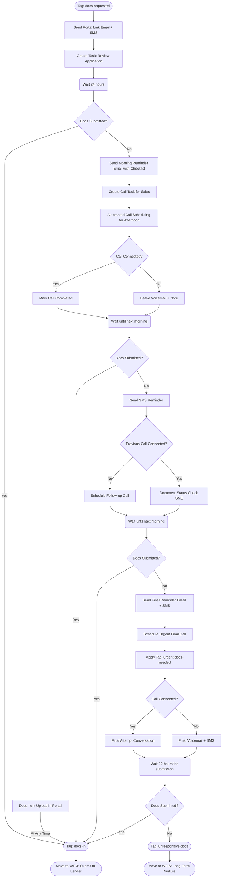

# Document Chase 2.1 - Enhanced Document Collection Workflow

## Overview

The Document Chase 2.1 workflow is an enhanced version of our existing WF-2 Docs Chase process, designed to improve document collection rates through a more robust follow-up system that combines automated messaging with scheduled sales calls.

**Key Improvements:**
- Multi-channel contact strategy (email, SMS, phone calls)
- Strategically timed follow-ups to increase urgency without overwhelming prospects
- Automated call scheduling for sales team
- Detailed call scripts tailored to different follow-up stages
- Clear tracking of prospect engagement
- Escalation paths for different prospect behaviors

## Workflow Timeline

| Day | Channel | Action | Goal |
|-----|---------|--------|------|
| 0 | Email + SMS | Initial document request | Introduce portal and requirements |
| 1 | Email | Morning reminder with checklist | Provide clear document requirements |
| 1 | Call | Afternoon follow-up call | Answer questions, assist with portal |
| 2 | SMS | Morning quick reminder | Create gentle urgency |
| 2 | Call | Afternoon follow-up if needed | Assist with technical issues |
| 3 | Email + SMS | Final reminder (urgency) | Create deadline pressure |
| 3 | Call | Final outreach attempt | Last chance personal touch |
| 4 | Tag | Tag as "unresponsive-docs" | Move to nurture sequence |
| Any | Portal | Document submission | Tag as "docs-in" and exit workflow |

## Detailed Mermaid Flowchart



## Call Strategy & Scripts

### Day 1 - Initial Follow-up Call

**Purpose:** Verify receipt of portal link, answer questions, explain document requirements

**Call Script:**
```
"Hi [prospect name], this is [rep name] from Nexli Funding. I'm calling to follow up on the document request we sent yesterday for your funding application.

Have you had a chance to review the email with the secure upload link?

[If yes] Great! Do you have any questions about what documents we need or how to upload them?

[If no] No problem. I can resend the link right now while we're on the phone and walk you through exactly what we need.

The main documents we need are [tailor based on funding type]. This typically takes clients about 10-15 minutes to upload. Would you like me to walk you through the portal now?

Our team reviews submissions daily, so the sooner you can upload, the faster we can move your application forward."
```

**After Call Action:**
- Tag prospect with appropriate follow-up (call-answered, call-noanswer)
- Note any specific issues or concerns in the CRM
- Send any promised materials immediately after call

### Day 2 - Conditional Follow-up Call

**Purpose:** Address technical issues or documentation challenges

**Call Script:**
```
"Hi [prospect name], this is [rep name] from Nexli Funding following up about your funding application documents.

I wanted to check if you've encountered any issues uploading your documents to our portal?

Many clients have questions about [common issue for funding type], and I'm happy to help walk through any challenges you're facing.

Is there anything specific that's preventing you from completing your submission?

[Address specific concerns]

We're looking to submit applications to our lenders tomorrow morning, so getting your documents today would ensure you don't miss this funding batch."
```

### Day 3 - Final Outreach Call

**Purpose:** Create urgency, overcome final objections, provide assistance

**Call Script:**
```
"Hi [prospect name], this is [rep name] with Nexli Funding with an important update about your application.

Your application will be marked inactive tomorrow if we don't receive your documents today. This is the final opportunity to maintain your pre-qualification status without needing to reapply.

Is there a specific reason you haven't been able to submit your documents?

[Address objections]

I have time right now to personally assist you with uploading any documents you have available. Even partial documentation can help us keep your application active while you gather any remaining items.

What time today could you set aside 15 minutes to complete this?"
```

## Email & SMS Templates

### Day 1 - Morning Reminder Email

**Subject:** [CHECKLIST] Your Nexli Funding Application Documents

**Body:**
```html
<h2>Your Document Checklist</h2>

<p>Hi {{contact.first_name}},</p>

<p>This is a friendly reminder about the documents needed for your pre-qualified funding application.</p>

<p>Here's a simple checklist of what we need:</p>

<ul>
    <li>Government-issued ID</li>
    <li>Last 4 months of business bank statements</li>
    <li>Business tax ID/EIN verification</li>
    <li>Completed application form in portal</li>
</ul>

<p>Our funding specialist will be calling this afternoon to answer any questions you might have.</p>

<p><a href="{{portal.link}}">Click here to access your secure upload portal</a></p>
```

### Day 2 - SMS Reminder

```
Nexli Funding: Quick reminder about your docs. Most clients complete uploads in under 15 min. Need help? Reply YES and we'll call you right away. {{portal.link}} -Nexli Team
```

### Day 3 - Final Reminder (Email + SMS)

**Subject:** URGENT: Final Day for Your Pre-Qualified Funding

**Body:**
```html
<h2 style="color: #d9534f;">FINAL NOTICE: Action Required Today</h2>

<p>Hi {{contact.first_name}},</p>

<p>This is the <strong>final notice</strong> regarding your pre-qualified business funding application.</p>

<p>Your application will become inactive tomorrow if we don't receive your documentation today.</p>

<p>Our funding specialist will make one final attempt to reach you today to help complete your submission.</p>

<p><a href="{{portal.link}}" style="background-color: #d9534f; color: white; padding: 10px 15px; text-decoration: none; border-radius: 5px; font-weight: bold;">UPLOAD DOCUMENTS NOW</a></p>
```

**Final SMS:**
```
FINAL NOTICE: Your Nexli Funding pre-qualification expires TODAY. Upload docs now to avoid reapplying: {{portal.link}} Our specialist will call shortly. -Nexli Funding
```

## Workflow Integration

### New Tags

| Tag | Purpose |
|-----|---------|
| docs-call-attempted | Tracks when calls have been made to prospect |
| docs-call-connected | Indicates successful conversation about documents |
| urgent-docs-needed | Applied on final day to prioritize in sales queue |
| docs-partial | When prospect has submitted some but not all documents |

### Sales Dashboard Integration

This workflow will create a dedicated "Document Chase" view in the sales dashboard with:

1. Daily call list automatically prioritized by:
   - Days in workflow (newer = higher priority)
   - Previous contact status (call-noanswer = higher priority)
   - Funding amount (higher = higher priority)

2. Key metrics tracked:
   - Time to document submission
   - Call connection rate
   - Document completion rate by rep
   - Conversion from docs-requested to docs-in

### Success Criteria

The enhanced Document Chase 2.1 workflow will be considered successful if:

- Document submission rate increases by at least 20%
- Average time to document submission decreases by 25%
- Rate of prospects tagged as "unresponsive-docs" decreases by 30%

## Implementation Checklist

1. Update email and SMS templates in GHL
2. Create call task automation in CRM
3. Configure new tags in system
4. Set up automated call scheduling
5. Create sales dashboard view
6. Train sales team on new scripts and process
7. Implement tracking for new KPIs

## Review & Approval

Document Chase 2.1 workflow design prepared by:
- Prepared Date: [Current Date]
- Implementation Target: [Target Date]
- Approved By: [Manager Name]