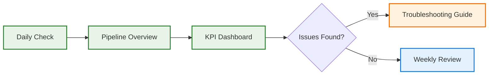
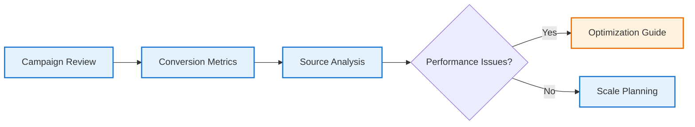
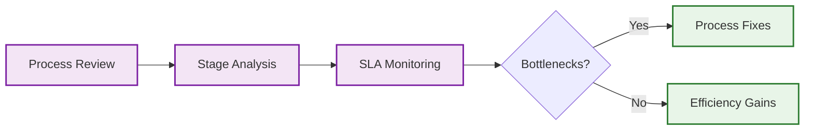

# Visual Documentation Hub

## 🎯 Quick Navigation for Owners & Marketers

This visual documentation suite transforms the complex Nexli Funding sales pipeline into easy-to-understand, actionable guides for busy executives and marketing teams.

---

## 📚 Documentation Suite Overview

### 🚀 Start Here: Core Documents

| Document | Purpose | Best For | Time to Read |
|----------|---------|----------|--------------|
| **[Simplified Pipeline Overview](./simplified-pipeline-overview.md)** | High-level visual funnel | Executives, quick decisions | 5 minutes |
| **[Workflow Stage Guide](./workflow-stage-guide.md)** | Detailed stage breakdowns | Operations, optimization | 15 minutes |
| **[KPI Dashboard Guide](./kpi-dashboard-guide.md)** | Performance metrics & alerts | Daily monitoring, reporting | 10 minutes |
| **[Troubleshooting Flowchart](./troubleshooting-flowchart.md)** | Problem solving & fixes | When issues arise | As needed |

---

## 🎯 Use Case Quick Access

### 👨‍💼 For Executives & Owners

**Your 5-Minute Morning Routine:**
1. 📊 [KPI Dashboard](./kpi-dashboard-guide.md#quick-status-reference) - Check overnight performance
2. 🎯 [Pipeline Overview](./simplified-pipeline-overview.md#lead-status-at-a-glance) - Review funnel health
3. 🚨 Any red flags? → [Troubleshooting Guide](./troubleshooting-flowchart.md#emergency-triage-system)

### 📈 For Marketing Teams

**Your Campaign Optimization Workflow:**
1. 📊 [Lead Generation Metrics](./kpi-dashboard-guide.md#lead-generation-metrics) - Analyze source performance
2. 🔄 [Conversion Tracking](./kpi-dashboard-guide.md#pipeline-conversion-metrics) - Find bottlenecks
3. 🔧 [Issues Found?](./troubleshooting-flowchart.md#lead-generation-problems) - Quick fixes

### ⚙️ For Operations Teams

**Your Process Optimization Flow:**
1. ⏱️ [SLA Compliance](./kpi-dashboard-guide.md#time-based-performance) - Check timing metrics
2. 📋 [Stage Performance](./workflow-stage-guide.md#quick-status-reference) - Identify weak points
3. 🔧 [Fix Issues](./troubleshooting-flowchart.md#document-collection-issues) - Immediate improvements

---

## 📊 Visual Guide Features

### 🎨 Color-Coded System
- 🟢 **Green**: Healthy performance, on-target metrics
- 🟡 **Yellow**: Attention needed, slight underperformance
- 🔴 **Red**: Critical issues, immediate action required
- 🔵 **Blue**: Information, process steps, neutral status

### 📱 Mobile-Optimized
All guides work perfectly on mobile devices for on-the-go management:
- Quick status tiles
- Simplified flowcharts
- Touch-friendly navigation
- Compressed data tables

### ⚡ Quick Reference Sections
Every guide includes:
- **TL;DR summaries** for busy executives
- **Action checklists** for immediate next steps
- **Benchmark targets** for performance comparison
- **Alert thresholds** for automated monitoring

---

## 🔍 Document Deep Dive

### 📈 [Simplified Pipeline Overview](./simplified-pipeline-overview.md)
**Perfect for:** First-time viewers, board presentations, investor meetings

**Key Features:**
- Visual sales funnel with conversion rates
- Lead status icons and meanings
- High-level workflow relationships
- Mobile-friendly status system

**Best Use:** 5-minute executive briefings, pipeline health checks

### ⚙️ [Workflow Stage Guide](./workflow-stage-guide.md)
**Perfect for:** Operations managers, process optimization, training

**Key Features:**
- Detailed stage breakdowns with timelines
- Performance monitoring checkpoints
- Management intervention triggers
- SLA compliance tracking

**Best Use:** Process improvement, staff training, bottleneck identification

### 📊 [KPI Dashboard Guide](./kpi-dashboard-guide.md)
**Perfect for:** Daily monitoring, performance tracking, reporting

**Key Features:**
- Executive dashboard mockups
- Revenue and cost tracking
- Automated alert configurations
- Mobile dashboard widgets

**Best Use:** Daily operations, weekly reviews, performance analysis

### 🔧 [Troubleshooting Flowchart](./troubleshooting-flowchart.md)
**Perfect for:** Problem solving, emergency response, system maintenance

**Key Features:**
- Emergency triage system
- Step-by-step problem diagnosis
- Quick fix checklists
- Escalation procedures

**Best Use:** When things go wrong, system maintenance, training support staff

---

## 🎯 Quick Start Guide

### New to Nexli Funding Sales Process?
1. **Start:** [Pipeline Overview](./simplified-pipeline-overview.md) (5 min)
2. **Understand:** [Stage Guide](./workflow-stage-guide.md) (15 min)
3. **Monitor:** [KPI Dashboard](./kpi-dashboard-guide.md) (10 min)
4. **Bookmark:** [Troubleshooting](./troubleshooting-flowchart.md) (for later)

### Need to Solve a Problem Right Now?
1. **Go to:** [Troubleshooting Guide](./troubleshooting-flowchart.md#emergency-triage-system)
2. **Identify:** Issue severity and type
3. **Follow:** Step-by-step resolution
4. **Escalate:** If needed using contact matrix

### Want to Optimize Performance?
1. **Check:** [KPI metrics](./kpi-dashboard-guide.md#conversion-rate-benchmarks)
2. **Identify:** Underperforming areas
3. **Analyze:** [Detailed stage breakdown](./workflow-stage-guide.md)
4. **Implement:** Specific optimizations

---

## 📋 Maintenance & Updates

### Document Update Schedule
- **Daily:** KPI targets and benchmarks (automated)
- **Weekly:** Performance thresholds and alerts
- **Monthly:** Process optimizations and new features
- **Quarterly:** Complete documentation review

### Contributing Improvements
Found something that could be clearer? Have a suggestion?
1. Note the specific document and section
2. Describe the improvement needed
3. Include any supporting data or examples
4. Submit via team feedback channel

### Version Control
- All changes are tracked and dated
- Previous versions available in git history
- Major updates communicated to all stakeholders
- Rollback procedures available if needed

---

## 🔗 Related Resources

### Technical Documentation
- **[Complete Workflow Playbook](../readme.md)** - Full technical details
- **[Sales Process Implementation](../sales-process-implementation.md)** - Setup guide
- **[Template Library](../templates/)** - Email, SMS, and voice templates

### External Tools Integration
- **GoHighLevel Setup** - CRM configuration guides
- **n8n Workflows** - AI call system documentation
- **Analytics Dashboards** - Looker Studio reports
- **Calendar Management** - Booking and reminder systems

---

## 💡 Pro Tips for Maximum Value

### 🎯 For Daily Use
- Bookmark the [KPI Dashboard guide](./kpi-dashboard-guide.md#mobile-dashboard-widgets) on your phone
- Set up automated alerts based on [threshold recommendations](./kpi-dashboard-guide.md#alert-system-configuration)
- Review the [daily health checklist](./troubleshooting-flowchart.md#quick-fix-checklist) each morning

### 📈 For Strategic Planning
- Use [conversion benchmarks](./kpi-dashboard-guide.md#conversion-rate-benchmarks) for goal setting
- Reference [optimization opportunities](./simplified-pipeline-overview.md#quick-decision-points) for quarterly planning
- Track [funnel metrics](./simplified-pipeline-overview.md#conversion-funnel-metrics) for ROI calculations

### 🔧 For Problem Prevention
- Implement [automated monitoring](./kpi-dashboard-guide.md#automated-alerts-setup) 
- Train team on [emergency procedures](./troubleshooting-flowchart.md#emergency-contacts)
- Regular [health checks](./troubleshooting-flowchart.md#daily-health-check-5-minute-scan) prevent major issues

---

**🎯 Remember: These visual guides are designed for quick decision-making. When in doubt, start with the problem - not the process - and use our troubleshooting flowchart to find the fastest path to resolution.**

---

*Last Updated: May 31, 2025 | Version: 1.0 | Next Review: June 30, 2025*