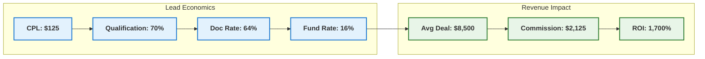
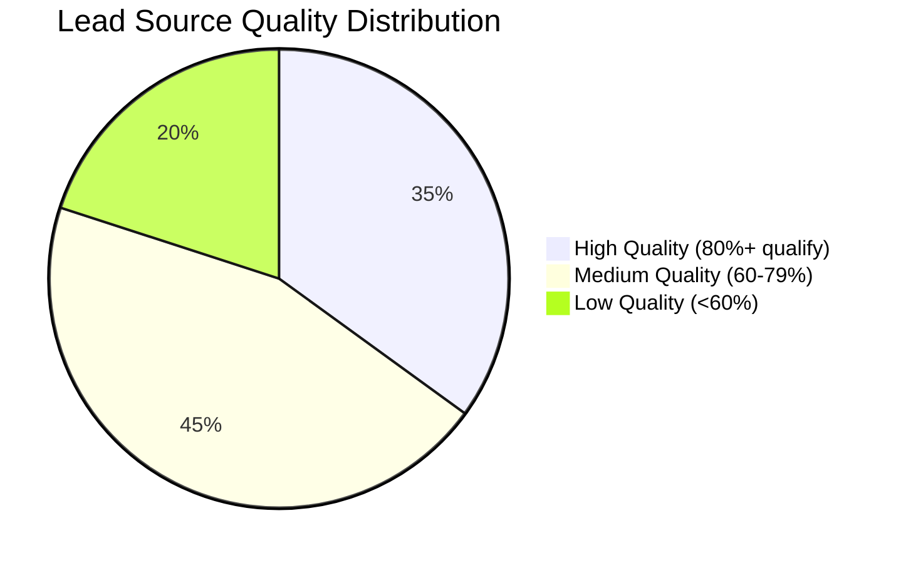
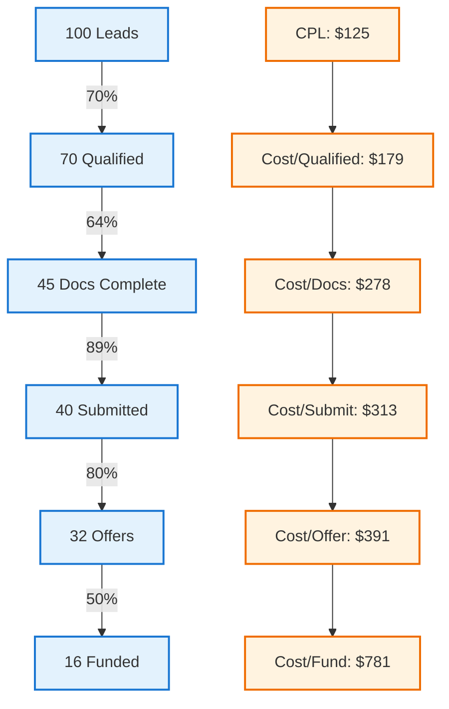
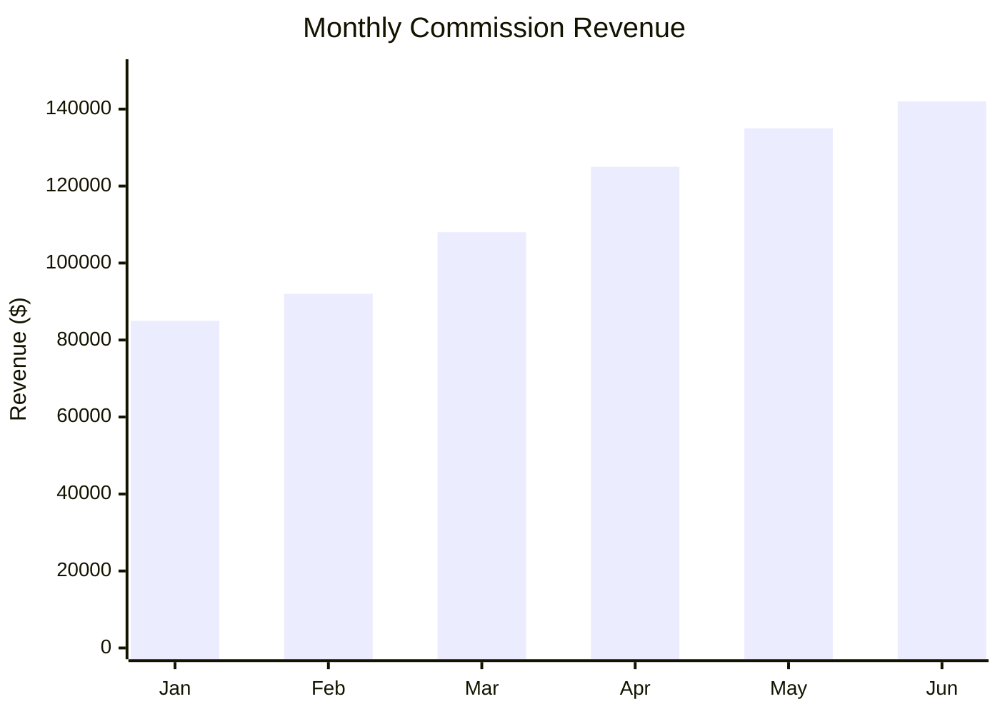
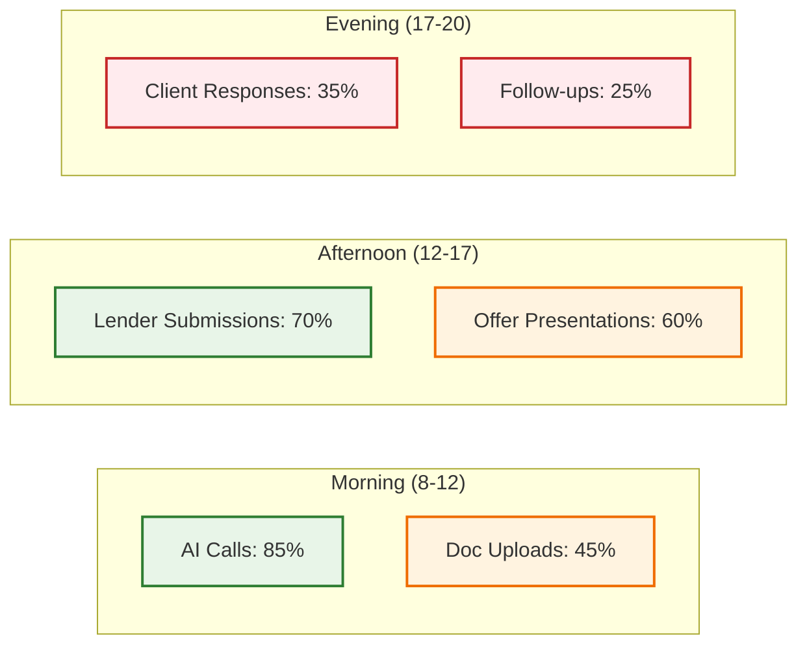
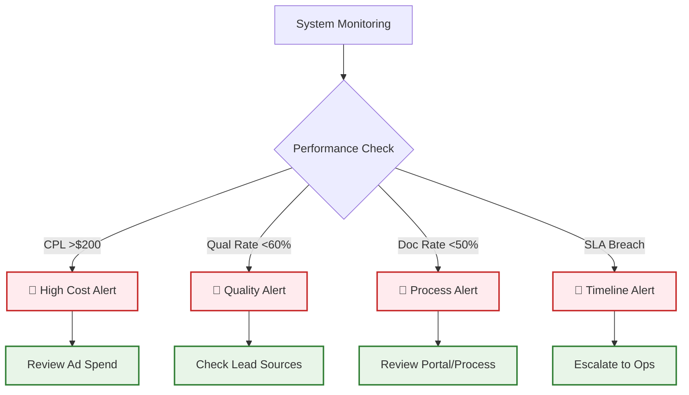
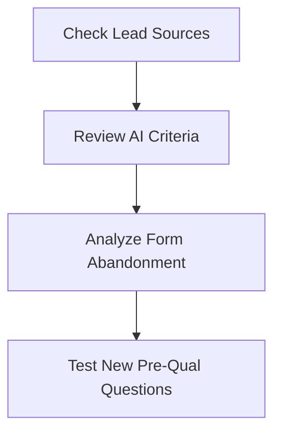
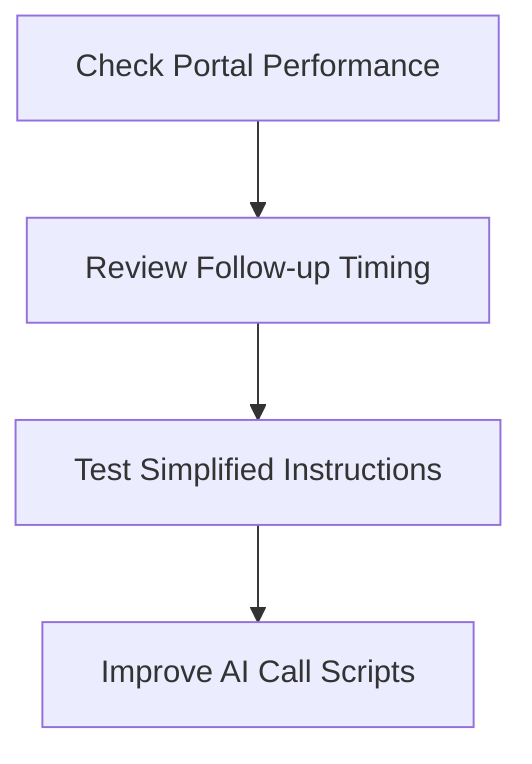
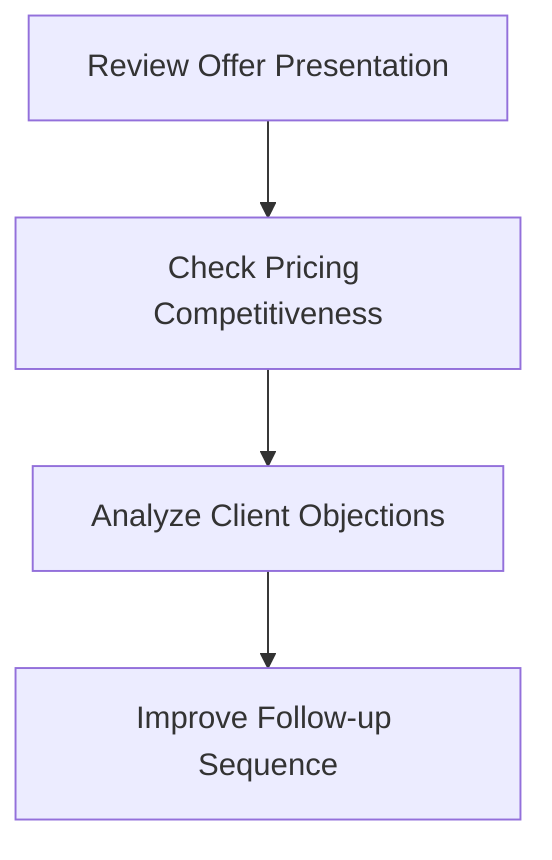

# KPI Dashboard Guide

## 📊 Visual Metrics & Performance Tracking

This guide helps owners and marketers understand key performance indicators, what they mean, and when to take action.

---

## 🎯 Executive Dashboard Overview

### Primary Revenue Metrics


---

## 📈 Lead Generation Metrics

### Cost Per Lead (CPL) Tracking
| Source | CPL | Volume | Quality Score | Action |
|--------|-----|---------|---------------|--------|
| **Google Ads** | $145 | 45/day | ⭐⭐⭐⭐ | Optimize |
| **Facebook** | $95 | 30/day | ⭐⭐⭐ | Scale up |
| **SEO Organic** | $25 | 15/day | ⭐⭐⭐⭐⭐ | Maintain |
| **Referrals** | $0 | 8/day | ⭐⭐⭐⭐⭐ | Incentivize |

### Lead Quality Indicators


**Quality Scoring:**
- 🟢 **High**: 80%+ qualification rate
- 🟡 **Medium**: 60-79% qualification rate  
- 🔴 **Low**: <60% qualification rate

---

## 🔄 Pipeline Conversion Metrics

### Funnel Performance Visualization


### Conversion Rate Benchmarks
| Stage | Current | Target | Best | Alert Level |
|-------|---------|--------|------|-------------|
| **Lead → Qualified** | 70% | 68-75% | 82% | <60% 🚨 |
| **Qualified → Docs** | 64% | 60-70% | 78% | <55% 🚨 |
| **Docs → Submit** | 89% | 85-95% | 97% | <80% 🚨 |
| **Submit → Offer** | 80% | 75-85% | 92% | <70% 🚨 |
| **Offer → Fund** | 50% | 45-55% | 68% | <40% 🚨 |

---

## ⏱️ Time-Based Performance

### SLA Compliance Dashboard

```mermaid
gantt
    title SLA Performance This Week
    dateFormat  X
    axisFormat %d
    
    section Docs Collection
    Target (72h)     :done, target1, 0, 3
    Actual Average   :active, actual1, 0, 2
    
    section File Prep
    Target (8h)      :done, target2, 0, 1
    Actual Average   :crit, actual2, 0, 1.5
    
    section Lender Response
    Target (24h)     :done, target3, 0, 1
    Actual Average   :active, actual3, 0, 1.2
```


### Response Time Metrics
| Metric | Target | Current | Trend | Status |
|--------|--------|---------|-------|--------|
| **AI Call Response** | <2 hours | 1.3h | ⬇️ | 🟢 |
| **Doc Portal Send** | <30 min | 18 min | ➡️ | 🟢 |
| **File Prep Time** | <8 hours | 6.2h | ⬇️ | 🟢 |
| **Offer Presentation** | <2 hours | 3.1h | ⬆️ | 🟡 |

---

## 💰 Revenue Performance

### Monthly Revenue Tracking


### Deal Size Distribution
| Range | Count | Percentage | Revenue |
|-------|-------|------------|---------|
| **$1K-$5K** | 45 | 28% | $148K |
| **$5K-$10K** | 68 | 42% | $512K |
| **$10K-$25K** | 35 | 22% | $625K |
| **$25K+** | 12 | 8% | $385K |

### Commission Analysis
- **Average Deal**: $8,500
- **Average Commission**: $2,125 (25%)
- **Top Performer**: $45K deal ($11.25K commission)
- **Commission/Lead**: $341

---

## 🎪 Activity Metrics

### Daily Activity Heatmap


### Team Performance Metrics
| Team Member | Calls/Day | Doc Rate | Close Rate | Revenue |
|-------------|-----------|----------|------------|---------|
| **AI System** | 125 | 68% | N/A | - |
| **Sarah (Closer)** | 15 | N/A | 52% | $85K |
| **Mike (Closer)** | 12 | N/A | 47% | $72K |
| **Operations** | N/A | 89% SLA | N/A | - |

---

## 🚨 Alert System Configuration

### Red Flag Indicators


### Automated Alerts Setup
| Trigger | Threshold | Recipients | Action |
|---------|-----------|------------|--------|
| **CPL Spike** | >150% of 7-day avg | Marketing Team | Pause low-performing ads |
| **Doc Rate Drop** | <55% for 24h | Operations | Check portal & follow-up |
| **AI Call Failure** | >20% no-answer | Tech Team | Review call system |
| **SLA Breach** | Any >24h delay | Management | Immediate escalation |

---

## 📱 Mobile Dashboard Widgets

### Quick Status Tiles
```
┌─────────────┬─────────────┬─────────────┬─────────────┐
│ Today Leads │  Doc Rate   │ Fund Rate   │ Revenue MTD │
│     47      │    68%      │    16%      │   $45.2K    │
│   ⬆️ +12%    │   ➡️ Stable  │   ⬇️ -2%     │  ⬆️ +18%    │
└─────────────┴─────────────┴─────────────┴─────────────┘

┌─────────────┬─────────────┬─────────────┬─────────────┐
│ AI Calls    │ Lender SLA  │ Hot Nurture │ Calendar    │
│   Active    │  On Track   │     23      │   85% Show  │
│    🟢       │     🟢      │    ⬆️ +8     │     🟢      │
└─────────────┴─────────────┴─────────────┴─────────────┘
```

### Traffic Light System
- 🟢 **Green**: Performance within target range
- 🟡 **Yellow**: Performance below target but manageable
- 🔴 **Red**: Performance requires immediate attention

---

## 📊 Weekly Executive Summary Template

### Performance Scorecard
| Metric | This Week | Last Week | Target | Status |
|--------|-----------|-----------|--------|--------|
| **Leads Generated** | 287 | 312 | 300 | 🟡 |
| **Qualification Rate** | 72% | 69% | 70% | 🟢 |
| **Funded Deals** | 18 | 15 | 16 | 🟢 |
| **Revenue** | $38.2K | $31.8K | $34K | 🟢 |
| **ROI** | 1,650% | 1,520% | 1,500% | 🟢 |

### Action Items for Next Week
1. 🎯 **Marketing**: Test new Facebook ad creative (CPL optimization)
2. 🔧 **Operations**: Reduce file prep time to <6 hours
3. 📞 **Sales**: Improve offer acceptance rate (+5%)
4. 📊 **Analytics**: Implement real-time SLA tracking

---

## 🔍 Drill-Down Analysis Tools

### When Metrics Are Off-Target

**Low Qualification Rate (<60%)**


**Poor Doc Collection (<55%)**


**Low Close Rate (<40%)**


---

*For troubleshooting specific issues, see the troubleshooting-flowchart.md*