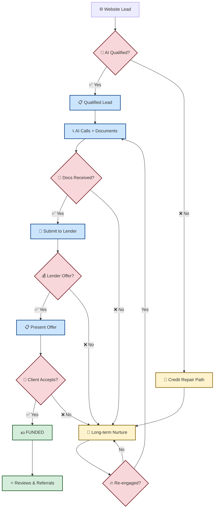
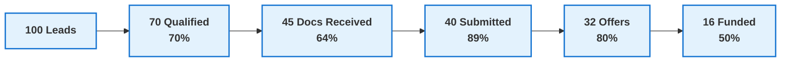
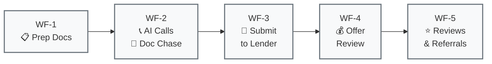
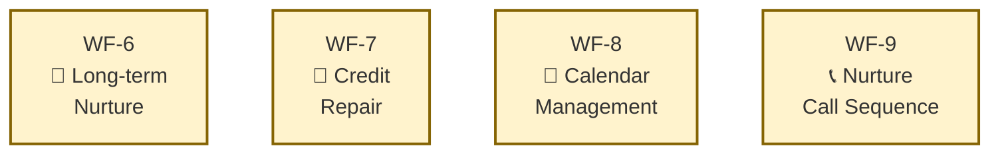

# Simplified Pipeline Overview

## 🎯 Quick Reference for Owners & Marketers

This visual guide breaks down the Nexli Funding sales pipeline into easy-to-understand stages that busy owners and marketers can scan quickly to understand performance and optimize conversions.

---

## 📊 High-Level Sales Funnel

---

## 🚦 Lead Status at a Glance

| Stage | Icon | Status | Next Action | Typical Timeline |
|-------|------|---------|-------------|------------------|
| **Website Lead** | 🌐 | New inquiry | AI qualification | Immediate |
| **Qualified** | ✅ | Passed AI screening | Start doc process | 0-2 hours |
| **AI Calls Active** | 📞 | AI attempting contact | Monitor call outcomes | Same day |
| **Docs Requested** | 📋 | Portal sent to client | Follow up if no upload | 24-72 hours |
| **Ready to Submit** | 📄 | All docs received | Package for lender | 4-8 hours |
| **With Lender** | 🏦 | File submitted | Wait for decision | 24-48 hours |
| **Offer Presented** | 💰 | Terms available | Client decision | 24-72 hours |
| **FUNDED** | 💵 | Deal closed | Request reviews | Complete |
| **Nurture** | 💌 | Long-term follow-up | Monitor re-engagement | Ongoing |

---

## 📈 Conversion Funnel Metrics

**Key Benchmark Conversion Rates:**
- **Qualification Rate**: 70% (AI pre-screening)
- **Doc Completion**: 64% (qualified → docs received)
- **Lender Approval**: 80% (submitted → offer)
- **Offer Acceptance**: 50% (offer → funded)
- **Overall Conversion**: 16% (lead → funded)

---

## 🔄 Automation Workflows Overview

### Primary Workflows (WF-1 to WF-5)

### Support Workflows

---

## ⚡ Quick Decision Points

### 🚨 When to Investigate
- **Doc completion < 60%**: Check portal links, follow-up messaging
- **AI call success < 50%**: Review call scripts, timing
- **Lender approval < 75%**: Check file quality, lender requirements
- **Offer acceptance < 45%**: Review terms presentation, pricing

### 🎯 Optimization Opportunities
- **High nurture pool**: Implement re-engagement campaigns
- **Low qualification rate**: Improve lead sources, AI criteria
- **Slow doc turnaround**: Simplify portal, improve instructions
- **Low offer acceptance**: Better expectation setting, competitive rates

---

## 📱 Mobile-Friendly Status Icons

| Status | Desktop View | Mobile Icon | Meaning |
|--------|--------------|-------------|---------|
| New Lead | 🌐 Website Lead | 🌐 | Fresh inquiry |
| Qualified | ✅ Qualified Lead | ✅ | Passed screening |
| AI Active | 📞 AI Calls Active | 📞 | Calling in progress |
| Docs Pending | 📋 Docs Requested | 📋 | Waiting for upload |
| Ready | 📄 Ready to Submit | 📄 | All docs received |
| With Lender | 🏦 With Lender | 🏦 | Under review |
| Offer Out | 💰 Offer Presented | 💰 | Terms available |
| Funded | 💵 FUNDED | 💵 | Deal closed |
| Nurture | 💌 Nurture | 💌 | Long-term follow-up |

---

*This overview provides the essential visual framework for understanding lead flow. For detailed workflow mechanics, see the workflow-stage-guide.md*