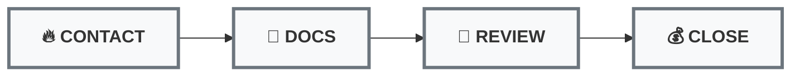

# Simplified Sales Pipeline Implementation Plan

## 🎯 Overview

This document provides a complete implementation guide for creating a simplified, action-oriented sales pipeline in GoHighLevel that allows sales reps to quickly scan, prioritize, and take action on leads without confusion.

**Design Philosophy**: One unified card design, clear progression, instant action clarity.

---

## 📊 4-Stage Pipeline Design



### Stage Definitions

| Stage | Purpose | Action Required | Move Forward When |
|-------|---------|----------------|-------------------|
| **🔥 CONTACT** | Initial qualification & engagement | Call, qualify, request docs | Portal sent OR docs requested |
| **📄 DOCS** | Document collection | Follow up until complete | All required docs uploaded |
| **🏦 REVIEW** | Lender submission & approval | Submit file, track status | Offer received from lender |
| **💰 CLOSE** | Present offer & finalize | Present terms, close deal | Funded OR final decline |

---

## 🎴 Universal Card Design

**Every card displays the same fields regardless of stage:**

```
┌─────────────────────────────────────┐
│ [Business Name]                     │
│ [Contact Name] | [Phone Number]     │
│ $[Amount] | [Credit Score Range]    │
│ [Days in Stage] | [Last Action]     │
│ [STAGE-SPECIFIC ACTION BUTTON]      │
└─────────────────────────────────────┘
```

### Field Specifications

| Field | GoHighLevel Mapping | Display Format | Example |
|-------|-------------------|----------------|---------|
| **Business Name** | `opportunity.name` or `contact.businessName` | Bold, 16px | "Vela Kitchen LLC" |
| **Contact Name** | `contact.firstName` + `contact.lastName` | Regular, 14px | "Michael Madden" |
| **Phone Number** | `contact.phone` | Click-to-call format | "+1 (914) 606-0100" |
| **Funding Amount** | `opportunity.value` | Currency format | "$100,000" |
| **Credit Score** | Custom field: `credit_range` | Text format | "600-659" |
| **Days in Stage** | Auto-calculated from stage change | Bold, color-coded | "2 days" |
| **Last Action** | `opportunity.lastActivityDate` | Relative format | "Called today" |

---

## 🚦 Priority Color System

**Based on "Days Since Last Stage Change":**

| Priority | Color | Days in Stage | Visual Indicator |
|----------|-------|---------------|------------------|
| **🔴 URGENT** | Red | 2+ days | Red border + red text |
| **🟡 ATTENTION** | Yellow | 1 day | Yellow border + orange text |
| **🟢 ON TRACK** | Green | Same day | Green border + black text |

### Color Rules Logic
```javascript
if (daysSinceStageChange >= 2) return 'red';
if (daysSinceStageChange >= 1) return 'yellow';
return 'green';
```

---

## ⚡ Stage-Specific Actions

| Stage | Primary Action | Button Text | Secondary Actions |
|-------|---------------|-------------|-------------------|
| **CONTACT** | Make initial call | `CALL NOW` | Send SMS, Send Email |
| **DOCS** | Follow up on documents | `FOLLOW UP` | Resend Portal, Call Client |
| **REVIEW** | Check lender status | `CHECK STATUS` | Call Lender, Prep Client |
| **CLOSE** | Present offer | `PRESENT OFFER` | Call Client, Send Terms |

---

## 🔧 GoHighLevel Implementation Guide

### Step 1: Create New Pipeline

1. **Navigate to**: Settings → Pipelines
2. **Click**: "Add New Pipeline"
3. **Name**: "Nexli Sales Pipeline"
4. **Create 4 Stages**:
   ```
   Stage 1: 🔥 CONTACT
   Stage 2: 📄 DOCS  
   Stage 3: 🏦 REVIEW
   Stage 4: 💰 CLOSE
   ```

### Step 2: Configure Pipeline Stages

For each stage, set:

#### Stage 1: 🔥 CONTACT
- **Name**: "🔥 CONTACT"
- **Color**: Orange (#FF6B35)
- **Auto-Actions**: None (manual progression)

#### Stage 2: 📄 DOCS
- **Name**: "📄 DOCS"
- **Color**: Blue (#4A90E2)
- **Auto-Actions**: None (manual progression)

#### Stage 3: 🏦 REVIEW
- **Name**: "🏦 REVIEW"
- **Color**: Purple (#8E44AD)
- **Auto-Actions**: None (manual progression)

#### Stage 4: 💰 CLOSE
- **Name**: "💰 CLOSE"
- **Color**: Green (#27AE60)
- **Auto-Actions**: None (manual progression)

### Step 3: Configure Card Fields

1. **Navigate to**: Opportunities → Settings → Card Fields
2. **Select Pipeline**: "Nexli Sales Pipeline"
3. **Configure Display Fields**:

```
Primary Fields (Always Visible):
☑ Opportunity Name
☑ Contact Name  
☑ Contact Phone
☑ Opportunity Value
☑ Days in Stage

Secondary Fields (Hover/Click):
☑ Contact Email
☑ Lead Source
☑ Assigned User
☑ Last Activity Date
☑ Tags
```

### Step 4: Create Custom Fields

Create these custom fields if they don't exist:

1. **Credit Score Range**
   - Field Type: Dropdown
   - Options: "Excellent (720+)", "Good (680-719)", "Average (600-679)", "Poor (550-599)", "Very Poor (<550)"

2. **Business Revenue Range**
   - Field Type: Dropdown  
   - Options: "Pre-Revenue", "$1-50k", "$50-100k", "$100-500k", "$500k-1M", "$1M+"

3. **Funding Purpose**
   - Field Type: Text
   - Max Length: 100 characters

### Step 5: Set Up Card Color Rules

1. **Navigate to**: Opportunities → Settings → Card Rules
2. **Create Rule 1 - URGENT (Red)**:
   ```
   Condition: Days Since Stage Change ≥ 2
   Action: Border Color = Red (#E74C3C)
   Action: Text Color = Red (#E74C3C)
   ```

3. **Create Rule 2 - ATTENTION (Yellow)**:
   ```
   Condition: Days Since Stage Change = 1
   Action: Border Color = Orange (#F39C12)
   Action: Text Color = Orange (#F39C12)
   ```

4. **Create Rule 3 - ON TRACK (Green)**:
   ```
   Condition: Days Since Stage Change = 0
   Action: Border Color = Green (#27AE60)
   Action: Text Color = Black (#2C3E50)
   ```

### Step 6: Configure Quick Actions

For each stage, set up quick action buttons:

1. **Navigate to**: Opportunities → Settings → Quick Actions
2. **Configure per stage**:

#### CONTACT Stage Actions:
```
Primary: Call Contact
Secondary: Send SMS
Tertiary: Send Email
```

#### DOCS Stage Actions:
```
Primary: Call for Documents
Secondary: Resend Portal Link
Tertiary: Send Reminder Email
```

#### REVIEW Stage Actions:
```
Primary: Check Lender Status
Secondary: Call Client Update
Tertiary: Internal Task
```

#### CLOSE Stage Actions:
```
Primary: Present Offer Call
Secondary: Send Terms Email
Tertiary: Schedule Closing
```

### Step 7: Mobile Optimization

1. **Navigate to**: Settings → Mobile Settings
2. **Enable**: "Optimized Card View"
3. **Set Card Width**: 320px (mobile-friendly)
4. **Enable**: "Click-to-call on phone numbers"
5. **Enable**: "Swipe actions for quick updates"

### Step 8: Set Up Automation Rules

Create workflow automations for stage progression:

#### Auto-Progression Rules:

1. **CONTACT → DOCS**:
   ```
   Trigger: Tag "docs-requested" is added
   Action: Move to DOCS stage
   Action: Add activity note "Documents requested"
   ```

2. **DOCS → REVIEW**:
   ```
   Trigger: Tag "docs-in" is added
   Action: Move to REVIEW stage  
   Action: Add activity note "Documents received"
   Action: Create task "Package file for lender"
   ```

3. **REVIEW → CLOSE**:
   ```
   Trigger: Tag "offer-out" is added
   Action: Move to CLOSE stage
   Action: Add activity note "Offer received"
   Action: Create task "Present offer to client"
   ```

4. **CLOSE → COMPLETE**:
   ```
   Trigger: Tag "funded" is added
   Action: Move to WON status
   Action: Add activity note "Deal funded"
   Action: Trigger review request workflow
   ```

### Step 9: Dashboard View Configuration

1. **Navigate to**: Opportunities → Board View
2. **Select**: "Nexli Sales Pipeline"
3. **Configure View**:
   - Sort by: Priority (Red → Yellow → Green)
   - Group by: Stage
   - Show: 20 cards per column
   - Enable: Drag & drop between stages

### Step 10: Team Training Setup

Create training materials:

#### Quick Reference Card:
```
🔥 CONTACT = Call & qualify new leads
📄 DOCS = Follow up for documents  
🏦 REVIEW = Track lender submission
💰 CLOSE = Present offer & close

PRIORITY ORDER:
1. Red cards (2+ days) - URGENT
2. Yellow cards (1 day) - TODAY  
3. Green cards (same day) - MAINTAIN
```

---

## 📱 Daily Workflow for Sales Reps

### Morning Routine (10 minutes):
1. **Open pipeline board view**
2. **Count total cards** in each stage
3. **Identify all RED cards** across stages
4. **Plan day priority**: Red → Yellow → Green

### Working Through the Pipeline:
1. **Start with RED cards** (any stage) - these are overdue
2. **Take immediate action** - call, follow up, check status
3. **Move cards forward** when action complete
4. **Work YELLOW cards** - need attention today
5. **Touch GREEN cards** - maintain momentum

### End of Day (5 minutes):
1. **Update any incomplete actions**
2. **Set follow-up tasks** for tomorrow
3. **Move any completed deals** to next stage
4. **Note any blockers** for manager review

---

## 🎯 Success Metrics

### Daily Targets:
- **Contact all RED cards** (2+ days old)
- **Move 3+ cards forward** between stages
- **Complete all planned calls** from yellow/green cards
- **Update all opportunity notes** with latest status

### Weekly Goals:
- **Average days per stage** < 1.5 days
- **Stage progression rate** > 70%
- **Contact frequency** > 1 touch per day in pipeline

### Pipeline Health:
- **CONTACT**: < 20 cards (quick qualification)
- **DOCS**: < 30 cards (active doc collection)
- **REVIEW**: < 15 cards (lender processing)
- **CLOSE**: < 10 cards (active negotiations)

---

## 🚨 Troubleshooting & Tips

### Common Issues:

**Cards not moving between stages:**
- Check automation rules are enabled
- Verify tags are being applied correctly
- Ensure workflows are active

**Color coding not working:**
- Verify "Days Since Stage Change" calculation
- Check color rule conditions
- Clear browser cache and refresh

**Mobile view problems:**
- Use GHL mobile app (not browser)
- Check card width settings
- Verify touch/swipe actions enabled

### Best Practices:

1. **Keep cards moving** - don't let them sit
2. **Use consistent tagging** - maintains automation
3. **Update notes regularly** - helps team coordination
4. **Review weekly** - optimize stage timing
5. **Train consistently** - ensure team adoption

---

## 📋 Implementation Checklist

- [ ] Create new pipeline with 4 stages
- [ ] Configure card field display
- [ ] Set up custom fields (credit score, revenue, etc.)
- [ ] Create color coding rules (red/yellow/green)
- [ ] Configure quick action buttons per stage
- [ ] Set up automation rules for stage progression
- [ ] Test mobile view and functionality
- [ ] Create team training materials
- [ ] Set up dashboard view for daily use
- [ ] Train sales team on new system
- [ ] Monitor for first week and adjust as needed

---

## 🔄 Migration from Current System

### Phase 1: Setup (Week 1)
1. Create new pipeline structure
2. Configure all settings and rules
3. Test with sample opportunities

### Phase 2: Data Migration (Week 2)
1. Map current opportunities to new stages:
   - "New Lead" → CONTACT
   - "Docs Requested" → DOCS  
   - "Docs In/Document Review" → REVIEW
   - "Ready for Submission" → CLOSE

### Phase 3: Team Training (Week 3)
1. Train sales team on new workflow
2. Run parallel systems for validation
3. Address any issues or questions

### Phase 4: Full Launch (Week 4)
1. Switch to new pipeline exclusively
2. Monitor metrics and performance
3. Optimize based on real usage

---

*This simplified pipeline design prioritizes clarity and action over complexity, enabling your sales team to focus on moving deals forward efficiently.*