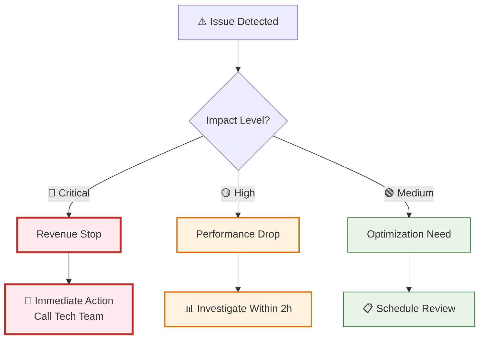
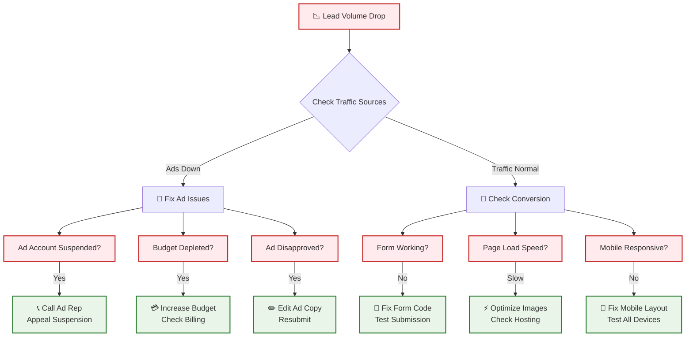
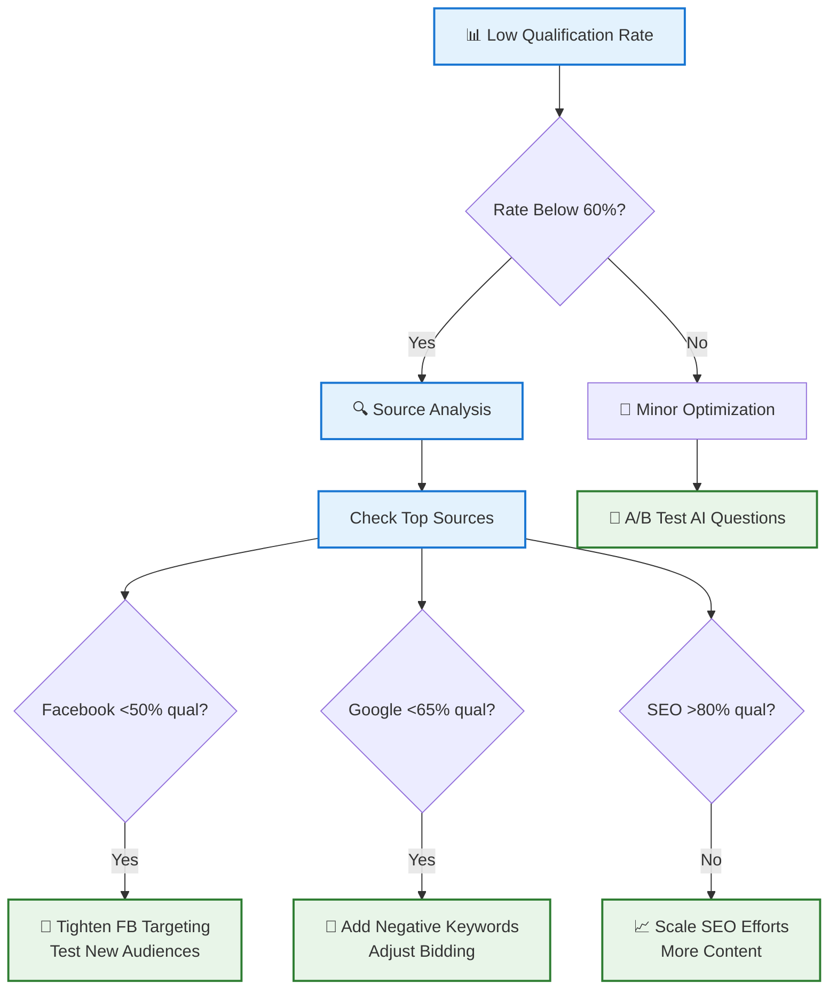
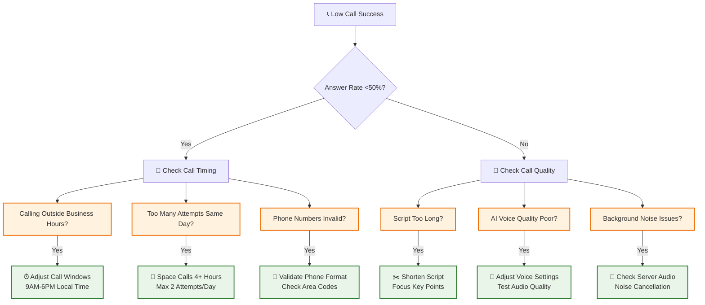
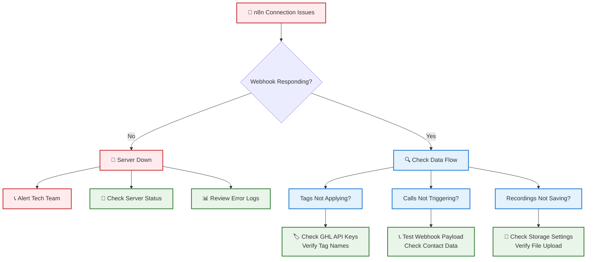
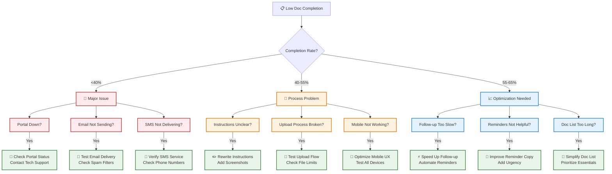
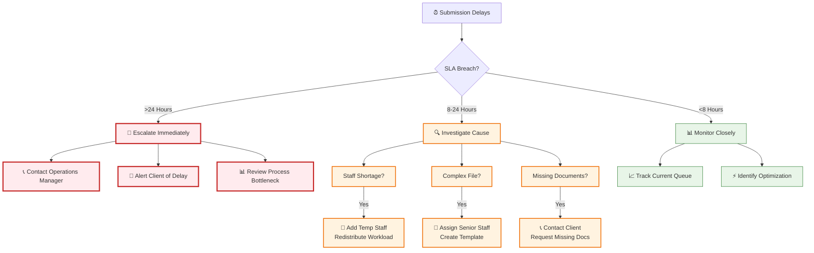
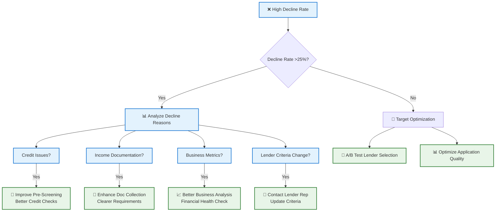
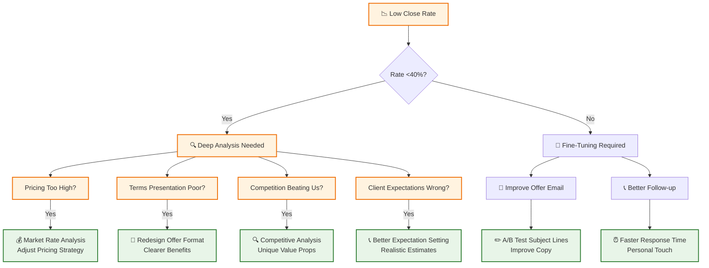
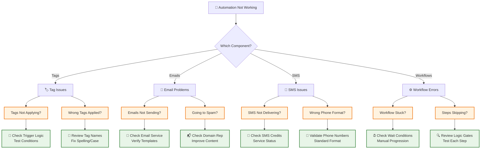

# Troubleshooting Flowchart Guide

## 🔧 Quick Problem Identification & Resolution

This visual guide helps owners and marketers quickly identify common issues and take immediate corrective action.

---

## 🚨 Emergency Triage System

### Quick Problem Assessment


---

## 📉 Lead Generation Problems

### Low Lead Volume Diagnosis


### Lead Quality Issues


---

## 📞 AI Call System Issues

### Call Performance Troubleshooting


### n8n Integration Problems


---

## 📄 Document Collection Issues

### Portal Performance Problems


---

## 🏦 Lender Processing Issues

### Submission Delays


### Lender Decline Analysis


---

## 💰 Close Rate Issues

### Offer Acceptance Problems


---

## 📱 System Integration Issues

### GHL Automation Problems


---

## 🔧 Quick Fix Checklist

### Daily Health Check (5-Minute Scan)
```
□ 📊 Lead volume normal (within 20% of yesterday)
□ 🎯 Qualification rate >60%
□ 📞 AI calls functioning (check last hour)
□ 📧 Emails sending (check delivery rate)
□ 📱 SMS working (check delivery rate)
□ 🏷️ Tags applying correctly (spot check)
□ ⏰ No SLA breaches (check alerts)
□ 💰 Funded deals on track (daily target)
```

### Weekly Deep Check (30-Minute Review)
```
□ 📈 CPL trending within budget
□ 🔄 Conversion rates at benchmark
□ 📞 AI call scripts performing
□ 📋 Document collection optimized
□ 🏦 Lender relationships healthy
□ 💰 Close rates competitive
□ 📊 Pipeline velocity normal
□ 🎯 Team performance targets met
```

---

## 📞 Emergency Contacts

### Escalation Matrix
| Issue Type | Severity | Contact | Response Time |
|------------|----------|---------|---------------|
| **Revenue Stop** | 🔴 Critical | CEO + Tech Lead | 15 minutes |
| **System Down** | 🔴 Critical | Tech Team | 30 minutes |
| **SLA Breach** | 🟡 High | Operations Manager | 2 hours |
| **Performance Drop** | 🟡 High | Team Lead | 4 hours |
| **Optimization** | 🟢 Medium | Next team meeting | 24 hours |

### Quick Contact List
- 🚨 **Emergency**: Alert all stakeholders
- 🔧 **Tech Issues**: tech-team@nexli.com
- 📊 **Operations**: ops@nexli.com
- 💰 **Revenue**: management@nexli.com
- 📈 **Marketing**: marketing@nexli.com

---

*This troubleshooting guide should be your first stop when issues arise. For performance optimization, see the kpi-dashboard-guide.md*