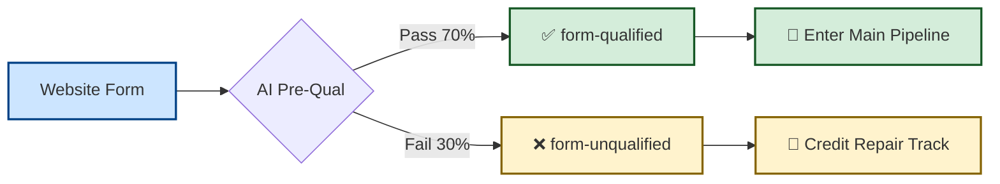
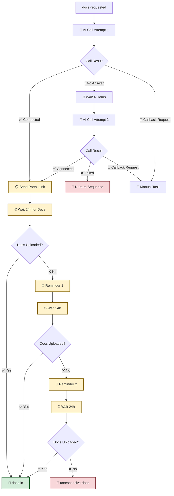
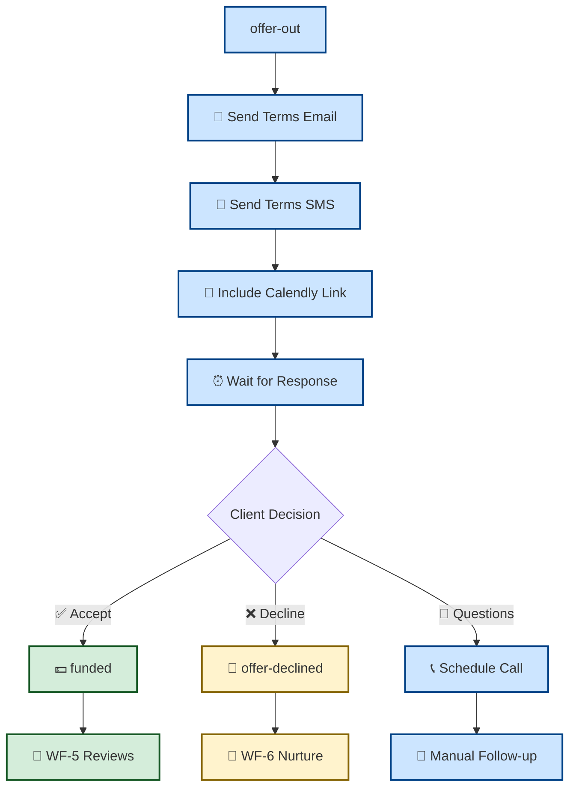
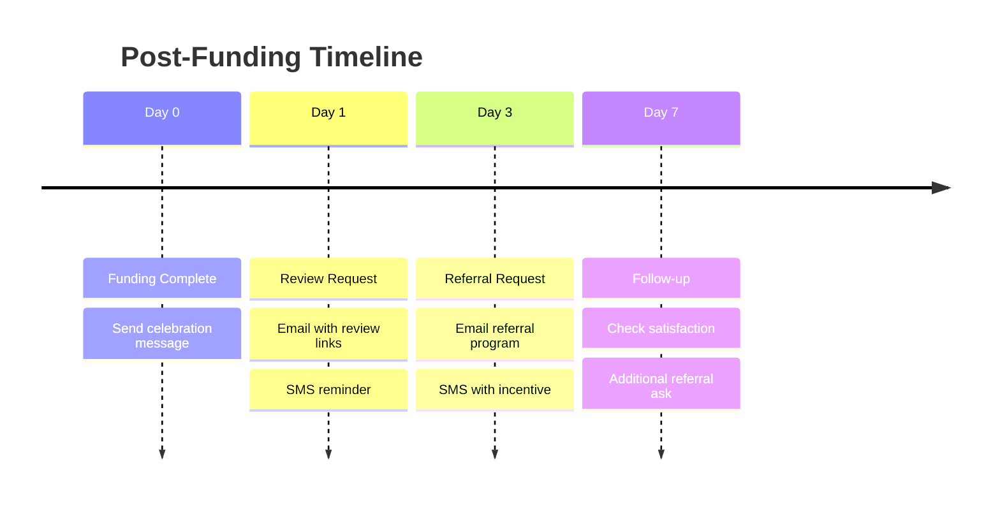
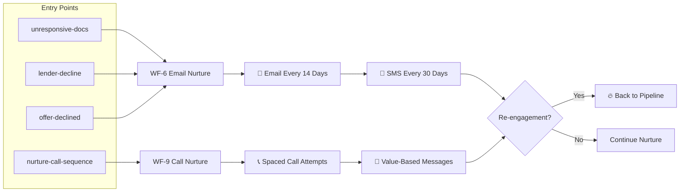
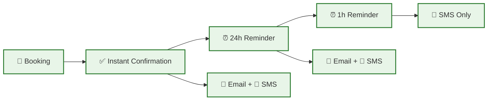

# Workflow Stage Guide

## 🎯 Detailed Breakdown for Operations & Management

This guide provides actionable insights for each stage of the Nexli Funding pipeline, with visual indicators and management checkpoints.

---

## 🌐 Stage 1: Lead Entry & Qualification

### Visual Status Flow

### Key Management Indicators
| Metric | Target | Red Flag | Action Required |
|--------|--------|----------|----------------|
| **Qualification Rate** | 65-75% | <60% or >80% | Review AI criteria |
| **Lead Volume** | Consistent daily flow | 50% day-over-day drop | Check traffic sources |
| **Form Completion** | >85% | <80% | Optimize form UX |

### What You See in GHL
- **Pipeline Stage**: "New Lead" → "Qualified" or "Unqualified"
- **Tags Applied**: `form-qualified` or `form-unqualified`
- **Automatic Actions**: Qualified leads immediately get `docs-requested` tag

---

## 📞 Stage 2: AI Calls & Document Collection (WF-2)

### Detailed Process Flow

### Performance Monitoring
| Stage | Success Rate Target | What to Watch | Intervention Needed |
|-------|-------------------|---------------|-------------------|
| **AI Call Answer Rate** | 60-70% | <50% answer rate | Check call timing, scripts |
| **Portal Conversion** | 70-80% | <65% doc completion | Simplify portal, improve instructions |
| **72-Hour Rule** | 80% docs within 72h | >20% need reminders | Follow-up sequence optimization |

### Alert Triggers
- 🚨 **AI Call Fails 2x**: Lead moves to WF-9 Nurture Call Sequence
- 🚨 **No Docs After 3 Reminders**: Lead moves to WF-6 Long-term Nurture
- ✅ **Docs Received**: Immediate move to WF-3 Submission prep

---

## 🏦 Stage 3: Lender Submission (WF-3)

### Process Timeline

```mermaid
gantt
    title Lender Submission SLA Timeline
    dateFormat  X
    axisFormat %H:%M
    
    section File Prep
    Package File    :active, prep, 0, 4h
    QC Review      :qc, after prep, 2h
    
    section Submission
    Submit to Lender :submit, after qc, 1h
    
    section SLA Tracking
    24h Deadline    :crit, deadline, 0, 24h
    Alert Trigger   :milestone, 24h
```

### Management Dashboard View
| Metric | Target | Current Status | Action |
|--------|--------|----------------|--------|
| **Prep Time** | <8 hours | ⚡ Track in real-time | Alert if >8h |
| **Submission SLA** | <24 hours | 🎯 Auto-alert at 24h | Escalate to ops |
| **Lender Response** | 24-48 hours | 📊 Track by lender | Review slow lenders |

### What Triggers Next Stage
- ✅ **Lender Approval**: `offer-out` tag → WF-4 Offer Review
- ❌ **Lender Decline**: `lender-decline` tag → WF-6 Nurture

---

## 💰 Stage 4: Offer Review (WF-4)

### Decision Tree Flow

### Conversion Optimization Points
| Factor | Impact | Optimization |
|--------|--------|--------------|
| **Response Time** | High | Send terms within 2 hours of lender approval |
| **Presentation** | Medium | Clear terms breakdown, visual format |
| **Follow-up** | High | Personal touch for high-value deals |

---

## ⭐ Stage 5: Post-Funding (WF-5)

### Review & Referral Sequence

### Success Metrics
- **Review Rate**: Target 40% of funded clients leave reviews
- **Referral Rate**: Target 25% provide qualified referrals
- **Response Time**: 80% respond to satisfaction survey

---

## 💌 Stage 6: Nurture System (WF-6 & WF-9)

### Nurture Pool Management

### Re-engagement Triggers (Hot Lead Sniffer)
| Trigger | Action | Priority |
|---------|--------|----------|
| **SMS Reply** | Immediate re-entry | 🔥 High |
| **Email Click** | Tag re-engaged | 🔥 High |
| **Calendar Booking** | Direct to appointment flow | 🔥 High |
| **Keyword Response** | ("READY", "START") | 🔥 High |

---

## 📅 Stage 7: Calendar Management (WF-8)

### Appointment Confirmation Flow

### Show Rate Optimization
- **Target Show Rate**: 75%
- **Confirmation Response**: 90% within 1 hour
- **Reminder Effectiveness**: 15% improvement with 1-hour SMS

---

## 🎯 Quick Status Reference

| Workflow | Duration | Success Indicator | Failure Action |
|----------|----------|-------------------|----------------|
| **WF-1** | Instant | `docs-requested` added | Check webhook |
| **WF-2** | 1-3 days | `docs-in` received | Move to nurture |
| **WF-3** | 1-2 days | `offer-out` or `lender-decline` | Escalate if delayed |
| **WF-4** | 2-5 days | `funded` or `offer-declined` | Personal follow-up |
| **WF-5** | 7 days | Reviews/referrals received | End sequence |
| **WF-6/9** | Ongoing | `re-engaged` tag | Continue nurture |
| **WF-8** | Per booking | Appointment attended | Reschedule flow |

---

*For performance metrics and KPI tracking, see the kpi-dashboard-guide.md*